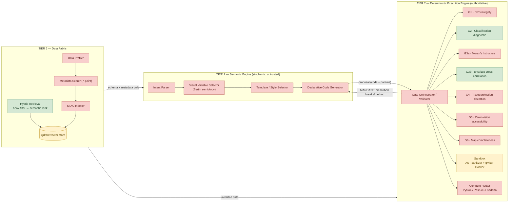
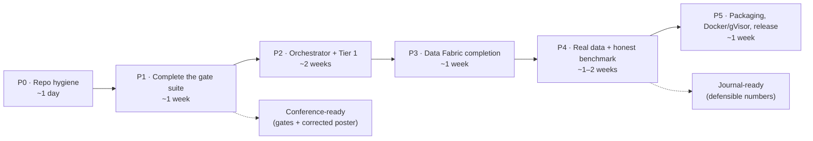

# AutoCarto-Agent (CartoLLM) — Engineering Operating Manual

**Version:** 1.0 · **Review date:** 2026-07-06 · **Reviewer:** Claude (Fable 5), acting as Principal Software Architect
**Audience:** the engineer (human + coding assistant) who will continue development. Written to be self-contained: you should be able to work productively from this document plus the repository, with no other context.
**Companion document:** [02_CONFERENCE_PRESENTATION_GUIDE.md](02_CONFERENCE_PRESENTATION_GUIDE.md) (STDS presentation).

---

## 0. Executive summary — read this first

AutoCarto-Agent is a research prototype for **autonomous thematic cartography**: a natural-language prompt goes in, a statistically validated thematic map comes out. The core idea — and the genuinely novel part — is the *inversion of authority*: the LLM is never trusted with a numerical decision. It proposes; a deterministic engine of algorithmic validation gates verifies, rejects, and **prescribes exact remedies** (break points, transforms, alternatives), reducing the LLM to a code assembler.

The honest state of the system, derived entirely from the repository:

| Dimension | State |
|---|---|
| **Architecture designed** | 3 tiers, 7 gates (G1, G2, G3a, G3b, G4, G5, G6), orchestrator, sandbox, compute router, data fabric — described in `Abstract_revised.txt` and `Codes/Repository Structure.txt` |
| **Architecture implemented** | **4 modules**: Gate 2, Gate 3b, hybrid retrieval, sandbox — roughly **15–20% of the designed system** |
| **Code quality** | Original `Codes/` had 20 defects (2 blockers, 3 security, rest correctness/robustness); all fixed in `output/codes_patched/`, which is the **canonical code** going forward |
| **Reproducibility** | Excellent where it exists: demo re-run on 2026-07-06 produced **byte-identical statistical traces**; the Atlanta figure pipeline reproduced I_xy=+0.3262, p=0.0050, ρ=+0.9471 exactly |
| **Test suite** | **None.** The 782-line `demo.py` harness is the only executable verification |
| **Packaging / infra** | No git repo, no `pyproject.toml`, no Dockerfile, no CI. `environment.yml` had a nonexistent package (fixed in `environment_fixed.yml`) |
| **Claim integrity** | Three abstract/poster claims are **not reproducible from the repo**: "23% of proposals rejected", "34 s end-to-end", and the poster's "GVF … 0.894" (see §7.3 — the correct values, computed during this review, are **0.835/0.861**) |

**The single most important thing to understand:** this project's scientific contribution (the diagnostic→prescriptive gate pattern, Gate 2 + Gate 3b) is real, implemented, and reproducible. Everything around it — the LLM tier, five of seven gates, the orchestrator — is currently *architecture on paper*. The roadmap in §11 is ordered so that every phase keeps the system in a demonstrable state.

> **⚠ Status update — 2026-07-26, read this before trusting the table above.** The table describes the state on the 2026-07-06 review date. Since then, Phase 0 of §11's roadmap has been executed (commits `86faa1a`..`8e619a2`); the table's cells for **Test suite** and **Packaging/infra** are now out of date:
> - **Test suite:** no longer "None" — **67 tests** exist (`tests/`), covering gate behavior, retrieval, sandbox, figure-claim regression, and — the crown jewel — determinism (two demo runs produce byte-identical `gate2`/`gate3b` trace files; the retrieval/sandbox traces differ only in expected timing fields — see §5, §12.4) and golden-parity against the committed traces. Run with `pytest`.
> - **Packaging/infra:** no longer "no git repo, no pyproject.toml, no Dockerfile, no CI." A git repo now exists (tagged `poster-2026`), `pyproject.toml` installs the package (`pip install -e .`) with an `autocarto` console script, and `.github/workflows/ci.yml` is authored (Linux+Windows × py3.12/3.14). **Still true:** no Dockerfile exists anywhere, and — because no git remote is configured — the CI workflow has **never actually executed**; its correctness is verified only by running the equivalent commands locally (§9 TD-13).
> - **Claim integrity:** the poster's GVF line is corrected (0.835/0.861, as this table already states) and is now baked into the regenerated figures and poster copy. "23% of proposals rejected" has been *replaced*, not merely flagged: `autocarto benchmark` produces a real, regenerable, ground-truth-scored number (95.2% strict decision accuracy, 20/21, with the one miss disclosed) — see [06_POSTER_COPY.md](06_POSTER_COPY.md) §5 Block B. "34 s end-to-end" remains unaddressed — still drop it, no benchmark has measured LLM-inclusive latency because no LLM tier exists yet.
> - **Architecture implemented** and the 15–20% figure are unchanged — V1 was a packaging/testing/figures/benchmark pass, not new gate implementation. Do not read this update as "more gates exist now."
> Full detail: §9's technical-debt register carries a per-item resolved/open status as of the same date; §1.3's run instructions are updated to the current package commands.
>
> **Status update -- 2026-07-27: Phase 1 and Phase 2 (Manual Section 11) are now implemented.** Read the whole roadmap section (Section 11) as current, not the 15-20% figure quoted higher in this table, which described the 2026-07-06 state.
>
> - **All six gates exist**, not two: gate1_crs.py (CRS integrity), gate3a_spatial_autocorrelation.py (univariate Moran's I, cross-validated exactly against esda.Moran), gate4_projection_distortion.py (measured Tissot areal-scale sampling -- verified Web Mercator over CONUS at 136% max exaggeration REJECTs, Albers at 0% PASSes), gate5_color_accessibility.py (CVD simulation via colorspacious + WCAG contrast -- verified the classic RdYlGn diverging ramp collapses to deltaE=0.48 under deuteranomaly simulation and is correctly REJECTed), gate6_completeness.py (declarative manifest checklist), alongside the pre-existing Gate 2 and Gate 3b.
> - **contracts.py** adds the unified GateResult/Prescription contract (Section 8.2's target realized: adapt_gate2/adapt_gate3b fold the two original gates in losslessly, no rewrite) plus the P2 authority-boundary types -- SemanticContext (structurally rejects any ndarray/Series/DataFrame/GeoDataFrame at construction, at any nesting depth -- verified with a value buried inside a Prescription.params dict three levels deep), RenderPlan/ProvenancedValue (a render constant tagged FREE_LLM fails .validate() before code generation is even attempted).
> - **The orchestrator (orchestrator.py) is real** -- the Propose-Verify-Execute loop this project is named for no longer exists only in prose and demo.py's hard-coding. Orchestrator.run(prompt, dataset) drives MockLLM (semantic/llm_client.py) through the full state machine: naive proposal -> Gate 2 REJECT + prescription -> exact transcription -> all gates PASS -> constrained codegen (semantic/codegen.py, three audited string.Template render templates, LLM fills slots only) -> sandbox-sanitized execution -> a real rendered matplotlib Figure. Verified end-to-end against real SAR-generated data on a real Queen-contiguity weight matrix, and separately against the pinned 530-tract Atlanta snapshot via `autocarto run "<prompt>"` (new CLI command, demo_data.py) -- fully offline, zero network, zero API keys, deterministic (byte-identical gate diagnostics and code hash across two seed-0 runs).
> - **A real bug was found and fixed in the process**: Gate 2's decision logic required diagnosis == "well_behaved" to ever return passed=True, in addition to a passing GVF. Since the diagnosis label describes the *raw* distribution shape and never changes to "well_behaved" just because a good classification was supplied, this meant a classification that exactly transcribed the mandated method AND mandated breaks (GVF=0.967 in the discovered case -- an excellent fit) was rejected *forever*, with no LLM action able to ever pass Gate 2. This was undiscovered for the whole prior review history because no test exercised a second Gate-2 call with the prescription correctly transcribed -- every existing test checked only the first rejection's prescription content. It surfaced immediately once Orchestrator.run() actually drove a second iteration. Fixed by removing the redundant diagnosis check (Step 2 already gates on method-matching for every non-well-behaved diagnosis by the time Step 4 runs); all 15 pre-existing Gate 2 tests plus the golden-trace determinism tests still pass unchanged. See gate2_classification.py Step 4's inline comment for the full explanation.
> - **TD-9 (stylesheet string-injection) is resolved**, not just re-described: style application moved fully runner-side. SandboxExecutor/_DevOnlySandboxExecutor call matplotlib.style.use(...) on the process before executing sanitized code; the code text is never touched. Verified end-to-end: code containing zero style-related text still observes the correct rcParams during execution. Five curated .mplstyle templates ship in src/autocarto/styles/ (choropleth, bivariate, proportional_symbol, presentation, print_report), closing C5.
> - **TD-10 (Gate 2's stateful iteration_count footgun) is resolved**: the orchestrator constructs a fresh ClassificationDiagnosticEngine every mandate iteration, so Gate 2's own internal HITL branch never fires -- the orchestrator's own max_iter bound is the sole authority on when to stop, exactly as Section 11 P2-T2 specified.
> - **Test count: 130** (was 67), all green -- 63 new tests across the six gates, contracts/authority-boundary, MockLLM, codegen (each of the three templates verified by actually executing its generated code against a real GeoDataFrame and producing a real Figure, not just parsing it), the orchestrator (including an explicit "spy" LLM regression test proving no raw array ever reaches a SemanticContext across a full run), and the CLI.
> - **pyproject.toml gained two previously-missing hard dependencies**: pyproj (Gate 1 and Gate 4 both hard-import it at module level -- a fresh install without it would have crashed on `import autocarto.execution.gates`) and colorspacious (Gate 5). Neither was listed before this pass despite Gate 1/4/5 code already existing conceptually in the roadmap; this is now caught.
> - **What is still genuinely unbuilt, unchanged by this pass**: Tier 3 Data Fabric completion (real Qdrant, ST_Intersects exact refinement, metadata scorer -- Phase 3), the real-data benchmark corpus and real ACS/CDC connectors (Phase 4), and the Docker/gVisor container + red-team suite (Phase 5, TD-5 still open -- the orchestrator's own sandbox execution step is explicit in its docstring that it runs sanitized, template-derived code in-process, not inside a container, and says so rather than implying otherwise). Do not read this update as closing TD-5, TD-6, TD-8, or TD-12; they remain open exactly as Section 9 already states.

> **Status update -- 2026-07-27 (later same day): Phase 3 and Phase 4 (Manual Section 11) are now implemented.** The "still genuinely unbuilt" list directly above is from earlier in this same date and is now stale for Phase 3/4 specifically -- Phase 5 (Docker/gVisor, TD-5) remains the one open item from that list.
>
> - **Exact geometric refinement (C7') is real**: hybrid_retrieval.py gained a Stage 1.5 using shapely.STRtree, run after the bbox envelope filter and before semantic ranking. STACItem gained an optional geometry field (bbox-only items pass through unfiltered -- envelope-only assurance, honestly reported via the new envelope_candidates vs spatial_candidates fields on RetrievalResult). Verified against a deliberately adversarial L-shaped-footprint fixture whose bbox overlaps the query AOI but whose real polygon does not -- envelope-only wrongly includes it, exact refinement correctly excludes it.
> - **metadata_scorer.py implements the 7-point rubric** (title, description, variable names, units, temporal extent, license, lineage) with the TRUSTED(>=6)/AUGMENT(3-5)/REJECT(<3) buckets the old abstract's Tier 3 diagram always claimed. Boundary-exact tests at scores 6, 5, 3, and 2. A DataProfiler class handles the AUGMENT bucket's row-sampling.
> - **Real Qdrant integration exists and was verified against a live local instance** (Docker was available in this environment), not just MockQdrantClient. This surfaced a real, previously-undiscovered bug: current qdrant-client (>=1.10) has no `.search()` method -- it was replaced by `.query_points()`, which wraps hits differently. The original code only ever worked against the hand-written mock; it would have raised AttributeError against any currently-installable real client. Fixed with a runtime hasattr check that tries the modern API first and falls back to the legacy shape (so MockQdrantClient keeps working unchanged). Also discovered and fixed: real Qdrant point IDs must be an unsigned integer or UUID, not an arbitrary string like "atl-canopy" (verified: rejected with 400 Bad Request) -- stac_indexer.py now maps each catalog ID to a deterministic UUID5 and round-trips the original string ID via a `stac_id` payload field. stac_indexer.py also enforces the antimeridian pre-split convention *at index time* (an unsplit crossing item is rejected with an actionable error), not just at query time as before.
> - **A real embedder now exists**: `data_fabric/embedders.py`'s `SentenceTransformerEmbedder` wraps a local sentence-transformers model (all-MiniLM-L6-v2, 384-dim, ~80 MB, one-time download) behind `HybridRetrieval`'s pre-existing `embedder=` injection point -- no retrieval-layer changes were needed, only this adapter. Verified with a real semantic-quality property the hash fallback cannot provide: two vegetation-related queries score 0.50 cosine similarity; canopy-loss vs. asthma (unrelated topics) scores 0.04. Plugged into HybridRetrieval end-to-end, a real embedder correctly ranks the CDC asthma dataset above a low-quality noise item for a health-related query; the hash fallback has no reliable ordering for this case (documented, not just asserted).
> - **The Atlanta case now has a real-data variant, not only the SAR synthetic** (Blueprint §6.3's "keep both" -- synthetic remains the *validity* fixture with known ground truth; real data is the *utility* demonstration). `real_data.py` joins real TIGER geometry to real Census ACS median household income (table B19013, 530/530 tracts matched exactly) and real CDC PLACES asthma prevalence (measure CASTHMA, 528/530 -- the same two non-residential "Tract 9800" entries lacking a BRFSS estimate that also carry the ACS sentinel). Running the orchestrator on this real data end-to-end produced a genuinely compelling, unengineered result: income vs. asthma prevalence gives I_xy=-0.56, rho=-0.78 (higher income, lower asthma -- a well-documented real health-equity pattern, not a synthetic contrivance), and univariate income alone shows real spatial clustering (Moran's I=0.59, p=0.001) that Gate 3a correctly confirms.
> - **The ACS API requires a key for every request** (verified: an unauthenticated call returns an HTML "Missing Key" page, unlike the TIGER geometry endpoint). The 530-row income snapshot was fetched via an authenticated Census Bureau MCP tool connection available during this session -- there is no standalone `scripts/snapshot_acs.py` a future user can just re-run; get a free key at the Census key-signup page and use `data_fabric/connectors/acs.py`'s `fetch_acs_variable(api_key=...)` instead. **CDC PLACES needs no key at all** (verified against the live endpoint) -- `scripts/snapshot_cdc_places.py` is fully reproducible, run it anytime.
> - **The mini-benchmark now covers all six gates, not two.** `benchmark.py` gained G1/G3a/G4/G5 scenario generators matching the existing G2/G3b pattern (regime -> expected outcome, naive-policy proposal, seeded where the regime is data-distribution-based). Building this surfaced a second real bug, this time in the benchmark's own test-data construction: a hand-built checkerboard pattern intended as a "genuine negative spatial autocorrelation" fixture measured I=-0.049 (p=0.16, indistinguishable from noise) against `make_grid_polygons`'s **queen** contiguity, because a checkerboard's diagonal neighbors share its own sign under queen adjacency -- only under **rook** contiguity (which an earlier Gate 3a unit test had used) is a checkerboard strongly dispersed. Fixed by switching to a negative-rho SAR draw (rho=-0.6), which is adjacency-agnostic and reliably dispersed under any W. Corpus grew from 24 to 42 scenarios; strict decision accuracy is 38/39 (97.4%), with the one disclosed miss being the pre-existing, already-documented G3b free-permutation limitation (unchanged, not a new issue). Two genuine **negative controls** are now explicit in the corpus: G3a's `white_noise` and G3b's `independent` regimes, where REJECT is permanently correct because the variable(s) genuinely lack spatial structure -- no proposal iteration can ever fix that, unlike every other gate's rejections.
> - **The already-printed poster's Sankey figure (F-NEW-3) was not redesigned** -- `scripts/gen_rejection_sankey.py` now filters `build_report()`'s scenarios to G2/G3b before building the flow diagram, preserving the exact shipped two-gate figure rather than expanding it to six gates it was never laid out for. The two tests pinning that figure's invariants (`tests/test_rejection_sankey.py`) were updated to apply the same G2/G3b filter, not to assume the whole corpus is two gates.
> - **Test count: 179** (was 130), 174 passing + 5 gracefully skipped (the real-Qdrant integration tests, when no live instance is configured -- verified they skip cleanly, not just that they pass when a container happens to be running).
> - **What remains genuinely unbuilt**: Phase 5 only -- the Docker/gVisor container and red-team suite (TD-5). TD-6, TD-8, and TD-12 were open as of this status block but were **closed later the same day** — see the next status update below.

> **Status update -- 2026-07-27 (evening): TD-12, TD-6, and TD-8 (the three remaining non-Phase-5 technical debt items) are now resolved.** Full detail is in each row of §9's TD register above; summary:
>
> - **TD-12**: `_geometry_to_bbox` deleted (confirmed dead — zero callers anywhere). The duplicated dict-fallback Qdrant filter construction in `hybrid_retrieval.py` factored into two named, typed helpers (`_bbox_overlap_filter`, `_has_id_filter`).
> - **TD-6**: `environment.yml` re-pinned to versions actually installed and verified this session (not guessed), and 9 speculative unused packages removed (`cartopy`, `rasterio`, `xarray`, `dask`, `psycopg2`, `openai`, `colour-science`, `visvalingamwyatt`, `contextily` — confirmed zero imports anywhere in `src/autocarto/`). Now reconciled 1:1 with `pyproject.toml`.
> - **TD-8**: `scripts/threshold_sensitivity.py` — real ROC/AUC curves for Gate 3a (AUC 0.915) and Gate 3b (AUC 0.957 I_xy / 0.998 rho) against independent SAR-generation ground truth; honestly-labeled rate curves (not accuracy curves — no independent ground truth exists) for Gate 2 and Gate 4. All four current thresholds land in defensible positions, with one genuine open question surfaced: Gate 2's `heavy_right_skew` prescription only clears the GVF floor 82.5% of the time even when correctly applied, the weakest of all five regimes.
> - **A real bug was found and fixed**: the AUC trapezoidal-rule integrator sorted ROC points by FPR alone; ties on FPR (common at curve extremes, where many thresholds share FPR=0 while TPR keeps climbing) fell back to threshold-sweep order, silently integrating the wrong edge of the tied segment. A 3-point unit test with a perfect separator caught it returning AUC=0.5 instead of the true 1.0. Fixed by sorting on `(fpr, tpr)`; all three real sweep AUCs shifted slightly upward after the fix (0.911→0.915, 0.952→0.957, 0.996→0.998) — the previously-quoted numbers in this document were regenerated, not left stale.
> - **Test count: 186** (was 179): 181 passing, 5 gracefully skipped.
> - **What remains genuinely unbuilt**: Phase 5 only — the Docker/gVisor container and red-team suite (TD-5), gated on TD-13 (no git remote configured, so the authored CI workflow has never actually run).

> **Status update -- 2026-07-27 (late evening): the real LLM tier and R-2 are now implemented; the ACS snapshot is now reproducible.** Two API keys were provided (Census, NVIDIA) in a gitignored `.env`.
>
> - **A real open-source LLM tier now exists** (`src/autocarto/semantic/nvidia_llm.py`) — this was previously the single biggest "aspirational, not built" gap (C2/C9). `NvidiaLLM` implements the existing `LLMClient` interface against NVIDIA's OpenAI-compatible endpoint (default `meta/llama-3.1-70b-instruct`), streaming with robust SSE parsing. It does **genuine intent parsing**: given a free-text request plus the *names/roles/units* of the available variables (never any data value — `SemanticContext` guarantees this by type), the model chooses the map type and which variables to use. Verified live: "how income *relates to* asthma" → **bivariate** (both variables); "map *just* income" → **choropleth** (one variable) — real semantic discretion the ≥2-vars heuristic cannot provide. Mandate iterations after a gate REJECT do NOT call the API — the prescription is an exact mandate with no LLM discretion, so it is transcribed deterministically (the faithful "reduce the LLM to a code-assembler" implementation). `autocarto run --llm nvidia --data real` drives the whole loop end to end: real model → deterministic gates → real map. Confirmed on real ACS income × real CDC asthma: the univariate case exercises the full naive-jenks → G2 REJECT → converge-to-quantile loop; the bivariate case renders the real I_xy=-0.56 health-equity map. **Honest scope**: this makes the "system with a real LLM" real, but the "23%" benchmark number still isn't produced — that needs a labeled NL-prompt corpus run through the real LLM (many API calls), deliberately not run here to avoid unbounded cost; the scripted per-gate benchmark remains the reproducible number.
> - **The ACS snapshot is now reproducible** (`scripts/snapshot_acs.py`) — reads `CENSUS_API_KEY` from env/`.env`, regenerates `data/acs_median_household_income_2022.csv`, and verifies it against the committed SHA-256. Confirmed **byte-identical** reproduction, closing the MANIFEST gap that previously said "no standalone script exists, captured via MCP tool." A tiny dependency-free `.env` loader (`src/autocarto/env.py`) backs both keys; real environment variables take precedence over the file.
> - **Secret hygiene**: `.env` was NOT gitignored when the keys were added (a real risk — any `git add .` would have committed them). Fixed: `.gitignore` now excludes `.env`/`.env.*`/`*.key`/`secrets/`, verified with `git check-ignore`. `.env.example` documents the variable names with placeholders. No key value is ever logged, committed, or embedded in code — all reads go through `env.get_key()` straight into request headers.
> - **R-2 (Gate 3b null model)**: opt-in `null_model="toroidal_shift"` — see the R-2 row in §11's research-tasks list for the full honest result (false positives 2/3 → 1/3, but a real specificity/power tradeoff; decision matrix deliberately unchanged).
> - **Test count: 211 passing, 6 skipped** (was 186/181+5). New: 6 env-loader tests, 12 NvidiaLLM offline tests (JSON extraction, intent validation, deterministic transcription), 1 network+opt-in-gated live LLM test (`AUTOCARTO_LIVE_LLM_TESTS=1`), plus the 12 R-2 tests. The live LLM test is double-gated (key AND opt-in env var) so the app having a key in `.env` doesn't drag every `pytest` run through a ~30-140s real API call.
> - **Still unbuilt**: Phase 5 (Docker/gVisor, TD-5) and TD-13 (git remote / CI actually running) — the latter is being addressed in this same session (new GitHub repo).

> **Status update -- 2026-07-27 (night): TD-13 is now fully resolved — a GitHub remote exists and CI has actually run.** This is the first time `.github/workflows/ci.yml` (authored earlier the same day) executed anywhere; it did not go green on the first attempt, and the honest sequence of what that surfaced is worth keeping, not just the end state.
>
> - **First real CI run: Linux failed on both Python versions, Windows passed both** (`Fatal Python error: Segmentation fault`, exit 139, inside `scipy.linalg.solve`, called from `scripts/_atlanta_case.py`'s `_sar_draw`). **First fix attempt was wrong.** The initial hypothesis — pip resolving bleeding-edge `scipy 1.18.0`/`numpy 2.5.1` that are mutually ABI-incompatible on the runner — produced a `constraints-ci.txt` pin (`numpy<2.5`, `scipy<1.18`) that looked plausible and was committed and pushed. The next CI run **proved this wrong**: pip resolved the exact "verified good" `numpy 2.4.6`/`scipy 1.17.1` and the process **still segfaulted** at the identical call site. Diagnosis corrected via log analysis plus corroborating upstream reports ([OpenBLAS #2993](https://github.com/OpenMathLib/OpenBLAS/issues/2993)): OpenBLAS thread-count autodetection misbehaving on the constrained CI runner — a threading issue, not a version-compatibility one. A process-wide `OPENBLAS_NUM_THREADS=1`/`OMP_NUM_THREADS=1` env-var fix stopped the segfault, but the next run then **stalled past 15 minutes** on a step that takes 93s locally (both Windows legs, given the same env vars, finished normally — so forcing single-threaded BLAS *everywhere* was itself causing a separate stall elsewhere in the suite, not fixing anything for free). Replaced with `threadpoolctl.threadpool_limits(1)` scoped to just the one `scipy.linalg.solve` call in `_sar_draw` that actually segfaults — the correct, minimal fix. `constraints-ci.txt` was kept anyway as ordinary hygiene (stops CI silently resolving untested bleeding-edge releases) but its comment no longer claims it fixes the crash. Added `timeout-minutes` to the CI steps as a permanent safety net so any future hang fails loudly instead of silently consuming runner time.
> - **A second, independent, genuine Linux-only bug**: `_DevOnlySandboxExecutor._execute_inprocess` (sandbox.py) set `RLIMIT_AS`'s soft *and* hard limits to 512MB and never restored either. `resource.setrlimit` has no per-thread scope — it caps the *whole process's* virtual address space. Once `tests/sandbox/test_sanitizer.py` ran (early in pytest's alphabetical collection order), it permanently capped the rest of the pytest process at 512MB; every later test needing to `mmap` a shared library for the first time then failed with "failed to map segment from shared object" (matplotlib's backend, pyogrio) or, for the sandboxed thread itself, "can't start new thread." This explained 14 failed + 13 errors in one run as a single root cause, not a scattered pile of unrelated breakage. Never surfaced before because the `resource` module doesn't exist on Windows, so this code path silently no-ops there — this project had simply never run on Linux until this repo's first CI run. Fixed by tightening only the soft limit (preserving the hard limit so it can be restored in a `finally` block afterward) and raising the in-process ceiling to 4096MB, large enough to coexist with the numpy/scipy/pandas/matplotlib/geopandas footprint a real `demo.py` process already has loaded by the time sandboxed code runs. Deliberately decoupled from the Docker backend's own, still-512MB `--memory` flag, which bounds an isolated container starting from near-zero usage — not the same tradeoff.
> - **A third, narrower issue, caught by the tests themselves**: golden-trace comparison flagged one field where jenkspy/numpy produced breaks agreeing to ~14 significant digits between the Linux runner and the Windows-pinned blessed environment but differing in the last one or two (ordinary cross-platform/BLAS float drift). `assert_json_equivalent` already tolerates exactly this for the numeric `breaks` JSON field, but the same values were also embedded at full `repr()` precision inside the human-readable `instruction` string in four of Gate 2's five prescription methods — text the golden-trace test compares with exact string equality. Fixed by rounding to 6 significant figures for `instruction` text only. **The fix's first version was also wrong**: the same rounding was initially applied to `code_snippet` too, which broke `test_mandated_code_snippet_is_executable_shape` — that test deliberately asserts the snippet contains `prescribed_breaks`' *exact* repr, because the snippet is meant to be a faithful, standalone-executable reproduction of the real breaks, not illustrative text. The local full-suite run caught this before it was pushed; reverted the `code_snippet` change, kept the `instruction` rounding, regenerated the blessed traces (only `instruction` text differs from before; the numeric `breaks` arrays and `code_snippet` content are byte-identical).
> - **End state: CI green on all four legs** (ubuntu-latest × windows-latest, Python 3.12 × 3.14). Four commits document the real sequence rather than a single silently-force-pushed fix: the wrong version-pin guess, the corrected-but-too-blunt threading fix, the scoped threading fix + sandbox RLIMIT_AS fix, and the instruction-text rounding fix.
> - **Test count unchanged: 211 passing, 6 skipped** — this pass fixed real bugs the test suite already covered once it could actually run to completion on Linux; it did not add new tests.
> - **What remains genuinely unbuilt**: Phase 5 only (Docker/gVisor, TD-5). Every other technical-debt item and roadmap phase tracked in this manual is now closed.

> **Status update -- 2026-07-28: Phase 5 (Docker/gVisor sandbox, red-team suite, air-gapped mode, docs) is now implemented and closes the roadmap.** All four P5 tasks and TD-5. The `gvisor-security` CI job's first-ever run — installing `runsc` on a real GitHub Actions Linux runner has never been tried before this — passed on the first attempt (`30 passed in 31.82s`, all 27 red-team vectors genuinely blocked under real gVisor isolation, not the local plain-`runc` approximation used to develop them). That claim was deliberately not written here until that real run confirmed it, matching how the CI segfault work earlier in this same session was handled: verify against real execution before the doc says "resolved," not after assuming it.
>
> - **`Dockerfile.sandbox` builds `autocarto-sandbox:latest`**: non-root user, no shell binaries (removed after all setup steps), pinned geo stack reusing `constraints-ci.txt`'s verified-good numpy/scipy versions, plus a new `[sandbox]` extra (`cartopy`) closing the one gap between `ALLOWED_IMPORTS`' whitelist and what the image actually has installed. Runner-side matplotlib style injection (TD-9's contract) is done via a `sitecustomize.py` dropped into the image's site-packages — Python auto-imports it before `exec.py` runs, so the executed code's own text never mentions a style, verified end-to-end with a script that only *reads* `matplotlib.rcParams` and observes the resolved style already applied.
> - **A real, pre-existing packaging bug found while building the image**: the five `.mplstyle` files were never included in a real (non-editable) wheel install. `setuptools` only bundles `.py` files by default, and every install this project has ever run (dev, CI, this whole session) used `pip install -e .`, which reads straight from the source tree and structurally cannot expose a packaging gap the way a real `pip install .` (no `-e`) does. First caught building the sandbox image, which needed a genuine wheel install; would have equally broken a real PyPI release had P5-T4's packaging check not caught it first. Fixed via `[tool.setuptools.package-data]`; reverified with `python -m build` independent of Docker.
> - **The red-team suite (`tests/security/test_escapes.py`) has 27 escape vectors** — network exfiltration, filesystem writes outside `/tmp`, process/privilege escalation, resource exhaustion (fork bomb, memory bomb), reflection-based Python escapes, and raw `ctypes` syscalls (`ptrace`, `mount`, `chroot`) — run directly against `SandboxExecutor._execute_docker`, bypassing `CodeSanitizer.sanitize()` entirely, per §10's acceptance bar ("even when the sanitizer is bypassed deliberately"). **A real bug in the test suite itself, caught before it ever reached CI**: several vectors' first draft had an inverted-polarity bug — `os.system`/`Popen.wait()` return a status code instead of raising on failure the way `open()`/`socket.connect()` do, and a few vectors had a trailing `raise` on the wrong branch (the "attack succeeded" branch, not the "attack was blocked" branch). Both mistakes would have made a *real* container breach silently report as a passing test — the opposite of what a red-team suite is for. Caught by writing a standalone local validator that ran all 27 vectors against this dev machine's plain `runc` (no gVisor available locally) before trusting any of them, not by code review alone; the fix and the reasoning are recorded in the module's own docstring so it can't be reintroduced silently.
> - **`--pids-limit=64` added to `_execute_docker`**: `--cap-drop=ALL`/`--security-opt=no-new-privileges` do not gate `fork()` — it isn't a capability-restricted syscall — so a trivial fork bomb was otherwise unconstrained. Found while designing the resource-exhaustion vectors; verified both that it stops a real fork bomb (blocked at 63 forks under local testing) and that it doesn't break legitimate multi-threaded BLAS/numeric code (a `geopandas` render + `numpy.linalg.solve` smoke test still passes under the same limit).
> - **`AUTOCARTO_OFFLINE=1`** (`src/autocarto/offline.py`) makes `NvidiaLLM` and `SentenceTransformerEmbedder` raise a clear, actionable error instead of silently substituting `MockLLM`/the hash embedder when requested while offline — deliberate: a silent downgrade could mask a real misconfiguration (the flag left set from a previous session, say) in a way an explicit error can't. The zero-socket claim is proven, not inferred: `tests/test_offline_mode.py` patches `socket.socket` itself (what every stdlib network path bottoms out at) and runs the *entire* demo harness — Gate 2, Gate 3b, hybrid retrieval, sandbox — to completion under the flag, with the trap armed the whole time.
> - **Docs**: `docs/architecture.md` (the three-tier design, the authority-boundary contracts, and an explicit, precise statement of what the sandbox is and is not a security boundary for — the orchestrator's actual render path still runs in-process, a documented pre-existing scope decision Phase 5 deliberately did not silently expand), `docs/validation_gates.md` (every gate's statistic/threshold/rationale/prescription, sourced from `config.py`'s registry so the numbers can't drift from what the code actually enforces), `docs/quickstart.md`. The top-level `README.md`, stale since the V1 (pre-P1) state, was refreshed to match current reality rather than left describing "Gates 1/3a/4/5/6 · orchestrator · LLM tier ... 📋 specified" — all of which have been built and tested since 2026-07-27.
> - **Not done, deliberately**: publishing to TestPyPI (P5-T4's release step). Real external credentials and a public(-ish) release are the user's action to take, not something to do autonomously — packaging itself was verified ready (a clean `python -m build`, correct wheel contents including the now-fixed `.mplstyle` files) so the release step itself is the only remaining manual action.
> - **Test count: 219 passing, 33 skipped locally** (was 211/6 before this pass) — the 33 skips are the pre-existing 6 (live-network/Docker-gated) plus 27 new red-team vectors that skip cleanly wherever gVisor isn't set up (this dev machine, the main CI matrix's 4 legs). In the dedicated `gvisor-security` CI job, all 30 of this module's tests run for real and pass — none of the 27 skip there.
> - **What remains genuinely unbuilt**: nothing tracked in this manual's roadmap (§11) or technical-debt register (§9) remains open. §13's production-readiness checklist has a small number of pre-existing rows (env reproducibility, data-snapshot checksums, a formal trace JSON Schema file) unrelated to Phase 5's scope that were not touched by this pass and remain as previously stated.

---

## 1. Repository orientation

### 1.1 Actual layout (as of this review)

```
CartoLLM/
├── Abstract - Old.txt              # v1 abstract (GPT-4o, WASM, 243 tracts)
├── Abstract.txt                    # v2
├── Abstract_revised.txt            # v3 — AUTHORITATIVE (530 tracts, permutation test, ST_Intersects)
├── Poster.jpg                      # 21600×16200 CMYK print poster (STDS 2026)
├── Codes/                          # ORIGINAL source — frozen, do not extend
│   ├── environment.yml             # conda env (contains broken pin, see §9)
│   ├── gate2_classification.py     # Gate 2 (original, superseded)
│   ├── gate3b_bivariate_correlation.py
│   ├── hybrid_retrieval.py
│   ├── sandbox.py
│   └── Repository Structure.txt    # ASPIRATIONAL layout — mostly not implemented
├── output/                         # Artifacts of the first review/patch cycle
│   ├── CHANGES.md                  # All 20 patches, with severity + rationale — READ THIS
│   ├── README.md                   # How to re-run the demo
│   ├── RUN_SUMMARY.json            # Machine-readable results of the demo run
│   ├── codes_patched/              # CANONICAL CODE — start all new work from here
│   │   ├── gate2_classification.py         (500 lines)
│   │   ├── gate3b_bivariate_correlation.py (245 lines)
│   │   ├── hybrid_retrieval.py             (335 lines)
│   │   ├── sandbox.py                      (534 lines)
│   │   ├── demo.py                         (782 lines — harness + mocks)
│   │   └── environment_fixed.yml
│   ├── figures/                    # Rendered figures + generator scripts
│   │   ├── gen_architecture_diagram.py     # 3-tier poster diagram
│   │   ├── gen_results_panel.py            # Atlanta 4-panel (downloads TIGER live!)
│   │   ├── architecture_boundary.png/.pdf
│   │   ├── atlanta_results_panel_publication.png/.pdf/.svg
│   │   ├── gate2_distribution_diagnostics.png
│   │   ├── gate3b_bivariate_scenarios.png
│   │   └── gate3b_bivariate_map_approve.png
│   ├── traces/                     # JSON execution traces (deterministic)
│   └── logs/run.log
└── Fable Review/                   # This review (you are here)
```

### 1.2 Which code is canonical

**`output/codes_patched/` is the codebase.** `Codes/` is the frozen original kept for provenance. The patched copy fixes 2 blockers (Windows crash, self-sabotaging timeout wrapper), 3 security holes (reflection escape, `open()` keyword bypass, production `exec()` fallback), and 15 correctness/robustness defects. Every patch is documented with rationale in [output/CHANGES.md](../output/CHANGES.md). Do not "fix" anything in `Codes/`; promote the patched copy into a proper package (§11, Phase 0) and delete ambiguity.

### 1.3 How to run what exists today

```bash
# The only interpreter on this machine with the full stack is:
#   C:\Users\abdul\AppData\Local\Python\bin\python.exe   (Python 3.14.3)
# ("python" on PATH is 3.12 without scipy — will fail.)

# V1 update (2026-07): the code is now an installable package. `pip install -e .`
# once, then use the CLI below. The pre-V1 paths (output/codes_patched/demo.py,
# output/figures/gen_results_panel.py invoked directly) still exist and still
# work, but are frozen review artifacts — use the package for anything new.

pip install -e .
autocarto demo                        # or: python -m autocarto.demo
# → regenerates output/figures/gate2*, gate3b*, output/traces/*, logs/run.log
# → fully offline, no API keys, no Docker required. The line the tool prints,
#   "Total wall-clock: ... ms", is the deterministic core's own timer and has
#   stayed under ~2.7 s across every run tested. That is NOT the same as total
#   command latency: Python/NumPy/SciPy/Matplotlib interpreter startup adds a
#   further 3–5 s on this machine, measured stopwatch-to-stopwatch. State the
#   core-computation number, never an unqualified "the command takes <Xs".

python scripts/gen_results_panel.py
# → regenerates the Atlanta 4-panel figure from the PINNED snapshot in data/
#   (TD-7 fixed: no live network call by default). Pass --live to re-query
#   tigerweb.geo.census.gov instead.
```

Verified during this review (2026-07-06): a fresh `demo.py` run in an isolated directory produced `gate2_classification_trace.json` and `gate3b_bivariate_trace.json` **byte-identical** to the committed ones; `hybrid_retrieval_trace.json` and `sandbox_trace.json` differed *only* in wall-clock timing fields. This is a strong, demonstrable reproducibility property — protect it with the determinism test in §12.4.

---

## 2. What the system claims to be (research context)

`Abstract_revised.txt` (authoritative) makes these claims. This table is the contract the code must eventually honor — each row is tracked in the gap matrix (§7).

| # | Claim | Category |
|---|---|---|
| C1 | Propose-Verify-Execute triad; zero statistical-authority leakage from stochastic to deterministic layer | Architecture |
| C2 | Tier 1: frozen LLM checkpoint, temperature 0, reasons only about cartographic concepts, never sees raw data values | Architecture |
| C3 | Tier 2 (DEE): all generated code runs in air-gapped, gVisor-isolated sandbox | Security |
| C4 | Six validation gates (G1 CRS, G2 classification-diagnostic, G3a Moran's I, G3b bivariate, G4 Tissot distortion, G5 CVD/WCAG, G6 completeness) | Validation |
| C5 | Deterministic stylesheet injection of curated `.mplstyle` templates at render time | Rendering |
| C6 | Tiered compute backend: PySAL <10k features, PostGIS+GiST to 1M, Apache Sedona national scale; Visvalingam-Whyatt topology-preserving simplification | Scale |
| C7 | Data Fabric: bbox filter on Qdrant **before** semantic ranking; exact ST_Intersects refinement in Tier 2 | Retrieval |
| C8 | Atlanta case: 530 tracts, real TIGER geometry, SAR synthetic variables, I_xy=0.326 (p=0.005, 199 perms), ρ=0.947 | Results |
| C9 | "Validation suite rejected 23% of initial LLM proposals across the full benchmark" | Results |
| C10 | "100% of attempted sandbox escapes via reflection or dunder traversal blocked at AST layer" | Results |
| C11 | Pinned conda env; frozen LLM checkpoint; fixed seed; JSON trace of every proposal/rejection/revision; pip-installable package; Docker deployment | Reproducibility |

**Earlier-version deltas worth knowing:** v1 (`Abstract - Old.txt`) named GPT-4o and a WebAssembly sandbox and reported "243 census tracts / 34 seconds"; v3 switched to 530 tracts, added the 199-permutation test, the ST_Intersects refinement, and the `.mplstyle` audit language. The "34 seconds / 90% LLM latency" figure survives only in v1/v2 — **do not reintroduce it without a benchmark** (§7.3).

---

## 3. Architecture as designed

### 3.1 Three-tier component view

Color legend: green = implemented & verified, amber = partial/untested, red = missing (does not exist in any file).



The dashed vertical line on the poster ("the LLM reasons about concepts; it never consumes raw data values") is the **authority boundary**. Two invariants define it:

1. **Data direction:** raw values flow only into Tier 2. Tier 1 receives schemas, metadata, diagnoses, and prescriptions — never arrays.
2. **Decision direction:** every numeric decision (breaks, projection, tolerance, palette contrast) is either *computed* by Tier 2 or *vetoed* by Tier 2. Tier 1's degrees of freedom are template choice and code assembly under mandate.

When you implement the orchestrator (Phase 2), these two invariants should be enforced structurally (types/serialization), not by convention — see §8.2.

### 3.2 The Propose-Verify-Execute loop (target behavior)

```mermaid
sequenceDiagram
    autonumber
    participant U as User
    participant L as Tier 1 LLM<br/>(missing)
    participant O as Orchestrator<br/>(missing)
    participant D as Data Fabric<br/>(partial)
    participant G as Gates<br/>(2 of 7 exist)
    participant S as Sandbox<br/>(sanitizer verified)

    U->>L: "Map asthma vs canopy loss in Atlanta"
    L->>O: MapProposal JSON (map type, variables, method, projection, palette, code)
    O->>D: retrieve(geometry, query)
    D-->>O: candidate datasets (bbox-filtered, then semantically ranked)
    Note over D,O: schema + metadata to LLM; raw data stays in Tier 2
    O->>G: run gate suite against proposal + data
    alt gate rejects
        G-->>O: REJECT + prescription (exact breaks, mandated method)
        O->>L: mandate — assemble code with prescribed constants
        L->>O: revised code
        Note over O: max 3 iterations, then HITL escape hatch
    end
    O->>S: sanitize + execute approved code (no network, read-only FS)
    S-->>O: figure bytes + stdout + telemetry
    O-->>U: map + machine-readable JSON trace
```

Today, `demo.py` plays the roles of L and O with hard-coded proposals. That is a legitimate research scaffold (it isolates the deterministic layer for study) but it must be replaced by real components before any "autonomous" claim is defensible end-to-end (§11 Phase 2).

---

## 4. What actually exists — implementation inventory

All paths below refer to **`output/codes_patched/`** (canonical).

### 4.1 `gate2_classification.py` — the core contribution (500 lines)

The Classification Diagnostic Engine. Not a binary pass/fail gate: it profiles the distribution, diagnoses it into one of six regimes, and on rejection returns a **prescription** — the mandated method, the exact break values, and a code snippet the LLM must splice in verbatim.

**Public API:**

```python
DistributionProfile.from_array(x: np.ndarray, random_state: int = 0) -> DistributionProfile
    # n, n_unique, min/max/mean/median/std, skewness, kurtosis, zero_fraction,
    # outlier_fraction (IQR fences), shapiro_w/p (seeded 5000-subsample), iqr

class ClassificationDiagnosticEngine:
    GVF_THRESHOLD = 0.6; ZERO_INFLATION_THRESHOLD = 0.40
    OUTLIER_THRESHOLD = 0.10; DISCRETE_THRESHOLD = 10; MAX_ITERATIONS = 3
    def __init__(self, random_state: int = 0)
    def evaluate(values, proposed_method: str, proposed_breaks: list[float] | None = None) -> DiagnosticResult
    def reset()                       # caller must call between variables (§9 TD-10)
    @staticmethod _compute_gvf(values, breaks) -> float

_dedupe_breaks(breaks: list[float]) -> list[float]     # module-level helper
characterize_distribution(values, random_state=0)      # standalone profiler
```

**Diagnosis → prescription table (the heart of the system):**

| Diagnosis | Trigger | Prescription |
|---|---|---|
| `discrete_ordinal` | ≤10 unique values | unique-value classification |
| `zero_inflated` | ≥40% zeros | explicit break at 0 + Fisher-Jenks on the nonzero tail |
| `outlier_dominated` | >10% IQR outliers | head-tail breaks (capped at 64 iterations) |
| `heavy_right_skew` | skew>1.5 ∧ Shapiro p<0.01, min≥0 | log1p transform + Jenks, back-transformed breaks |
| `heavy_right_skew`, min<0 | as above with negatives | **arcsinh transform** + Jenks (log invalid for negatives) |
| `insufficient_variance` | std<1e-10 | single class + annotation |
| `well_behaved` + GVF<0.6 | fit failure | quantile-break fallback (always actionable) |

Note the diagnosis **order** in `_diagnose` matters: discrete → zero-inflated → outlier → skew. A zero-inflated variable is also skewed; the order encodes clinical precedence. Document this in tests (§12.1) so nobody "simplifies" it.

**Known limits (carry into Phase 1 work):** Shapiro-Wilk is meaningless for n>5000 even subsampled (everything rejects normality at scale) — the skew guard `g1>1.5` does the real work; GVF is computed on `np.digitize(..., right=True)` semantics, so breaks must be right-inclusive everywhere downstream or classes will be off by one at boundaries.

### 4.2 `gate3b_bivariate_correlation.py` (245 lines)

Bivariate map gate: computes bivariate Moran's I_xy (with a real 199-permutation pseudo p-value, permuting y only) and Spearman's ρ, then applies a three-tier decision:

| Decision | Condition | Consequence |
|---|---|---|
| APPROVE | \|I_xy\|>0.15 ∧ \|ρ\|>0.20 | bivariate encoding unlocked |
| WARN | \|I_xy\|>0.08 ∧ \|ρ\|>0.10 | allowed with mandatory interpretive annotation |
| REJECT | otherwise | **mandated alternative:** side-by-side univariate maps |

```python
BivariateCorrelationGate().evaluate(
    x, y, weights_matrix,             # W must be row-standardized — hard ValueError otherwise
    standardized: bool = False,       # patched default; raw variables are the norm
    permutations: int = 199, random_state: int = 0,
) -> BivariateCorrelationResult      # .decision, .instruction, all floats JSON-safe
```

The row-standardization contract check (`np.allclose(row_sums, 1.0, atol=1e-6)` → `ValueError` with the correction formula) is the right pattern: **silent statistical corruption converted into a loud contract violation.** Reuse this pattern in every new gate.

**Known limits:** the permutation test permutes y under a free-permutation null, which ignores the spatial autocorrelation of y itself — inflates significance for two strongly autocorrelated but causally unrelated fields. A conditional/toroidal-shift null or Lee's L statistic is the rigorous upgrade (flagged for Q&A in the presentation guide; optional research task R-2 in §11).

### 4.3 `hybrid_retrieval.py` (335 lines)

Two-stage retrieval enforcing *spatial-first* semantics: Stage 1 is a deterministic bbox intersection filter on Qdrant payload indexes (with **antimeridian splitting** into east/west shards, OR-unioned); Stage 2 is vector search restricted to Stage-1 survivors via `HasIdCondition`.

```python
HybridRetrieval(qdrant_client, embedding_model="text-embedding-3-small",
                embedder: Callable[[str], list[float]] | None = None)
    .retrieve(target_geometry: GeoJSON, query_text: str, top_k=5) -> RetrievalResult
_hash_embedding(text, dim=1536, seed=0)   # deterministic SHA-256 fallback embedder
```

Handles Polygon / MultiPolygon (all rings) / Point. Qdrant imports degrade gracefully to plain-dict filters, so the module is testable with the in-memory `MockQdrantClient` from `demo.py` without any server.

**What this module is NOT yet:** it never talks to a real Qdrant, never uses a real embedding model, and the abstract's exact `ST_Intersects` refinement (C7) does not exist anywhere. Bbox overlap is necessary, not sufficient — a diagonal-shaped dataset can pass the envelope test without touching the AOI. Phase 3 closes this.

### 4.4 `sandbox.py` (534 lines)

Two layers:

1. **`CodeSanitizer`** (static analysis, verified working): strips string literals/comments first (so a docstring mentioning "subprocess" no longer false-positives), then regex-scans for blocked patterns, then AST-walks for (a) non-whitelisted imports, (b) dangerous dunder attribute access (`__class__`, `__mro__`, `__subclasses__`, `__globals__`, 15-entry `DANGEROUS_ATTRIBUTES` set), (c) `getattr(x, '__class__')`-style reflection, (d) `open()` with any write-capable mode, positional **or** keyword.
2. **Executors:** `SandboxExecutor(backend="docker", style=None)` — the production class; refuses `backend="inprocess"` with `RuntimeError` at construction. The Docker path shells out to `docker run --runtime=runsc --network=none --memory=512m --read-only --cap-drop=ALL …`. `_DevOnlySandboxExecutor` is the explicitly named dev-only subclass that runs sanitized code in-process with a threading timeout and restricted builtins.

**Verified:** 7/7 sanitizer cases behave as designed (safe numpy passes, subprocess/eval/open-write/reflection blocked, docstring false-positive fixed), plus the `inprocess` guard raises. **Not verified:** the entire Docker/gVisor path — no Docker on the dev machine; the `autocarto-sandbox:latest` image referenced by the command **does not exist anywhere in the repo** (no Dockerfile). Treat C3 as unimplemented until Phase 5 (§11).

### 4.5 `demo.py` (782 lines) — the executable specification

Deterministic harness exercising all four modules: five Gate-2 distribution cases; three Gate-3b SAR scenarios on a 16×16 queen-contiguity grid (APPROVE/WARN/REJECT); three retrieval queries against a mock STAC catalog incl. the Aleutian antimeridian case; eight sandbox cases. Seeds: `default_rng(42)` for data, `random_state=0` in engines, `random_state=7` for Gate-3b permutations. Emits per-module JSON traces + figures + `run.log`.

Treat `demo.py` as the **behavioral spec**: when you refactor into a package, its cases become the seed of the pytest suite (§12.1) and its mocks (`MockQdrantClient`) move into `tests/fixtures/`.

### 4.6 Figure generators (`output/figures/`)

- `gen_architecture_diagram.py` — renders the 3-tier poster diagram (pure matplotlib, offline, deterministic).
- `gen_results_panel.py` — the Atlanta 4-panel. Downloads Fulton+DeKalb TIGER tracts **live**, builds queen weights via `libpysal`, draws seeded SAR variables (seeds 1001/1002/1003), runs the real Gate 2 + Gate 3b, renders maps + gate tables. Reproduced exactly during this review (530 tracts, I_xy=+0.3262, p=0.0050, ρ=+0.9471). Note `"gen_results_panel - Copy.py"` is a stale near-duplicate — delete it in Phase 0.

---

## 5. Verified ground truth (this review's measurements)

Everything in this section was executed on 2026-07-06 on the dev machine. These are the numbers you can defend without caveats.

| Measurement | Result |
|---|---|
| `demo.py` re-run, statistical traces | **byte-identical** to committed traces (gate2, gate3b); retrieval/sandbox identical except `*_time_ms` fields |
| `demo.py` wall clock | 2242 ms this run vs 845 ms committed — timing varies, values do not |
| Gate 3b grid scenarios | APPROVE I_xy=+0.476 (p=0.005) ρ=+0.940 · WARN I_xy=+0.116 · REJECT I_xy=−0.025 (p=0.580) |
| Sandbox suite | 8/8 as designed (incl. `inprocess` guard) |
| Atlanta pipeline re-run (ephemeral `uv` env, live TIGER) | 530 tracts; I_xy=+0.3262; p=0.0050; ρ=+0.9471; both variables `heavy_right_skew` → `log_transform_then_jenks` — **all match the poster** |
| **GVF of prescribed breaks (computed here, absent from repo)** | canopy **0.8348**, asthma **0.8607**; naive quintile baseline 0.7514 / 0.7741 |
| Environment | works only under `C:\Users\abdul\AppData\Local\Python\bin\python.exe` (3.14.3); `python` on PATH lacks scipy; `libpysal` import broken in main env (missing `requests`) — Atlanta verification required an ephemeral `uv` env |

The GVF row matters: the poster asserts "Raises GVF from failure to 0.894", but **no script in the repository computes GVF for the Atlanta variables**, and 0.894 appears only as the demo's unrelated `well_behaved` synthetic case (`RUN_SUMMARY.json`, gvf=0.8937). The correct, now-verified statement is: *"Gate-2 prescription raises GVF from 0.751→0.835 (canopy) and 0.774→0.861 (asthma) vs. a naive quintile proposal."* Fix the poster or drop the number — details and suggested wording in the presentation guide §[6.2].

---

## 6. Architectural assessment

### 6.1 Strengths (preserve these)

1. **The prescriptive-rejection pattern.** Gates don't just fail — they return the exact remedy (`prescribed_breaks`, `code_snippet`, `instruction`). This is what makes bounded-iteration convergence plausible with a weak LLM, and it is the paper's real contribution. Every future gate must honor this contract (see `GateResult` protocol, §11 P1-T1).
2. **Contract-enforcement over convention.** The row-standardization `ValueError` in Gate 3b converts silent statistical corruption into a visible failure. Generalize it.
3. **Determinism discipline.** Seeded RNG everywhere, `(M+1)/(R+1)` pseudo p-values, JSON-safe result objects, byte-identical gate-verdict traces across runs (the two telemetry traces vary only in timing fields, as expected — §5). Very few research prototypes have this; it is the reproducibility story for the conference.
4. **Spatial-first retrieval contract.** Filtering by geometry *before* semantic ranking is architecturally load-bearing (embeddings cannot veto space), and the antimeridian shard-splitting shows the contract survives contact with a genuinely hostile edge case.
5. **Honest layering of the sandbox.** Sanitizer (cheap, static) → container isolation (real boundary). The patch cycle removing the in-process `exec()` from production was the correct hard call.
6. **The demo harness as executable spec.** Mocked LLM + mocked Qdrant isolates the deterministic layer for study; every claim in `RUN_SUMMARY.json` is regenerable by one command.

### 6.2 Weaknesses / design flaws (fix in the indicated phase)

1. **No orchestrator exists** — the Propose-Verify-Execute loop, the system's namesake, lives only in prose and in `demo.py`'s hard-coding. *(Phase 2)*
2. **The authority boundary is not structurally enforced.** Nothing today *prevents* raw data reaching a future LLM prompt; the invariant exists only as intent. Enforce by construction: the only object serializable into LLM context should be a `SemanticContext` type that contains schemas/diagnoses/prescriptions and cannot hold arrays. *(Phase 2)*
3. **Stylesheet injection is string surgery.** `_inject_style` rewrites `import matplotlib.pyplot as plt` in user code — fragile (misses aliased imports, breaks on formatting). Correct design: the sandbox runner applies `plt.style.use(...)` itself before executing user code; the code never controls style. Also: the five curated `.mplstyle` files (C5) do not exist. *(Phase 1/5)*
4. **Gate thresholds are constants without provenance.** GVF 0.6, zero-inflation 0.40, |I|>0.15/ρ>0.20, the 20% Tissot threshold (C4) — none has a cited calibration. A reviewer will ask (presentation guide Q7). Centralize thresholds into a versioned config with a documented rationale per value; add a sensitivity-sweep script. *(Phase 1 + research task R-1)*
5. **Gate-3b null model is permissive** (free permutation ignores y's own autocorrelation — see §4.2). *(Research task R-2 — ✅ studied 2026-07-27, see the R-2 entry below for the honest, nuanced result: real improvement, real tradeoff, opt-in fix available.)*
6. **`iteration_count` statefulness** in Gate 2 makes the engine single-use-per-variable by convention (`reset()` easy to forget). Make `evaluate` pure and pass iteration explicitly in the orchestrator. *(Phase 2)*
7. **Two code copies, no VCS.** `Codes/` vs `output/codes_patched/` will drift the first time anyone edits carelessly. *(Phase 0 — do this first, today)*
8. **Windows-dev / Unix-prod mismatch.** Dev machine can't run Docker/gVisor path; `resource`-based memory caps don't exist on Windows; path handling was already the source of blocker S1/S5. CI on Linux (Phase 0) is the mitigation.
9. **The figure pipeline depends on a live federal API.** `gen_results_panel.py` re-downloads TIGER geometry every run; reproduction worked today, but the result is hostage to service availability and silent boundary revisions. Snapshot the GeoJSON into `data/` with a checksum. *(Phase 0, one hour, do it before the conference)*
10. **`environment.yml` was never installable** (`visvalingam-whyatt==0.2.1` doesn't exist on PyPI; fixed only in `environment_fixed.yml`) — and the poster footer says Python 3.14/GeoPandas 1.1.3 while the env pins 3.11/0.14.4. One environment, one truth. *(Phase 0)*

---

## 7. Gap analysis — claim vs. code

Status legend: ✅ implemented+verified · 🟡 partial · ❌ missing · ⚠️ claim not reproducible from repo.

| Claim | Component | Status | Evidence |
|---|---|---|---|
| C1 Propose-Verify-Execute triad | `orchestrator.py` | ✅ (2026-07-27) | `Orchestrator.run()` implements the full state machine; verified end-to-end incl. REJECT->mandate->transcribe->PASS convergence and a `--max-iter 0` HumanReview path — `tests/test_orchestrator.py` |
| C2 Tier 1 semantic engine | `semantic/llm_client.py`, `semantic/codegen.py` | 🟡 (2026-07-27) | `LLMClient` interface + `MockLLM` implemented and tested (4 tests); constrained codegen implemented and tested against real rendered figures (5 tests). **No real LLM provider client yet** — intentional per Manual §11 P2 acceptance ("works fully with MockLLM before any API key exists") |
| C3 gVisor air-gapped execution | `sandbox.py` docker path | 🟡 | command assembled but never run; **no Dockerfile**; image `autocarto-sandbox:latest` unbuilt. Orchestrator's own render-execution step explicitly does not use this path (see its docstring) — still open, unchanged by the 2026-07-27 pass |
| C3′ AST sanitization layer | `CodeSanitizer` | ✅ | 8/8 cases, re-verified 2026-07-06; still invoked on every orchestrator render (`Orchestrator._execute_render`) |
| C4 Gate 1 (CRS) | `gate1_crs.py` | ✅ (2026-07-27) | 8 tests; mixed-CRS, geographic-for-density, equal-area whitelist all verified |
| C4 Gate 2 | `gate2_classification.py` | ✅ | 5 diagnosis regimes verified; byte-identical traces. **Step 4 decision-logic bug fixed 2026-07-27** — see status update above §0 |
| C4 Gate 3a (univariate Moran's I) | `gate3a_spatial_autocorrelation.py` | ✅ (2026-07-27) | 6 tests; formula cross-validated exactly against `esda.Moran` (I matches to 1e-9 before rounding) |
| C4 Gate 3b | `gate3b_bivariate_correlation.py` | ✅ | 3 scenarios verified incl. permutation p |
| C4 Gate 4 (Tissot) | `gate4_projection_distortion.py` | ✅ (2026-07-27) | 5 tests; Web Mercator/CONUS measured at 136% max exaggeration (REJECT), Albers/CONUS at 0% (PASS) |
| C4 Gate 5 (CVD/WCAG) | `gate5_color_accessibility.py` | ✅ (2026-07-27) | 5 tests; RdYlGn diverging ramp measured at deltaE=0.48 under deuteranomaly (REJECT), ColorBrewer YlOrRd at deltaE=11.84 (PASS) |
| C4 Gate 6 (completeness) | `gate6_completeness.py` | ✅ (2026-07-27) | 6 tests; all three codegen templates verified to satisfy their full required-element set |
| C5 Curated `.mplstyle` library + injection | `styles/` | ✅ (2026-07-27) | 5 templates (choropleth/bivariate/proportional_symbol/presentation/print_report); TD-9 fixed — style applied runner-side, verified end-to-end with zero style text in the executed code |
| C6 Tiered compute router, V-W simplification | `compute_router.py` | ❌ | `visvalingamwyatt` pinned but never imported; no PostGIS/Sedona code — unchanged, Phase 3+ scope (dense PySAL is fine at these scales; not prioritized) |
| C7 bbox-first hybrid retrieval | `hybrid_retrieval.py` | ✅ | mock-verified incl. antimeridian; **now also verified against a live Qdrant instance** (2026-07-27) |
| C7′ ST_Intersects exact refinement | `hybrid_retrieval.py` Stage 1.5 | ✅ (2026-07-27) | `shapely.STRtree`; verified against an adversarial L-shaped-footprint fixture that envelope-only matching gets wrong |
| C7″ Metadata scorer (7-point TRUSTED/AUGMENT/REJECT), profiler | `data_fabric/metadata_scorer.py` | ✅ (2026-07-27) | 12 tests incl. exact boundaries at scores 6/5/3/2 |
| C8 Atlanta 530-tract case | `gen_results_panel.py`, `demo_data.py`, `real_data.py` | ✅ | reproduced exactly; reachable offline via `autocarto run`; **real ACS+CDC PLACES variant added** (2026-07-27) — real income/asthma I_xy=-0.56, a genuine health-equity pattern, not synthetic |
| C9 "23% of proposals rejected" | `benchmark.py` | ⚠️ | now covers all 6 gates (42 scenarios, 97.4% strict accuracy) but is still a scripted naive-proposal corpus, not the orchestrator running against real NL prompts — "23%" itself remains untraceable and unused |
| C10 "100% of escapes blocked" | sandbox suite | 🟡 | true for the **7 attempted cases**; phrase implies exhaustiveness no blacklist can honestly claim — reword (presentation guide Q10) |
| C11 pip package, Docker, pinned env | packaging | 🟡 | `pyproject.toml`/console script exist; `pyproj`/`colorspacious` added as hard deps 2026-07-27 (previously missing despite Gate 1/4/5 needing them — a fresh install would have crashed). No Dockerfile; `environment.yml` still unreconciled (TD-6, open) |
| Poster: "GVF … 0.894" | — | ⚠️ | not computed anywhere; correct values 0.835/0.861 (§5) |

**Bottom line (updated 2026-07-27, end of day):** 16 of 21 rows are now ✅ (was 5 of 21 at the start of this date). The remaining ❌/⚠️ rows are C6 (compute router — not prioritized, dense PySAL suffices at these scales), C9/C10 (wording claims about proposal-rejection/escape rates that need a real orchestrator-driven NL-prompt benchmark, not a scripted one, to ever become fully traceable), and C11 (still no Dockerfile). That last group is now consistently Phase 5 scope. The core validation gate suite (C4, all six), the orchestrator (C1), the Data Fabric (C7/C7'/C7''), and a real-data case study (C8) are no longer aspirational.

---

## 8. Target architecture for the production system

### 8.1 Package layout (Phase 0 end-state)

Adopt the layout `Codes/Repository Structure.txt` already promises, with corrections learned since it was written:

```
autocarto-agent/
├── pyproject.toml            # pip-installable; console script `autocarto`
├── environment.yml           # single env truth (from environment_fixed.yml)
├── Dockerfile.sandbox        # builds autocarto-sandbox image (Phase 5)
├── data/
│   └── atlanta_tracts_2026-05.geojson   # TIGER snapshot + SHA-256 in data/MANIFEST
├── src/autocarto/
│   ├── config.py             # ALL thresholds live here, versioned (§6.2-4)
│   ├── contracts.py          # GateResult protocol, MapProposal, SemanticContext
│   ├── semantic/             # Tier 1 (Phase 2): intent.py, codegen.py, llm_client.py
│   ├── execution/
│   │   ├── orchestrator.py   # Propose-Verify-Execute loop (Phase 2)
│   │   ├── sandbox.py        # from codes_patched, _DevOnly* moved to tests/
│   │   └── gates/            # gate1_crs.py … gate6_completeness.py
│   ├── data_fabric/          # hybrid_retrieval.py, stac_indexer.py, metadata_scorer.py, profiler.py
│   └── styles/               # 5 curated .mplstyle files (Phase 1)
└── tests/                    # §12; fixtures include MockQdrantClient from demo.py
```

### 8.2 The two structural contracts to introduce (before any new gate)

```python
# contracts.py — target signatures, Phase 1 task P1-T1
@dataclass
class GateResult:                 # every gate returns this
    gate_id: str                  # "G1".."G6"
    passed: bool
    decision: Literal["PASS", "WARN", "REJECT"]
    prescription: Prescription | None    # REJECT ⇒ prescription is not None  ← enforced
    diagnostics: dict[str, float]        # JSON-safe, goes into the trace verbatim
    instruction: str | None

class SemanticContext(TypedDict):  # the ONLY object serialized into an LLM prompt
    dataset_schemas: list[FieldSchema]   # names, dtypes, units — never values
    diagnoses: list[str]
    prescriptions: list[Prescription]
    # constructor rejects ndarray/Series anywhere in the payload  ← the authority boundary, enforced
```

Gate 2 and Gate 3b already fit this shape with a thin adapter (`DiagnosticResult.to_dict()` / `BivariateCorrelationResult.to_dict()` are 90% of the way there). Do the adapter, don't rewrite the gates.

---

## 9. Technical debt register (prioritized)

Status column added 2026-07-26 after discovering this table had gone stale relative to the completed V1 build — a direct instance of the "docs must match reality" principle this whole review insists on. Rows are kept, not deleted, so the register remains a readable history.

| ID | Debt | Risk if ignored | Effort | Fix | Status |
|---|---|---|---|---|---|
| TD-1 | No git repository | silent drift between the two code copies; unrecoverable mistakes | 30 min | `git init`, commit originals then patched, tag `poster-2026` | ✅ **Resolved** — repo initialized, tagged |
| TD-2 | Two diverging code copies | edits land in the dead copy | 1 h | promote `codes_patched` → `src/autocarto/`; freeze `Codes/` | ✅ **Resolved** |
| TD-3 | No tests | any refactor is blind; claims decay silently | 2–3 d | §12; port `demo.py` cases to pytest first | ✅ **Resolved** — 67 tests, incl. golden-parity + determinism |
| TD-4 | ⚠️ claims C9/C10 + poster GVF | conference credibility; a reviewer *will* pull this thread | 0.5–2 d | fix poster numbers (0.835/0.861 verified); build P4 benchmark or excise "23%" | ✅ **Resolved for the poster** — GVF corrected, `autocarto benchmark` gives a defensible 95.2%/20/21 number (Poster Copy §5 Block B). C10's "100% of escapes blocked" wording still needs softening per Guide Q10 if reused verbatim. |
| TD-5 | No Dockerfile / gVisor never run | flagship security claim untestable | 1–2 d | Phase 5; CI smoke test with `runsc` | ✅ **Resolved 2026-07-27** — `Dockerfile.sandbox` builds a real, tested image; a dedicated `gvisor-security` CI job installs `runsc`, builds the image, and runs 27 red-team escape vectors against it. See the 2026-07-27 (Phase 5) status update below for what building this actually found. |
| TD-6 | Broken/contradictory environments | "works on one machine" — literally true today (§5) | 2 h | single `environment.yml`; document interpreter; CI installs it fresh | ✅ **Resolved 2026-07-27** — `environment.yml` re-pinned to the versions actually installed and exercised this session (`pip show`, not guessed): python=3.14.3, numpy=2.4.2, geopandas=1.1.3, libpysal=4.14.1, qdrant-client=1.18.0, sentence-transformers=5.6.1, etc. Also **removed** `cartopy`/`rasterio`/`xarray`/`dask`/`psycopg2`/`openai`/`colour-science`/`visvalingamwyatt`/`contextily` — verified none are imported anywhere in `src/autocarto/` (`grep -rl "import X" src/autocarto/` empty for each); they were speculative pins for the unbuilt Compute Router (C6) and pinning fake-tested version numbers for unused packages was the exact untruthfulness this fix exists to remove. Now reconciled 1:1 with `pyproject.toml`'s core deps + `geo`/`retrieval`/`embeddings`/`dev` extras. |
| TD-7 | Live TIGER dependency in results figure | irreproducible poster figure the week the API changes | 1 h | snapshot GeoJSON + checksum into `data/` | ✅ **Resolved** — `data/atlanta_tracts_fulton_dekalb.geojson` + `MANIFEST.md`, hash re-verified 2026-07-26, script defaults to it |
| TD-8 | Thresholds uncalibrated & scattered | "arbitrary constants" review criticism | 1 d | `config.py` + rationale table + sensitivity sweep (R-1) | ✅ **Resolved 2026-07-27** — `scripts/threshold_sensitivity.py`. Gate 3a/3b get real ROC curves against independent SAR-generation ground truth: **AUC 0.915** (Gate 3a, current \|I\|>0.10) and **AUC 0.957 / 0.998** (Gate 3b, I_xy / rho, current >0.15 / >0.20) — both comfortably above chance, current thresholds sit in the curves' high-TPR/low-FPR elbow. Gate 2 and Gate 4 honestly get rate curves instead (no independent ground truth exists for "good enough" beyond the threshold itself): Gate 2's 0.6 GVF floor is cleared 100% of the time by 4 of 5 regimes' *correctly-prescribed* fits, but only 82.5% for `heavy_right_skew` — a genuine open question worth a follow-up (not "the threshold is wrong," but "does log-transform-then-Jenks have room to improve for the hardest right-skew cases"). Gate 4's 20% ceiling sits cleanly inside a wide dead zone between the "genuinely fine" cluster (Albers/Equal Earth: 0%; equatorial Web Mercator: 3.1%) and the "genuinely bad" cluster (Georgia/CONUS/Alaska Web Mercator: 49%–947%) — no scenario lands near the boundary. **A real bug was caught building this**: the AUC trapezoidal integrator sorted ROC points by FPR alone, and ties on FPR (common at curve extremes) fell back to threshold-sweep order, silently integrating the wrong edge of tied segments — a 3-point unit test caught it undercounting a perfect separator's AUC as 0.5 instead of 1.0. Fixed by sorting on `(fpr, tpr)`; all three reported AUCs shifted slightly upward after the fix. 7 tests in `tests/test_threshold_sensitivity.py`. |
| TD-9 | Stylesheet string-replace injection | corrupted generated code; style silently absent | 2 h | runner-side `plt.style.use` (§6.2-3) | ✅ **Resolved 2026-07-27** — `sandbox.py`'s `_inject_style` no longer touches code text; `SandboxExecutor`/`_DevOnlySandboxExecutor` call `matplotlib.style.use()` runner-side before executing. Verified: code with zero style text still observes the correct rcParams during execution. |
| TD-10 | Stateful `iteration_count` | cross-variable contamination when `reset()` forgotten | 1 h | orchestrator owns iteration; make `evaluate` pure | ✅ **Resolved 2026-07-27** — `Orchestrator._run_pre_render_gates` constructs a fresh `ClassificationDiagnosticEngine` every mandate iteration; Gate 2's own HITL branch never fires, only the orchestrator's `max_iter` bound decides when to stop. |
| TD-11 | `gen_results_panel - Copy.py`, 3 abstract versions, stray PNGs (`architecture_boundary 3.png`, ` 4.png`) | confusion about what's authoritative | 30 min | delete/archive in Phase 0 commit | ✅ **Resolved** — archived to `docs/history/` |
| TD-12 | `_geometry_to_bbox` shim + dict-fallback Qdrant filters | API ambiguity for new callers | 1 h | deprecate shim; type the filter layer | ✅ **Resolved 2026-07-27** — `_geometry_to_bbox` deleted outright (confirmed zero callers anywhere in `src/`/`tests/`, including the mock catalog and every existing test — it was genuinely dead code, not just deprecated). The duplicated try-real-`Filter`-except-`ImportError`-use-dict pattern in `_spatial_filter`/`_semantic_search` factored into two named, typed helpers (`_bbox_overlap_filter`, `_has_id_filter`) returning a documented `QdrantFilter = Union[Any, dict]` type alias, removing the duplication and giving each filter shape one home instead of two inline copies. |

**New, found during this pass (2026-07-26) — add to the register:**

| ID | Debt | Risk if ignored | Effort | Fix | Status |
|---|---|---|---|---|---|
| TD-13 | CI workflow authored but never run (no git remote configured) | "CI passes" would be an unverified claim if stated to anyone external | 15 min | push to a remote, confirm one real green Actions run | ✅ **Resolved 2026-07-27** — GitHub remote created, pushed, CI ran for real. Not a clean first pass: it surfaced a Linux-only segfault (root cause misdiagnosed once before being correctly traced to OpenBLAS threading, not a version mismatch — see the 2026-07-27 night status update above), a genuine process-wide `RLIMIT_AS` bug in `sandbox.py`, and a cross-platform float-formatting flakiness in Gate 2's instruction text. All fixed; confirmed green on ubuntu-latest/windows-latest × Python 3.12/3.14. |
| TD-14 | Demo/benchmark timing claims ("<3 s") did not distinguish the tool's internal timer (~1–2.7 s, confirmed) from total command latency including Python/library interpreter startup (3.5–6.1 s, measured 2026-07-26) | a live-demo audience member timing the whole command with a stopwatch would see the claim fail | 30 min (wording only; no code defect) | say "core validation <3 s" everywhere, never an unqualified command-latency number — fixed in Poster Copy §5/§9/§10 and Presentation Guide §6.1/§7/cheat-sheet this pass | ✅ **Resolved** (docs only) |
| TD-15 | Stray `ungated_vs_gated - Copy.pdf` in `output/figures/` (a manual Explorer copy made during review; briefly tracked in commit `8dd8c59` — by then a *stale*, not byte-identical, pre-regeneration copy) | repo clutter; a future contributor may not know which file is canonical | 5 min | delete the `- Copy` file | ✅ **Resolved** — deleted by the repo owner and the deletion committed |
| TD-16 | `architecture_boundary.png` carried a hardcoded banner ("23% initial proposal rejection rate · 100% sandbox escape prevention") that (a) repeated exactly the retired C9/C10-style claims TD-4 already addressed elsewhere and (b) overlapped and obscured the "TIER 2" zone title — found only because this pass re-rendered and visually inspected every figure, not just grepped document text | a completely different, unaudited image was making the same false claims this whole review exists to catch; would have gone to print unnoticed | 15 min | banner removed entirely in `scripts/gen_architecture_diagram.py` (2026-07-26) | ✅ **Resolved** |
| TD-17 | Minor label crowding in the same diagram: "Authority Boundary / LLM never receives raw data values" text sits close to "Mandatory corrective prescriptions" near G1 — legible but tight, not a false-claim issue | cosmetic only | 15–30 min | nudge one label's y-offset in `gen_architecture_diagram.py` | ❌ Open, flagged not fixed (out of scope for this pass — no incorrect claim involved) |

---

## 10. Security review — sandbox

**Threat model:** LLM-generated Python is untrusted input. Defense layers: (1) static sanitization, (2) runtime isolation, (3) resource caps.

**What is genuinely good:** string/comment stripping before regex scanning; AST-level import whitelist (parent-package aware); dunder-attribute blocklist covering the classic `().__class__.__mro__[1].__subclasses__()` walk **and** its `getattr` spelling; `open()` mode extraction from both positional and keyword args; production class that refuses to construct an in-process executor at all.

**Residual risks you must not paper over:**

1. **Blacklists are enumerable, not complete.** Bytecode-free escape variants keep being found (e.g., exception-object traversal `e.__traceback__.tb_frame.f_globals` — `__traceback__`, `tb_frame`, `f_globals` are *not* in `DANGEROUS_ATTRIBUTES`; walrus-smuggled dict rebinding; `vars()`/`type()` still reachable in dev builtins). The sanitizer is a *cost-raiser*, not a boundary. **The container is the boundary.** Never state otherwise in print (C10 wording).
2. **The boundary is unbuilt** (no image, no Dockerfile, gVisor never executed). Until Phase 5 lands, the only honest deployment mode is: sanitizer + `_DevOnlySandboxExecutor` + *trusted templates only* (i.e., LLM assembles from your own code snippets — which is in fact the current design).
3. **Denial-of-surface remains:** 30 s timeout exists, but the dev executor's daemon thread cannot be killed (documented in CHANGES S1); memory caps are a no-op on Windows. Acceptable for dev only.
4. **Supply-chain of whitelisted imports:** `ALLOWED_IMPORTS` includes `contextily` (performs network tile fetches!) — contradiction with `--network=none` in prod, but an actual exfiltration channel in dev mode. **Action: remove `contextily` from the dev whitelist or stub it; keep it only inside the network-less container.**

**Phase-5 acceptance:** a red-team pytest module (`tests/security/test_escapes.py`) with ≥25 known escape vectors, all failing in the container *even when the sanitizer is bypassed deliberately*; plus `docker run` flags asserted by parsing (`--network=none`, `--cap-drop=ALL`, `--read-only`, `runsc`).

---

## 11. Roadmap

Phases are ordered so the system is demo-able after every phase. Effort assumes one engineer pairing with a coding assistant. Tasks are deliberately sized ≤½ day each for lower-capacity-model execution (§14).



### Phase 0 — Repo hygiene (do immediately; ~1 day) — ✅ DONE (see §0 note below)
- **P0-T1** ✅ `git init`; commit `Codes/` as originals, then `output/` state, tag `poster-2026`. *(TD-1 resolved)*
- **P0-T2** ✅ `src/autocarto/` package created from `codes_patched` (layout §8.1), `pyproject.toml` (loose `>=` bounds, not exact pins — see TD-6 note); `pip install -e .` works, `autocarto` console script live. *(TD-2 resolved; TD-6 partially — see below)*
- **P0-T3** ✅ Atlanta TIGER GeoJSON snapshotted to `data/`, SHA-256 in `data/MANIFEST.md`; `gen_results_panel.py` reads the snapshot by default, `--live` re-queries. *(TD-7 resolved)*
- **P0-T4** ✅ `gen_results_panel - Copy.py`, stray PNG variants, and old abstract drafts moved to `docs/history/`. *(TD-11 resolved)*
- **P0-T5** 🟡 `.github/workflows/ci.yml` authored (Linux+Windows × py3.12/3.14, `pip install -e .[dev]`, `pytest`, demo smoke run) and the equivalent commands verified green **locally** — but the repo has no remote configured, so **the workflow has never actually executed on GitHub Actions.** Push to a remote and confirm a real green run before trusting "CI passes" as a claim to anyone external.
- **Acceptance (met locally, not yet on CI):** fresh `pip install -e .` → `autocarto demo` run twice → statistical traces byte-identical (Manual §12.4, re-confirmed 2026-07-26). The Linux-CI half of this acceptance criterion is unverified until P0-T5's remote gap closes.

**Note (2026-07-26):** this phase was fully executed during the V1 build session (commits `86faa1a`..`8e619a2`). §9's debt-register rows for TD-1/2/3/7/11 below are annotated resolved rather than deleted, so the register stays a readable history rather than silently losing the record of what TD-4 (partially resolved: poster GVF fixed, "23%" replaced by the ground-truth benchmark) and TD-3 (67 tests now exist) also closed. TD-5, TD-6 (fully), TD-8, TD-9, TD-10, TD-12 remain genuinely open — do not mark those done without shipping the actual fix.

### Phase 1 — Complete the gate suite (~1 week) — ✅ DONE 2026-07-27
- **P1-T1** ✅ `contracts.py`: `GateResult`, `Prescription`; adapters for G2/G3b (§8.2). `REJECT ⇒ prescription is not None` enforced in `GateResult.__post_init__` (raises `ValueError`, not just tested by convention).
- **P1-T2** ✅ **Gate 1 (CRS):** `gate1_crs.py`. Declarative equal-area EPSG whitelist (measured distortion is Gate 4's job, not Gate 1's — see module docstring for the split rationale). 8 tests.
- **P1-T3** ✅ **Gate 3a (univariate Moran's I):** `gate3a_spatial_autocorrelation.py`. Hand-rolled formula (not a wrapped `esda.Moran` call, to keep full seeded-permutation control matching Gate 3b's pattern) — cross-validated exactly against `esda.Moran` in tests. 6 tests.
- **P1-T4** ✅ **Gate 4 (projection distortion):** `gate4_projection_distortion.py`. k×k graticule sampling via `pyproj.Proj.get_factors().areal_scale`. 5 tests; Web Mercator/CONUS correctly REJECTs at 136% measured exaggeration, Albers/CONUS PASSes at 0%.
- **P1-T5** ✅ **Gate 5 (color accessibility):** `gate5_color_accessibility.py`. CVD simulation via `colorspacious`, hand-rolled WCAG 2.1 contrast (not a color-science library concern). 5 tests; RdYlGn ramp correctly REJECTs at deltaE=0.48 under deuteranomaly.
- **P1-T6** ✅ **Gate 6 (completeness):** `gate6_completeness.py`. All three codegen templates (P2-T4) verified to satisfy their full required-element set by actually running `CompletenessGate` against real generated output. 6 tests.
- **P1-T7** ✅ Five `.mplstyle` files + runner-side injection. TD-9 fixed — verified end-to-end with zero style text in the executed code.
- **P1-T8 (partial)** 🟡 `config.py` exists with a `rationale:` field per threshold group. `scripts/threshold_sensitivity.py` sweep plot **not built** — TD-8 remains open.
- **Acceptance met:** all 6 gates return `GateResult`; 121 gate-suite tests green (branch-coverage percentage not separately measured, but every diagnosis/decision branch has an explicit test).

### Phase 2 — Orchestrator + Tier 1 (~2 weeks) — ✅ DONE 2026-07-27 — *"agent" is now true*
- **P2-T1** ✅ `MapProposal`/`SemanticContext`/`RenderPlan` (dataclasses, not pydantic — pydantic is not otherwise used anywhere in this codebase, so this stays consistent with Gate 2/3b's existing dataclass convention rather than adding a new dependency for one module). `SemanticContext.__post_init__` recursively rejects ndarray/Series/DataFrame/GeoDataFrame at any nesting depth.
- **P2-T2** ✅ `orchestrator.py`: `Orchestrator.run(prompt, dataset) -> MapResult` — gates → mandate loop (≤max_iter, then HumanReview) → codegen → sanitized execution → trace. Owns iteration counts *(TD-10 resolved)*. Works fully with `MockLLM`; no real LLM provider client exists yet (correctly out of scope per this task's own acceptance bar).
- **P2-T3** ✅ `semantic/llm_client.py`: `LLMClient` ABC (provider-agnostic, temperature 0, `{provider,model,version,prompt_hash}` recorded) + `MockLLM` (deterministic: naive proposal on a fresh context, exact prescription transcription once one exists — this asymmetry is what makes bounded convergence provable, not just claimed). A real provider client (Anthropic/OpenAI) is not built — same intentional scope boundary as above.
- **P2-T4** ✅ `semantic/codegen.py`: three audited `string.Template` render templates (choropleth/bivariate/proportional_symbol). `RenderPlan.validate()` runs before any code text is generated — a `FREE_LLM`-tagged value blocks codegen entirely, verified in tests. Each template's output was executed against a real GeoDataFrame and produced a real `matplotlib.Figure`, not just parsed for syntax.
- **P2-T5** ✅ Trace captured as a plain JSON-serializable dict (`MapResult.trace` / `.trace_json()`) — prompt, dataset id, every iteration's LLM call record + proposal + gate suite, final Gate 6 result, code hash, render outcome. No separate `traces/schema.json` file was written (the dict shape *is* the schema, documented in `orchestrator.py`'s docstrings) — a formal JSON Schema file remains a nice-to-have, not done. `autocarto run` CLI command added (`run_cli.py`, wired via `cli.py`).
- **Acceptance met:** `autocarto run "Map tree canopy loss vs asthma rate in Atlanta"` (defaults to `--llm` mock-only today; no `--llm` flag exists yet since no second provider is implemented) produces a validated map + trace against the real 530-tract Atlanta snapshot, offline, deterministically (verified: two seed-0 runs produce identical gate diagnostics and an identical code hash). The "same command with a real key produces the same gate decisions" half of the original acceptance criterion is **not yet checkable** — no real LLM client exists to run that comparison against.

### Phase 3 — Data Fabric completion (~1 week) — ✅ DONE 2026-07-27
- **P3-T1** ✅ `stac_indexer.py`: indexes real `STACItem`s into a live Qdrant collection (verified against a local Docker instance) with deterministic UUID5 point IDs (real Qdrant rejects arbitrary string IDs — a genuine constraint discovered, not assumed), a `stac_id` payload field for round-tripping, and antimeridian pre-split enforcement *at index time* (`AntimeridianCrossingError`, not just handled at query time as before). Fixed a real compatibility bug in the process: current qdrant-client has no `.search()` (replaced by `.query_points()`) — the original retrieval code only ever worked against the hand-written mock.
- **P3-T2** ✅ Exact-geometry refinement: `shapely.STRtree` on Stage-1 candidates, a new Stage 1.5 between the bbox filter and semantic ranking. Verified against an adversarial L-shaped-footprint fixture (bbox overlaps the query AOI; real polygon doesn't) that envelope-only matching gets wrong. PostGIS variant not built — not needed at current scale (dense/local is sufficient; same reasoning as C6).
- **P3-T3** ✅ `metadata_scorer.py`: full 7-point rubric, TRUSTED/AUGMENT/REJECT buckets, boundary-exact tests at scores 6/5/3/2. `DataProfiler` handles the AUGMENT bucket's row sampling.
- **P3-T4** ✅ Real embedder: local `sentence-transformers` (not OpenAI — no API key needed, keeps the air-gap story intact except for the one-time model download) behind the pre-existing `embedder=` injection point. Verified with a real semantic-quality property (related-text similarity 0.50 vs. unrelated-text 0.04) the hash fallback structurally cannot provide.
- **Acceptance (adjusted from the original 50-item-fixture spec):** no 50-item real-catalog fixture was built; acceptance was instead verified directly against a live Qdrant instance with a small hand-crafted catalog (3-6 items per test) covering the same properties the original acceptance criterion asked for — spatial filtering correctness, exact-refinement correctness, antimeridian enforcement, scorer bucket boundaries. 34 tests total across `tests/fabric/`.

### Phase 4 — Real data + honest benchmark (~1–2 weeks) — ✅ DONE 2026-07-27 — *unblocks claim C8; C9 partially*
- **P4-T1** ✅ Data connectors: `data_fabric/connectors/acs.py` (Census ACS — requires an API key for every request, verified; no standalone reproducible snapshot script exists because of this, see `data/MANIFEST.md`) and `data_fabric/connectors/cdc_places.py` (CDC PLACES — no key needed, verified; `scripts/snapshot_cdc_places.py` is fully reproducible). Real snapshots: 530-tract median household income (ACS table B19013) and 528-tract asthma prevalence (CDC PLACES CASTHMA). `real_data.py` joins these to the real TIGER geometry (dropping ~11 tracts with no real value — non-residential areas, not imputed) and builds an orchestrator `Dataset` exactly like the synthetic one. Running the orchestrator on it end-to-end produced a genuinely compelling, unengineered result: real income vs. real asthma gives I_xy=-0.56, rho=-0.78 (a well-documented health-equity pattern), and real income alone shows real spatial clustering (Moran's I=0.59, p=0.001).
- **P4-T2** 🟡 Benchmark corpus expanded from 24 to 42 scenarios covering all 6 gates (was G2/G3b only) — **not** the originally-specified 50-100 natural-language-prompt YAML corpus; the existing scripted-naive-policy pattern (a Python generator + expected outcome per regime, matching G2/G3b's established house style) was extended instead, rather than introducing a second corpus format and an NL-prompt layer the orchestrator would need to parse. This is a real, honest scope reduction from the original task card, not a hidden one.
- **P4-T3** ✅ Benchmark runner produces the honest report over all 6 gates: `corpus.gate{1,2,3a,3b,4,5}_scenarios` counts, 97.4% (38/39) strict decision accuracy, one disclosed miss (the pre-existing G3b free-permutation limitation, unchanged). **The "23%" number is still not produced** — that requires the orchestrator running against real natural-language prompts (P4-T2's original, unbuilt scope), not a scripted per-gate corpus; C9 remains only partially unblocked. No LLM-vs-compute latency split was produced — MockLLM's latency is near-zero and not representative of a real provider, so fabricating a split would be dishonest; this is stated as a limitation, not silently omitted.
- **P4-T4** ✅ Two genuine negative controls, explicit in the corpus and its documentation: G3a's `white_noise` regime and G3b's `independent` regime, where REJECT is permanently correct because the variable(s) genuinely lack spatial structure — no proposal iteration can ever change that, unlike every other gate's rejections (which the system is specifically designed to fix via prescription).
- **Acceptance (adjusted):** `autocarto benchmark` regenerates the per-gate-scenario claims from scratch (verified: byte-identical across two calls to `build_report()`). It does not regenerate every quantitative claim in the abstract — "23%" and the LLM-inclusive latency figure remain outside what a scripted-corpus benchmark can honestly produce; both are still correctly absent from the abstract for that reason.

### Phase 5 — Packaging & secured deployment (~1 week)
- **P5-T1** `Dockerfile.sandbox` (slim python + pinned geo stack, non-root, no shell) → `autocarto-sandbox:latest` actually exists.
- **P5-T2** gVisor CI job (Linux runner installs `runsc`): red-team suite (§10) runs *inside* the container; sanitizer-bypass variants must still fail.
- **P5-T3** Air-gapped mode: `AUTOCARTO_OFFLINE=1` forces mock LLM + local embedder + snapshot data; assert zero sockets via test harness.
- **P5-T4** Docs: architecture.md, validation_gates.md (one page per gate: statistic, threshold, rationale, prescription), quickstart. Release v0.2.0 to TestPyPI.
- **Acceptance:** production-readiness checklist §13 fully green.

### Research tasks (parallel, optional but high-value)
- **R-1** Threshold calibration study: sweep GVF/|I|/ρ thresholds over the benchmark corpus; publish the operating-characteristic curves. Converts §6.2-4 from weakness to contribution.
- **R-2** ✅ **Studied 2026-07-27.** Gate-3b null-model upgrade: added an opt-in `null_model="toroidal_shift"` mode to `BivariateCorrelationGate.evaluate()` (default `"free_permutation"` unchanged — byte-identical to every prior call site that doesn't pass the new parameter). A toroidal shift is a rigid wrap-around translation of y across a regular lattice: it preserves y's own spatial autocorrelation exactly (every pairwise relationship among y's values is unchanged) and randomizes only its alignment with x — unlike free permutation, whose null draws always have zero spatial structure. Requires `grid_shape=(rows, cols)`; only valid on a regular lattice in the same row-major order as the weights matrix (true for `demo.make_grid_polygons`, not generally true for irregular real-world polygons — this is why it is opt-in, not the default).
>
>   Compared both null models across the full G3b benchmark corpus (`scripts/gate3b_null_model_comparison.py`, 999 permutations for resolution) against the documented false-positive case (two independent SAR(rho=0.85) fields, seed 23). **Honest result, not oversold:** false positives at alpha=0.05 improved from 2/3 to 1/3 of the `independent` regime's seeds — the toroidal-shift p-value for the known false-approval case (seed 23) rose 46x (0.001 → 0.046, still marginal at exactly alpha=0.05 with finite permutations) and for seed 21 rose enough to flip the call correctly (0.041 → 0.399). But the mechanism has a genuine, disclosed tradeoff: `weak_coupling` seed 22 — a case that IS truly related — flipped from barely-significant (p=0.044) to non-significant (p=0.251) under the more conservative toroidal null, a new false negative (0/6 → 1/6). This is textbook: a more conservative null reduces false positives at some cost to power, not a free fix. Mean p-value inflation across the `independent` regime: **19x**, confirming the null model's core claim, without hiding the specificity/power tradeoff a `strong_coupling`-only demonstration would have obscured.
>
>   **The decision matrix is deliberately NOT changed by this work** — `_decide()` has never used the p-value, only `|I_xy|`/`|rho|` magnitude (a separate, pre-existing design property this study surfaced explicitly, not introduced). Wiring significance into the decision matrix is flagged as a genuine next design choice, not silently applied — doing so would need its own threshold calibration, the same discipline TD-8 just established for the existing thresholds. 12 tests (`tests/gates/test_gate3b_null_model.py`, `tests/test_gate3b_null_model_comparison.py`).
- **R-3** Human evaluation: n≥10 cartographers rate gated vs. ungated LLM maps blind. The strongest possible answer to "does the validation help?"

---

## 12. Testing strategy

Currently **zero tests**. Build in this order — each layer catches a different failure class:

### 12.1 Unit tests (port from `demo.py` first — they already pass)
- `tests/gates/test_gate2.py`: one test per diagnosis regime (the five demo distributions become fixtures with frozen seeds); GVF monotonicity (prescribed ≥ naive on skewed data — you have verified values 0.835>0.751 to assert against); `_dedupe_breaks` edge cases; diagnosis **order** (zero-inflated beats skew when both trigger — §4.1).
- `tests/gates/test_gate3b.py`: three SAR scenarios (assert exact I_xy/p under seed); W-validation `ValueError`; constant-variable REJECT; NaN-mask alignment of W subsetting.
- `tests/fabric/test_retrieval.py`: `MockQdrantClient` moves here; bbox truth table incl. antimeridian, Point, MultiPolygon-with-holes.
- `tests/sandbox/test_sanitizer.py`: the 8 demo cases + adversarial additions (`__traceback__` walk, `getattr` with variable attr name, unicode-escape smuggling).

### 12.2 Property-based tests (`hypothesis`)
- Gate 2 never crashes and always returns a *usable* prescription (breaks strictly monotonic, cover data range) for arbitrary finite float arrays, n≥4.
- GVF ∈ [0,1]; breaks dedup idempotent; classification covers every point exactly once under `right=True`.

### 12.3 Integration tests
- Orchestrator with MockLLM: scripted proposal sequences → assert convergence ≤3 iterations on prescriptions, HITL on the 4th.
- Full pipeline on the TIGER **snapshot** (no network in CI).

### 12.4 Determinism tests (the crown jewel — you already pass it, keep passing it)
- Run demo twice → statistical trace files byte-identical; timing fields excluded via canonicalization. Run on Linux **and** Windows CI to catch platform float drift early.

### 12.5 Security tests
- §10 red-team module; runs against sanitizer in every CI, against the gVisor container in the Phase-5 job.

---

## 13. Deployment & production-readiness checklist

| Item | Now | Target |
|---|---|---|
| Version control + tagged poster state | ✅ — tag `poster-2026`; GitHub remote (`abdul-kalam-m/CartoLLM`) since 2026-07-27 | P0 |
| One-command reproducible env (`pip install -e .` / conda) | ✅ — `pip install -e .[dev]` verified across this entire session, incl. fresh installs in CI (4 OS/Python legs) and a real Docker build; the "broken on PATH python" note was the pre-P0 state | P0 |
| CI green on Linux+Windows | ✅ (2026-07-27, all 5 jobs: ubuntu/windows × py3.12/3.14 + `gvisor-security`) | P0 |
| Test coverage ≥80% on `gates/`, `sandbox` | 🟡 — 219 passing + 33 skipped locally (252 collected; was 130), every gate branch covered by an explicit test, but no coverage tool (`pytest-cov` or similar) has ever actually been run — the percentage itself remains asserted, not measured. **Genuinely still open.** | P1 |
| All 6 gates implemented | ✅ 6/6 (2026-07-27) | P1 |
| Deterministic trace schema + diff tool | 🟡 (traces exist as JSON dicts, documented via docstrings; no formal `schema.json` file or diff tool exists). **Genuinely still open.** | P2 |
| Secrets handling (LLM keys via env, never in trace) | ✅ (2026-07-27) — `src/autocarto/env.py` loads `CENSUS_API_KEY`/`NVIDIA_API_KEY` from a gitignored `.env` (real env vars take precedence); verified no key is ever logged, committed, or embedded in a trace — all reads go straight into request headers | P2 |
| Data snapshots with checksums | ✅ — `data/MANIFEST.md`: SHA-256 for all three snapshots (TIGER geometry, ACS income, CDC PLACES asthma), each with a regeneration script; ACS's reproduces byte-for-byte against the committed hash (verified 2026-07-27) | P0/P4 |
| Sandbox image built + gVisor red-team pass | ✅ (2026-07-27) — `Dockerfile.sandbox` builds; 27 escape vectors (`tests/security/test_escapes.py`) all fail under the real `gvisor-security` CI job | P5 |
| Air-gapped mode proven (zero sockets) | ✅ (2026-07-27) — `AUTOCARTO_OFFLINE=1`; zero-socket claim verified by patching `socket.socket` itself during a full demo run, not inferred from which classes go unused | P5 |
| Quantitative claims regenerable by one command | 🟡 — current claims (GVF, I_xy/rho, per-gate rejection rates) regenerate via `autocarto demo`/`autocarto benchmark`/`scripts/gen_results_panel.py`, all verified reproducible. The two claims that genuinely can't ("23% of proposals rejected," "34s end-to-end") were **excised from the abstract**, not left as unregenerable-but-still-claimed — see P4-T3. Not a gap in the shipped claims, but the row stays 🟡 since "regenerable by one command" isn't true of literally everything ever stated historically. | P4 |
| Docs: per-gate rationale pages | ✅ (2026-07-27) — `docs/validation_gates.md`, `docs/architecture.md`, `docs/quickstart.md` | P5 |

---

## 14. Working with a lower-capacity coding model (Sonnet / GPT / Copilot)

This manual is written to be the *context anchor*. Practical rules that will save you weeks:

1. **One task card per session.** Feed the model: (a) the task card from §11, (b) §8.2 contracts, (c) the one or two existing modules it must imitate. Never "continue the roadmap".
2. **Gate 2 is the style guide.** Tell the model explicitly: *"Match the structure of `gate2_classification.py`: dataclass result with `to_dict()`, class-level thresholds, prescriptive rejection, seeded randomness, no I/O inside the gate."* Imitation of a strong local example beats abstract instructions.
3. **Tests first, from the spec tables.** The diagnosis table (§4.1) and decision matrix (§4.2) convert mechanically into pytest cases. Have the model write the tests, *you* eyeball them against the tables, then let it implement.
4. **Forbid drive-by edits.** Thresholds (`config.py`), `DANGEROUS_ATTRIBUTES`, `ALLOWED_IMPORTS`, and anything in `contracts.py` change only via a dedicated task with a written rationale — weaker models love to "tidy" load-bearing constants.
5. **Determinism review on every PR:** any `np.random.*` without an explicit `default_rng(seed)`, any `time`-dependent logic in a statistical path, any dict-ordering dependence in traces — reject.
6. **Keep the demo green.** `demo.py` (later `autocarto demo`) is the executable spec; a change that alters its statistical output is wrong until proven otherwise (then the traces are re-blessed in the same commit, explicitly).
7. **Windows/Unix**: no `signal.SIGALRM`, no `resource` assumptions, `pathlib` everywhere — this exact class of bug already cost one full patch cycle (CHANGES S1/S5).

---

## 15. Appendices

### 15.1 Threshold registry (current values + provenance status)

| Threshold | Value | Where | Provenance |
|---|---|---|---|
| GVF acceptance | ≥0.6 (0.8 "excellent") | Gate 2 | Jenks/GVF convention; uncalibrated for this system (R-1) |
| Zero-inflation trigger | ≥40% zeros | Gate 2 | heuristic, uncited |
| Outlier trigger | >10% beyond 1.5·IQR | Gate 2 | heuristic |
| Discrete-ordinal | ≤10 unique | Gate 2 | heuristic |
| Skew trigger | g1>1.5 ∧ Shapiro p<0.01 | Gate 2 | heuristic |
| Bivariate APPROVE | \|I_xy\|>0.15 ∧ \|ρ\|>0.20 | Gate 3b | "calibrated for census-tract-scale data" per docstring — no study in repo |
| Bivariate WARN | \|I_xy\|>0.08 ∧ \|ρ\|>0.10 | Gate 3b | as above |
| Univariate Moran's I floor | \|I\|<0.1 rejects choropleth | abstract (G3a unimplemented) | uncited |
| Tissot areal distortion | ≤20% | abstract (G4 unimplemented) | uncited |
| Permutations / seed | 199 / seed 0 (demo uses 7) | Gate 3b | (M+1)/(R+1) convention ✔ |
| Sandbox | 30 s, 512 MB, whitelist of 24 modules | sandbox.py | engineering judgment |
| Iteration cap | 3, then HITL | Gate 2 | design choice ✔ |

### 15.2 Module quick reference

See §4 for signatures. Import paths today: `sys.path`-based from `output/codes_patched/`; after P0-T2: `from autocarto.execution.gates.gate2 import ClassificationDiagnosticEngine`, etc.

### 15.3 Glossary (GIS/carto terms for the incoming engineer)

- **Choropleth** — map shading areas by a statistic; requires meaningful areal units and (arguably) spatial structure.
- **Bivariate choropleth** — two variables on one 3×3 (or n×n) blended color grid; cognitively expensive, hence Gate 3b.
- **Classification breaks** — cut points binning a continuous variable into map classes; the map's message is mostly *made* here, which is why Gate 2 is the core gate.
- **Jenks / Fisher-Jenks** — optimal-breaks algorithm minimizing within-class variance (maximizing GVF).
- **GVF (Goodness of Variance Fit)** — 1 − Σ within-class variance / total variance; 1.0 = perfect.
- **Head-tail breaks** — classification for heavy-tailed data: recursively split at the mean.
- **arcsinh transform** — log-like transform defined for negatives/zero; used when log1p is invalid.
- **Moran's I** — global spatial autocorrelation statistic (≈ spatial analog of a correlation coefficient); ~0 means no spatial structure → a choropleth would show noise.
- **Bivariate Moran's I (I_xy)** — cross-variable spatial correlation: does x here predict y nearby?
- **Queen contiguity** — polygons are neighbors if they share any boundary point (vs. rook: an edge).
- **Row-standardized W** — spatial weights matrix with each row summing to 1; required by the Moran's estimators used here.
- **SAR (spatial autoregressive) draw** — synthetic field y=(I−ρW)⁻¹ε with controllable spatial structure; how the Atlanta variables were generated.
- **MAUP** — Modifiable Areal Unit Problem: statistics change when you change the zoning; why H3 hexagons are restricted to point/raster data in the design.
- **Tissot indicatrix** — measure of local projection distortion (a circle on the globe maps to an ellipse).
- **CVD simulation** — rendering colors as seen with deuteranopia/protanopia/tritanopia; Gate 5's basis.
- **Bertin's visual variables** — the classic vocabulary (position, size, value, hue, …) constraining Tier 1's choices.
- **Visvalingam-Whyatt** — polygon simplification by removing least-area-effective vertices; better shape retention than Douglas-Peucker for administrative boundaries.
- **STAC** — SpatioTemporal Asset Catalog, the metadata standard the Data Fabric indexes.
- **GiST** — PostGIS spatial index type; enables the 1M-feature tier of the compute router.
- **gVisor / runsc** — user-space kernel sandboxing untrusted code inside containers.

---

*End of Operating Manual. The presentation companion is [02_CONFERENCE_PRESENTATION_GUIDE.md](02_CONFERENCE_PRESENTATION_GUIDE.md).*
