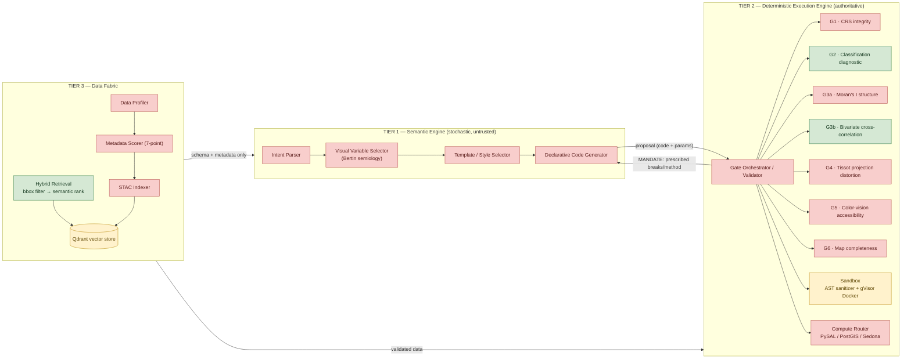
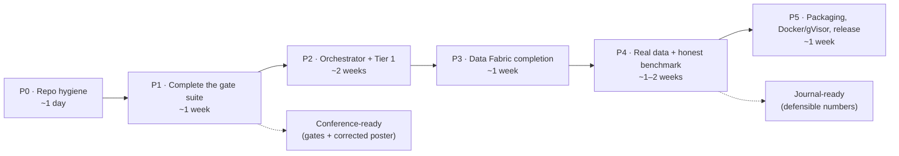

# AutoCarto-Agent (CartoLLM) — Engineering Operating Manual

**Version:** 1.0 · **Review date:** 2026-07-06 · **Reviewer:** Claude (Fable 5), acting as Principal Software Architect
**Audience:** the engineer (human + coding assistant) who will continue development. Written to be self-contained: you should be able to work productively from this document plus the repository, with no other context.
**Companion document:** [02_CONFERENCE_PRESENTATION_GUIDE.md](02_CONFERENCE_PRESENTATION_GUIDE.md) (STDS presentation).

---

## 0. Executive summary — read this first

AutoCarto-Agent is a research prototype for **autonomous thematic cartography**: a natural-language prompt goes in, a statistically validated thematic map comes out. The core idea — and the genuinely novel part — is the *inversion of authority*: the LLM is never trusted with a numerical decision. It proposes; a deterministic engine of algorithmic validation gates verifies, rejects, and **prescribes exact remedies** (break points, transforms, alternatives), reducing the LLM to a code assembler.

The honest state of the system, derived entirely from the repository:

| Dimension | State |
|---|---|
| **Architecture designed** | 3 tiers, 7 gates (G1, G2, G3a, G3b, G4, G5, G6), orchestrator, sandbox, compute router, data fabric — described in `Abstract_revised.txt` and `Codes/Repository Structure.txt` |
| **Architecture implemented** | **4 modules**: Gate 2, Gate 3b, hybrid retrieval, sandbox — roughly **15–20% of the designed system** |
| **Code quality** | Original `Codes/` had 20 defects (2 blockers, 3 security, rest correctness/robustness); all fixed in `output/codes_patched/`, which is the **canonical code** going forward |
| **Reproducibility** | Excellent where it exists: demo re-run on 2026-07-06 produced **byte-identical statistical traces**; the Atlanta figure pipeline reproduced I_xy=+0.3262, p=0.0050, ρ=+0.9471 exactly |
| **Test suite** | **None.** The 782-line `demo.py` harness is the only executable verification |
| **Packaging / infra** | No git repo, no `pyproject.toml`, no Dockerfile, no CI. `environment.yml` had a nonexistent package (fixed in `environment_fixed.yml`) |
| **Claim integrity** | Three abstract/poster claims are **not reproducible from the repo**: "23% of proposals rejected", "34 s end-to-end", and the poster's "GVF … 0.894" (see §7.3 — the correct values, computed during this review, are **0.835/0.861**) |

**The single most important thing to understand:** this project's scientific contribution (the diagnostic→prescriptive gate pattern, Gate 2 + Gate 3b) is real, implemented, and reproducible. Everything around it — the LLM tier, five of seven gates, the orchestrator — is currently *architecture on paper*. The roadmap in §11 is ordered so that every phase keeps the system in a demonstrable state.

> **⚠ Status update — 2026-07-26, read this before trusting the table above.** The table describes the state on the 2026-07-06 review date. Since then, Phase 0 of §11's roadmap has been executed (commits `86faa1a`..`8e619a2`); the table's cells for **Test suite** and **Packaging/infra** are now out of date:
> - **Test suite:** no longer "None" — **67 tests** exist (`tests/`), covering gate behavior, retrieval, sandbox, figure-claim regression, and — the crown jewel — determinism (two demo runs byte-identical) and golden-parity against the committed traces. Run with `pytest`.
> - **Packaging/infra:** no longer "no git repo, no pyproject.toml, no Dockerfile, no CI." A git repo now exists (tagged `poster-2026`), `pyproject.toml` installs the package (`pip install -e .`) with an `autocarto` console script, and `.github/workflows/ci.yml` is authored (Linux+Windows × py3.12/3.14). **Still true:** no Dockerfile exists anywhere, and — because no git remote is configured — the CI workflow has **never actually executed**; its correctness is verified only by running the equivalent commands locally (§9 TD-13).
> - **Claim integrity:** the poster's GVF line is corrected (0.835/0.861, as this table already states) and is now baked into the regenerated figures and poster copy. "23% of proposals rejected" has been *replaced*, not merely flagged: `autocarto benchmark` produces a real, regenerable, ground-truth-scored number (95.2% strict decision accuracy, 20/21, with the one miss disclosed) — see [06_POSTER_COPY.md](06_POSTER_COPY.md) §5 Block B. "34 s end-to-end" remains unaddressed — still drop it, no benchmark has measured LLM-inclusive latency because no LLM tier exists yet.
> - **Architecture implemented** and the 15–20% figure are unchanged — V1 was a packaging/testing/figures/benchmark pass, not new gate implementation. Do not read this update as "more gates exist now."
> Full detail: §9's technical-debt register carries a per-item resolved/open status as of the same date; §1.3's run instructions are updated to the current package commands.

---

## 1. Repository orientation

### 1.1 Actual layout (as of this review)

```
CartoLLM/
├── Abstract - Old.txt              # v1 abstract (GPT-4o, WASM, 243 tracts)
├── Abstract.txt                    # v2
├── Abstract_revised.txt            # v3 — AUTHORITATIVE (530 tracts, permutation test, ST_Intersects)
├── Poster.jpg                      # 21600×16200 CMYK print poster (STDS 2026)
├── Codes/                          # ORIGINAL source — frozen, do not extend
│   ├── environment.yml             # conda env (contains broken pin, see §9)
│   ├── gate2_classification.py     # Gate 2 (original, superseded)
│   ├── gate3b_bivariate_correlation.py
│   ├── hybrid_retrieval.py
│   ├── sandbox.py
│   └── Repository Structure.txt    # ASPIRATIONAL layout — mostly not implemented
├── output/                         # Artifacts of the first review/patch cycle
│   ├── CHANGES.md                  # All 20 patches, with severity + rationale — READ THIS
│   ├── README.md                   # How to re-run the demo
│   ├── RUN_SUMMARY.json            # Machine-readable results of the demo run
│   ├── codes_patched/              # CANONICAL CODE — start all new work from here
│   │   ├── gate2_classification.py         (500 lines)
│   │   ├── gate3b_bivariate_correlation.py (245 lines)
│   │   ├── hybrid_retrieval.py             (335 lines)
│   │   ├── sandbox.py                      (534 lines)
│   │   ├── demo.py                         (782 lines — harness + mocks)
│   │   └── environment_fixed.yml
│   ├── figures/                    # Rendered figures + generator scripts
│   │   ├── gen_architecture_diagram.py     # 3-tier poster diagram
│   │   ├── gen_results_panel.py            # Atlanta 4-panel (downloads TIGER live!)
│   │   ├── architecture_boundary.png/.pdf
│   │   ├── atlanta_results_panel_publication.png/.pdf/.svg
│   │   ├── gate2_distribution_diagnostics.png
│   │   ├── gate3b_bivariate_scenarios.png
│   │   └── gate3b_bivariate_map_approve.png
│   ├── traces/                     # JSON execution traces (deterministic)
│   └── logs/run.log
└── Fable Review/                   # This review (you are here)
```

### 1.2 Which code is canonical

**`output/codes_patched/` is the codebase.** `Codes/` is the frozen original kept for provenance. The patched copy fixes 2 blockers (Windows crash, self-sabotaging timeout wrapper), 3 security holes (reflection escape, `open()` keyword bypass, production `exec()` fallback), and 15 correctness/robustness defects. Every patch is documented with rationale in [output/CHANGES.md](../output/CHANGES.md). Do not "fix" anything in `Codes/`; promote the patched copy into a proper package (§11, Phase 0) and delete ambiguity.

### 1.3 How to run what exists today

```bash
# The only interpreter on this machine with the full stack is:
#   C:\Users\abdul\AppData\Local\Python\bin\python.exe   (Python 3.14.3)
# ("python" on PATH is 3.12 without scipy — will fail.)

# V1 update (2026-07): the code is now an installable package. `pip install -e .`
# once, then use the CLI below. The pre-V1 paths (output/codes_patched/demo.py,
# output/figures/gen_results_panel.py invoked directly) still exist and still
# work, but are frozen review artifacts — use the package for anything new.

pip install -e .
autocarto demo                        # or: python -m autocarto.demo
# → regenerates output/figures/gate2*, gate3b*, output/traces/*, logs/run.log
# → fully offline, no API keys, no Docker required. The line the tool prints,
#   "Total wall-clock: ... ms", is the deterministic core's own timer and has
#   stayed under ~2.7 s across every run tested. That is NOT the same as total
#   command latency: Python/NumPy/SciPy/Matplotlib interpreter startup adds a
#   further 3–5 s on this machine, measured stopwatch-to-stopwatch. State the
#   core-computation number, never an unqualified "the command takes <Xs".

python scripts/gen_results_panel.py
# → regenerates the Atlanta 4-panel figure from the PINNED snapshot in data/
#   (TD-7 fixed: no live network call by default). Pass --live to re-query
#   tigerweb.geo.census.gov instead.
```

Verified during this review (2026-07-06): a fresh `demo.py` run in an isolated directory produced `gate2_classification_trace.json` and `gate3b_bivariate_trace.json` **byte-identical** to the committed ones; `hybrid_retrieval_trace.json` and `sandbox_trace.json` differed *only* in wall-clock timing fields. This is a strong, demonstrable reproducibility property — protect it with the determinism test in §12.4.

---

## 2. What the system claims to be (research context)

`Abstract_revised.txt` (authoritative) makes these claims. This table is the contract the code must eventually honor — each row is tracked in the gap matrix (§7).

| # | Claim | Category |
|---|---|---|
| C1 | Propose-Verify-Execute triad; zero statistical-authority leakage from stochastic to deterministic layer | Architecture |
| C2 | Tier 1: frozen LLM checkpoint, temperature 0, reasons only about cartographic concepts, never sees raw data values | Architecture |
| C3 | Tier 2 (DEE): all generated code runs in air-gapped, gVisor-isolated sandbox | Security |
| C4 | Six validation gates (G1 CRS, G2 classification-diagnostic, G3a Moran's I, G3b bivariate, G4 Tissot distortion, G5 CVD/WCAG, G6 completeness) | Validation |
| C5 | Deterministic stylesheet injection of curated `.mplstyle` templates at render time | Rendering |
| C6 | Tiered compute backend: PySAL <10k features, PostGIS+GiST to 1M, Apache Sedona national scale; Visvalingam-Whyatt topology-preserving simplification | Scale |
| C7 | Data Fabric: bbox filter on Qdrant **before** semantic ranking; exact ST_Intersects refinement in Tier 2 | Retrieval |
| C8 | Atlanta case: 530 tracts, real TIGER geometry, SAR synthetic variables, I_xy=0.326 (p=0.005, 199 perms), ρ=0.947 | Results |
| C9 | "Validation suite rejected 23% of initial LLM proposals across the full benchmark" | Results |
| C10 | "100% of attempted sandbox escapes via reflection or dunder traversal blocked at AST layer" | Results |
| C11 | Pinned conda env; frozen LLM checkpoint; fixed seed; JSON trace of every proposal/rejection/revision; pip-installable package; Docker deployment | Reproducibility |

**Earlier-version deltas worth knowing:** v1 (`Abstract - Old.txt`) named GPT-4o and a WebAssembly sandbox and reported "243 census tracts / 34 seconds"; v3 switched to 530 tracts, added the 199-permutation test, the ST_Intersects refinement, and the `.mplstyle` audit language. The "34 seconds / 90% LLM latency" figure survives only in v1/v2 — **do not reintroduce it without a benchmark** (§7.3).

---

## 3. Architecture as designed

### 3.1 Three-tier component view

Color legend: green = implemented & verified, amber = partial/untested, red = missing (does not exist in any file).



The dashed vertical line on the poster ("the LLM reasons about concepts; it never consumes raw data values") is the **authority boundary**. Two invariants define it:

1. **Data direction:** raw values flow only into Tier 2. Tier 1 receives schemas, metadata, diagnoses, and prescriptions — never arrays.
2. **Decision direction:** every numeric decision (breaks, projection, tolerance, palette contrast) is either *computed* by Tier 2 or *vetoed* by Tier 2. Tier 1's degrees of freedom are template choice and code assembly under mandate.

When you implement the orchestrator (Phase 2), these two invariants should be enforced structurally (types/serialization), not by convention — see §8.2.

### 3.2 The Propose-Verify-Execute loop (target behavior)

```mermaid
sequenceDiagram
    autonumber
    participant U as User
    participant L as Tier 1 LLM<br/>(missing)
    participant O as Orchestrator<br/>(missing)
    participant D as Data Fabric<br/>(partial)
    participant G as Gates<br/>(2 of 7 exist)
    participant S as Sandbox<br/>(sanitizer verified)

    U->>L: "Map asthma vs canopy loss in Atlanta"
    L->>O: MapProposal JSON (map type, variables, method, projection, palette, code)
    O->>D: retrieve(geometry, query)
    D-->>O: candidate datasets (bbox-filtered, then semantically ranked)
    Note over D,O: schema + metadata to LLM; raw data stays in Tier 2
    O->>G: run gate suite against proposal + data
    alt gate rejects
        G-->>O: REJECT + prescription (exact breaks, mandated method)
        O->>L: mandate — assemble code with prescribed constants
        L->>O: revised code
        Note over O: max 3 iterations, then HITL escape hatch
    end
    O->>S: sanitize + execute approved code (no network, read-only FS)
    S-->>O: figure bytes + stdout + telemetry
    O-->>U: map + machine-readable JSON trace
```

Today, `demo.py` plays the roles of L and O with hard-coded proposals. That is a legitimate research scaffold (it isolates the deterministic layer for study) but it must be replaced by real components before any "autonomous" claim is defensible end-to-end (§11 Phase 2).

---

## 4. What actually exists — implementation inventory

All paths below refer to **`output/codes_patched/`** (canonical).

### 4.1 `gate2_classification.py` — the core contribution (500 lines)

The Classification Diagnostic Engine. Not a binary pass/fail gate: it profiles the distribution, diagnoses it into one of six regimes, and on rejection returns a **prescription** — the mandated method, the exact break values, and a code snippet the LLM must splice in verbatim.

**Public API:**

```python
DistributionProfile.from_array(x: np.ndarray, random_state: int = 0) -> DistributionProfile
    # n, n_unique, min/max/mean/median/std, skewness, kurtosis, zero_fraction,
    # outlier_fraction (IQR fences), shapiro_w/p (seeded 5000-subsample), iqr

class ClassificationDiagnosticEngine:
    GVF_THRESHOLD = 0.6; ZERO_INFLATION_THRESHOLD = 0.40
    OUTLIER_THRESHOLD = 0.10; DISCRETE_THRESHOLD = 10; MAX_ITERATIONS = 3
    def __init__(self, random_state: int = 0)
    def evaluate(values, proposed_method: str, proposed_breaks: list[float] | None = None) -> DiagnosticResult
    def reset()                       # caller must call between variables (§9 TD-10)
    @staticmethod _compute_gvf(values, breaks) -> float

_dedupe_breaks(breaks: list[float]) -> list[float]     # module-level helper
characterize_distribution(values, random_state=0)      # standalone profiler
```

**Diagnosis → prescription table (the heart of the system):**

| Diagnosis | Trigger | Prescription |
|---|---|---|
| `discrete_ordinal` | ≤10 unique values | unique-value classification |
| `zero_inflated` | ≥40% zeros | explicit break at 0 + Fisher-Jenks on the nonzero tail |
| `outlier_dominated` | >10% IQR outliers | head-tail breaks (capped at 64 iterations) |
| `heavy_right_skew` | skew>1.5 ∧ Shapiro p<0.01, min≥0 | log1p transform + Jenks, back-transformed breaks |
| `heavy_right_skew`, min<0 | as above with negatives | **arcsinh transform** + Jenks (log invalid for negatives) |
| `insufficient_variance` | std<1e-10 | single class + annotation |
| `well_behaved` + GVF<0.6 | fit failure | quantile-break fallback (always actionable) |

Note the diagnosis **order** in `_diagnose` matters: discrete → zero-inflated → outlier → skew. A zero-inflated variable is also skewed; the order encodes clinical precedence. Document this in tests (§12.1) so nobody "simplifies" it.

**Known limits (carry into Phase 1 work):** Shapiro-Wilk is meaningless for n>5000 even subsampled (everything rejects normality at scale) — the skew guard `g1>1.5` does the real work; GVF is computed on `np.digitize(..., right=True)` semantics, so breaks must be right-inclusive everywhere downstream or classes will be off by one at boundaries.

### 4.2 `gate3b_bivariate_correlation.py` (245 lines)

Bivariate map gate: computes bivariate Moran's I_xy (with a real 199-permutation pseudo p-value, permuting y only) and Spearman's ρ, then applies a three-tier decision:

| Decision | Condition | Consequence |
|---|---|---|
| APPROVE | \|I_xy\|>0.15 ∧ \|ρ\|>0.20 | bivariate encoding unlocked |
| WARN | \|I_xy\|>0.08 ∧ \|ρ\|>0.10 | allowed with mandatory interpretive annotation |
| REJECT | otherwise | **mandated alternative:** side-by-side univariate maps |

```python
BivariateCorrelationGate().evaluate(
    x, y, weights_matrix,             # W must be row-standardized — hard ValueError otherwise
    standardized: bool = False,       # patched default; raw variables are the norm
    permutations: int = 199, random_state: int = 0,
) -> BivariateCorrelationResult      # .decision, .instruction, all floats JSON-safe
```

The row-standardization contract check (`np.allclose(row_sums, 1.0, atol=1e-6)` → `ValueError` with the correction formula) is the right pattern: **silent statistical corruption converted into a loud contract violation.** Reuse this pattern in every new gate.

**Known limits:** the permutation test permutes y under a free-permutation null, which ignores the spatial autocorrelation of y itself — inflates significance for two strongly autocorrelated but causally unrelated fields. A conditional/toroidal-shift null or Lee's L statistic is the rigorous upgrade (flagged for Q&A in the presentation guide; optional research task R-2 in §11).

### 4.3 `hybrid_retrieval.py` (335 lines)

Two-stage retrieval enforcing *spatial-first* semantics: Stage 1 is a deterministic bbox intersection filter on Qdrant payload indexes (with **antimeridian splitting** into east/west shards, OR-unioned); Stage 2 is vector search restricted to Stage-1 survivors via `HasIdCondition`.

```python
HybridRetrieval(qdrant_client, embedding_model="text-embedding-3-small",
                embedder: Callable[[str], list[float]] | None = None)
    .retrieve(target_geometry: GeoJSON, query_text: str, top_k=5) -> RetrievalResult
_hash_embedding(text, dim=1536, seed=0)   # deterministic SHA-256 fallback embedder
```

Handles Polygon / MultiPolygon (all rings) / Point. Qdrant imports degrade gracefully to plain-dict filters, so the module is testable with the in-memory `MockQdrantClient` from `demo.py` without any server.

**What this module is NOT yet:** it never talks to a real Qdrant, never uses a real embedding model, and the abstract's exact `ST_Intersects` refinement (C7) does not exist anywhere. Bbox overlap is necessary, not sufficient — a diagonal-shaped dataset can pass the envelope test without touching the AOI. Phase 3 closes this.

### 4.4 `sandbox.py` (534 lines)

Two layers:

1. **`CodeSanitizer`** (static analysis, verified working): strips string literals/comments first (so a docstring mentioning "subprocess" no longer false-positives), then regex-scans for blocked patterns, then AST-walks for (a) non-whitelisted imports, (b) dangerous dunder attribute access (`__class__`, `__mro__`, `__subclasses__`, `__globals__`, 15-entry `DANGEROUS_ATTRIBUTES` set), (c) `getattr(x, '__class__')`-style reflection, (d) `open()` with any write-capable mode, positional **or** keyword.
2. **Executors:** `SandboxExecutor(backend="docker", style=None)` — the production class; refuses `backend="inprocess"` with `RuntimeError` at construction. The Docker path shells out to `docker run --runtime=runsc --network=none --memory=512m --read-only --cap-drop=ALL …`. `_DevOnlySandboxExecutor` is the explicitly named dev-only subclass that runs sanitized code in-process with a threading timeout and restricted builtins.

**Verified:** 7/7 sanitizer cases behave as designed (safe numpy passes, subprocess/eval/open-write/reflection blocked, docstring false-positive fixed), plus the `inprocess` guard raises. **Not verified:** the entire Docker/gVisor path — no Docker on the dev machine; the `autocarto-sandbox:latest` image referenced by the command **does not exist anywhere in the repo** (no Dockerfile). Treat C3 as unimplemented until Phase 5 (§11).

### 4.5 `demo.py` (782 lines) — the executable specification

Deterministic harness exercising all four modules: five Gate-2 distribution cases; three Gate-3b SAR scenarios on a 16×16 queen-contiguity grid (APPROVE/WARN/REJECT); three retrieval queries against a mock STAC catalog incl. the Aleutian antimeridian case; eight sandbox cases. Seeds: `default_rng(42)` for data, `random_state=0` in engines, `random_state=7` for Gate-3b permutations. Emits per-module JSON traces + figures + `run.log`.

Treat `demo.py` as the **behavioral spec**: when you refactor into a package, its cases become the seed of the pytest suite (§12.1) and its mocks (`MockQdrantClient`) move into `tests/fixtures/`.

### 4.6 Figure generators (`output/figures/`)

- `gen_architecture_diagram.py` — renders the 3-tier poster diagram (pure matplotlib, offline, deterministic).
- `gen_results_panel.py` — the Atlanta 4-panel. Downloads Fulton+DeKalb TIGER tracts **live**, builds queen weights via `libpysal`, draws seeded SAR variables (seeds 1001/1002/1003), runs the real Gate 2 + Gate 3b, renders maps + gate tables. Reproduced exactly during this review (530 tracts, I_xy=+0.3262, p=0.0050, ρ=+0.9471). Note `"gen_results_panel - Copy.py"` is a stale near-duplicate — delete it in Phase 0.

---

## 5. Verified ground truth (this review's measurements)

Everything in this section was executed on 2026-07-06 on the dev machine. These are the numbers you can defend without caveats.

| Measurement | Result |
|---|---|
| `demo.py` re-run, statistical traces | **byte-identical** to committed traces (gate2, gate3b); retrieval/sandbox identical except `*_time_ms` fields |
| `demo.py` wall clock | 2242 ms this run vs 845 ms committed — timing varies, values do not |
| Gate 3b grid scenarios | APPROVE I_xy=+0.476 (p=0.005) ρ=+0.940 · WARN I_xy=+0.116 · REJECT I_xy=−0.025 (p=0.580) |
| Sandbox suite | 8/8 as designed (incl. `inprocess` guard) |
| Atlanta pipeline re-run (ephemeral `uv` env, live TIGER) | 530 tracts; I_xy=+0.3262; p=0.0050; ρ=+0.9471; both variables `heavy_right_skew` → `log_transform_then_jenks` — **all match the poster** |
| **GVF of prescribed breaks (computed here, absent from repo)** | canopy **0.8348**, asthma **0.8607**; naive quintile baseline 0.7514 / 0.7741 |
| Environment | works only under `C:\Users\abdul\AppData\Local\Python\bin\python.exe` (3.14.3); `python` on PATH lacks scipy; `libpysal` import broken in main env (missing `requests`) — Atlanta verification required an ephemeral `uv` env |

The GVF row matters: the poster asserts "Raises GVF from failure to 0.894", but **no script in the repository computes GVF for the Atlanta variables**, and 0.894 appears only as the demo's unrelated `well_behaved` synthetic case (`RUN_SUMMARY.json`, gvf=0.8937). The correct, now-verified statement is: *"Gate-2 prescription raises GVF from 0.751→0.835 (canopy) and 0.774→0.861 (asthma) vs. a naive quintile proposal."* Fix the poster or drop the number — details and suggested wording in the presentation guide §[6.2].

---

## 6. Architectural assessment

### 6.1 Strengths (preserve these)

1. **The prescriptive-rejection pattern.** Gates don't just fail — they return the exact remedy (`prescribed_breaks`, `code_snippet`, `instruction`). This is what makes bounded-iteration convergence plausible with a weak LLM, and it is the paper's real contribution. Every future gate must honor this contract (see `GateResult` protocol, §11 P1-T1).
2. **Contract-enforcement over convention.** The row-standardization `ValueError` in Gate 3b converts silent statistical corruption into a visible failure. Generalize it.
3. **Determinism discipline.** Seeded RNG everywhere, `(M+1)/(R+1)` pseudo p-values, JSON-safe result objects, byte-identical traces across runs. Very few research prototypes have this; it is the reproducibility story for the conference.
4. **Spatial-first retrieval contract.** Filtering by geometry *before* semantic ranking is architecturally load-bearing (embeddings cannot veto space), and the antimeridian shard-splitting shows the contract survives contact with a genuinely hostile edge case.
5. **Honest layering of the sandbox.** Sanitizer (cheap, static) → container isolation (real boundary). The patch cycle removing the in-process `exec()` from production was the correct hard call.
6. **The demo harness as executable spec.** Mocked LLM + mocked Qdrant isolates the deterministic layer for study; every claim in `RUN_SUMMARY.json` is regenerable by one command.

### 6.2 Weaknesses / design flaws (fix in the indicated phase)

1. **No orchestrator exists** — the Propose-Verify-Execute loop, the system's namesake, lives only in prose and in `demo.py`'s hard-coding. *(Phase 2)*
2. **The authority boundary is not structurally enforced.** Nothing today *prevents* raw data reaching a future LLM prompt; the invariant exists only as intent. Enforce by construction: the only object serializable into LLM context should be a `SemanticContext` type that contains schemas/diagnoses/prescriptions and cannot hold arrays. *(Phase 2)*
3. **Stylesheet injection is string surgery.** `_inject_style` rewrites `import matplotlib.pyplot as plt` in user code — fragile (misses aliased imports, breaks on formatting). Correct design: the sandbox runner applies `plt.style.use(...)` itself before executing user code; the code never controls style. Also: the five curated `.mplstyle` files (C5) do not exist. *(Phase 1/5)*
4. **Gate thresholds are constants without provenance.** GVF 0.6, zero-inflation 0.40, |I|>0.15/ρ>0.20, the 20% Tissot threshold (C4) — none has a cited calibration. A reviewer will ask (presentation guide Q7). Centralize thresholds into a versioned config with a documented rationale per value; add a sensitivity-sweep script. *(Phase 1 + research task R-1)*
5. **Gate-3b null model is permissive** (free permutation ignores y's own autocorrelation — see §4.2). *(Research task R-2)*
6. **`iteration_count` statefulness** in Gate 2 makes the engine single-use-per-variable by convention (`reset()` easy to forget). Make `evaluate` pure and pass iteration explicitly in the orchestrator. *(Phase 2)*
7. **Two code copies, no VCS.** `Codes/` vs `output/codes_patched/` will drift the first time anyone edits carelessly. *(Phase 0 — do this first, today)*
8. **Windows-dev / Unix-prod mismatch.** Dev machine can't run Docker/gVisor path; `resource`-based memory caps don't exist on Windows; path handling was already the source of blocker S1/S5. CI on Linux (Phase 0) is the mitigation.
9. **The figure pipeline depends on a live federal API.** `gen_results_panel.py` re-downloads TIGER geometry every run; reproduction worked today, but the result is hostage to service availability and silent boundary revisions. Snapshot the GeoJSON into `data/` with a checksum. *(Phase 0, one hour, do it before the conference)*
10. **`environment.yml` was never installable** (`visvalingam-whyatt==0.2.1` doesn't exist on PyPI; fixed only in `environment_fixed.yml`) — and the poster footer says Python 3.14/GeoPandas 1.1.3 while the env pins 3.11/0.14.4. One environment, one truth. *(Phase 0)*

---

## 7. Gap analysis — claim vs. code

Status legend: ✅ implemented+verified · 🟡 partial · ❌ missing · ⚠️ claim not reproducible from repo.

| Claim | Component | Status | Evidence |
|---|---|---|---|
| C1 Propose-Verify-Execute triad | orchestrator | ❌ | no `validator.py`/loop anywhere; `demo.py` hard-codes proposals |
| C2 Tier 1 semantic engine | intent parser, VV selector, template selector, codegen, any LLM call | ❌ | zero LLM-related code in repo; no API client, no prompts |
| C3 gVisor air-gapped execution | `sandbox.py` docker path | 🟡 | command assembled but never run; **no Dockerfile**; image `autocarto-sandbox:latest` unbuilt |
| C3′ AST sanitization layer | `CodeSanitizer` | ✅ | 8/8 cases, re-verified 2026-07-06 |
| C4 Gate 1 (CRS) | — | ❌ | not in repo |
| C4 Gate 2 | `gate2_classification.py` | ✅ | 5 diagnosis regimes verified; byte-identical traces |
| C4 Gate 3a (univariate Moran's I) | — | ❌ | only bivariate exists; univariate \|I\|<0.1 rejection unimplemented |
| C4 Gate 3b | `gate3b_bivariate_correlation.py` | ✅ | 3 scenarios verified incl. permutation p |
| C4 Gates 4/5/6 (Tissot, CVD/WCAG, completeness) | — | ❌ | not in repo (colour libs are pinned in env but never imported) |
| C5 Curated `.mplstyle` library + injection | `styles/` | ❌ | no style files; injection is fragile string replace |
| C6 Tiered compute router, V-W simplification | `compute_router.py` | ❌ | `visvalingamwyatt` pinned but never imported; no PostGIS/Sedona code |
| C7 bbox-first hybrid retrieval | `hybrid_retrieval.py` | ✅ | mock-verified incl. antimeridian |
| C7′ ST_Intersects exact refinement | — | ❌ | envelope test only |
| C7″ Metadata scorer (7-point TRUSTED/AUGMENT/REJECT), profiler | — | ❌ | `metadata_score` is a stored int in mocks; no scoring logic |
| C8 Atlanta 530-tract case | `gen_results_panel.py` | ✅ | reproduced exactly this review |
| C9 "23% of proposals rejected" | benchmark | ⚠️ | no benchmark harness, no corpus of prompts, no rejection ledger — number is untraceable |
| C10 "100% of escapes blocked" | sandbox suite | 🟡 | true for the **7 attempted cases**; phrase implies exhaustiveness no blacklist can honestly claim — reword (presentation guide Q10) |
| C11 pip package, Docker, pinned env | packaging | ❌ | no `pyproject.toml`, no Dockerfile, env pin was broken |
| Poster: "GVF … 0.894" | — | ⚠️ | not computed anywhere; correct values 0.835/0.861 (§5) |

**Bottom line:** 5 of 21 rows are ✅. The ✅ set happens to contain the intellectually novel components — which is why the honest framing ("reference architecture + validated core gates", not "completed system") both protects you and still gives you a strong paper. The presentation guide operationalizes this framing.

---

## 8. Target architecture for the production system

### 8.1 Package layout (Phase 0 end-state)

Adopt the layout `Codes/Repository Structure.txt` already promises, with corrections learned since it was written:

```
autocarto-agent/
├── pyproject.toml            # pip-installable; console script `autocarto`
├── environment.yml           # single env truth (from environment_fixed.yml)
├── Dockerfile.sandbox        # builds autocarto-sandbox image (Phase 5)
├── data/
│   └── atlanta_tracts_2026-05.geojson   # TIGER snapshot + SHA-256 in data/MANIFEST
├── src/autocarto/
│   ├── config.py             # ALL thresholds live here, versioned (§6.2-4)
│   ├── contracts.py          # GateResult protocol, MapProposal, SemanticContext
│   ├── semantic/             # Tier 1 (Phase 2): intent.py, codegen.py, llm_client.py
│   ├── execution/
│   │   ├── orchestrator.py   # Propose-Verify-Execute loop (Phase 2)
│   │   ├── sandbox.py        # from codes_patched, _DevOnly* moved to tests/
│   │   └── gates/            # gate1_crs.py … gate6_completeness.py
│   ├── data_fabric/          # hybrid_retrieval.py, stac_indexer.py, metadata_scorer.py, profiler.py
│   └── styles/               # 5 curated .mplstyle files (Phase 1)
└── tests/                    # §12; fixtures include MockQdrantClient from demo.py
```

### 8.2 The two structural contracts to introduce (before any new gate)

```python
# contracts.py — target signatures, Phase 1 task P1-T1
@dataclass
class GateResult:                 # every gate returns this
    gate_id: str                  # "G1".."G6"
    passed: bool
    decision: Literal["PASS", "WARN", "REJECT"]
    prescription: Prescription | None    # REJECT ⇒ prescription is not None  ← enforced
    diagnostics: dict[str, float]        # JSON-safe, goes into the trace verbatim
    instruction: str | None

class SemanticContext(TypedDict):  # the ONLY object serialized into an LLM prompt
    dataset_schemas: list[FieldSchema]   # names, dtypes, units — never values
    diagnoses: list[str]
    prescriptions: list[Prescription]
    # constructor rejects ndarray/Series anywhere in the payload  ← the authority boundary, enforced
```

Gate 2 and Gate 3b already fit this shape with a thin adapter (`DiagnosticResult.to_dict()` / `BivariateCorrelationResult.to_dict()` are 90% of the way there). Do the adapter, don't rewrite the gates.

---

## 9. Technical debt register (prioritized)

Status column added 2026-07-26 after discovering this table had gone stale relative to the completed V1 build — a direct instance of the "docs must match reality" principle this whole review insists on. Rows are kept, not deleted, so the register remains a readable history.

| ID | Debt | Risk if ignored | Effort | Fix | Status |
|---|---|---|---|---|---|
| TD-1 | No git repository | silent drift between the two code copies; unrecoverable mistakes | 30 min | `git init`, commit originals then patched, tag `poster-2026` | ✅ **Resolved** — repo initialized, tagged |
| TD-2 | Two diverging code copies | edits land in the dead copy | 1 h | promote `codes_patched` → `src/autocarto/`; freeze `Codes/` | ✅ **Resolved** |
| TD-3 | No tests | any refactor is blind; claims decay silently | 2–3 d | §12; port `demo.py` cases to pytest first | ✅ **Resolved** — 67 tests, incl. golden-parity + determinism |
| TD-4 | ⚠️ claims C9/C10 + poster GVF | conference credibility; a reviewer *will* pull this thread | 0.5–2 d | fix poster numbers (0.835/0.861 verified); build P4 benchmark or excise "23%" | ✅ **Resolved for the poster** — GVF corrected, `autocarto benchmark` gives a defensible 95.2%/20/21 number (Poster Copy §5 Block B). C10's "100% of escapes blocked" wording still needs softening per Guide Q10 if reused verbatim. |
| TD-5 | No Dockerfile / gVisor never run | flagship security claim untestable | 1–2 d | Phase 5; CI smoke test with `runsc` | ❌ Open — confirmed again 2026-07-26, zero Dockerfile/gVisor artifacts anywhere |
| TD-6 | Broken/contradictory environments | "works on one machine" — literally true today (§5) | 2 h | single `environment.yml`; document interpreter; CI installs it fresh | ❌ **Still open — do not mark resolved.** `environment.yml` exists at root but pins python=3.11.8/geopandas=0.14.4/libpysal=4.9.2, none of which have ever been installed or tested; the actual verified stack is 3.14.3/1.1.3/4.14.1 (confirmed 2026-07-26). `pyproject.toml`'s loose `>=` bounds are fine for packaging but don't substitute for a reconciled lock file. |
| TD-7 | Live TIGER dependency in results figure | irreproducible poster figure the week the API changes | 1 h | snapshot GeoJSON + checksum into `data/` | ✅ **Resolved** — `data/atlanta_tracts_fulton_dekalb.geojson` + `MANIFEST.md`, hash re-verified 2026-07-26, script defaults to it |
| TD-8 | Thresholds uncalibrated & scattered | "arbitrary constants" review criticism | 1 d | `config.py` + rationale table + sensitivity sweep (R-1) | ❌ Open |
| TD-9 | Stylesheet string-replace injection | corrupted generated code; style silently absent | 2 h | runner-side `plt.style.use` (§6.2-3) | ❌ Open |
| TD-10 | Stateful `iteration_count` | cross-variable contamination when `reset()` forgotten | 1 h | orchestrator owns iteration; make `evaluate` pure | ❌ Open (no orchestrator exists yet — V2 scope) |
| TD-11 | `gen_results_panel - Copy.py`, 3 abstract versions, stray PNGs (`architecture_boundary 3.png`, ` 4.png`) | confusion about what's authoritative | 30 min | delete/archive in Phase 0 commit | ✅ **Resolved** — archived to `docs/history/` |
| TD-12 | `_geometry_to_bbox` shim + dict-fallback Qdrant filters | API ambiguity for new callers | 1 h | deprecate shim; type the filter layer | ❌ Open |

**New, found during this pass (2026-07-26) — add to the register:**

| ID | Debt | Risk if ignored | Effort | Fix | Status |
|---|---|---|---|---|---|
| TD-13 | CI workflow authored but never run (no git remote configured) | "CI passes" would be an unverified claim if stated to anyone external | 15 min | push to a remote, confirm one real green Actions run | ❌ Open |
| TD-14 | Demo/benchmark timing claims ("<3 s") did not distinguish the tool's internal timer (~1–2.7 s, confirmed) from total command latency including Python/library interpreter startup (3.5–6.1 s, measured 2026-07-26) | a live-demo audience member timing the whole command with a stopwatch would see the claim fail | 30 min (wording only; no code defect) | say "core validation <3 s" everywhere, never an unqualified command-latency number — fixed in Poster Copy §5/§9/§10 and Presentation Guide §6.1/§7/cheat-sheet this pass | ✅ **Resolved** (docs only) |
| TD-15 | Stray `ungated_vs_gated - Copy.pdf` in `output/figures/` (byte-identical duplicate, evidently a manual Explorer copy made during review) | repo clutter; a future contributor may not know which file is canonical | 5 min | delete the `- Copy` file (not done automatically — confirm with the repo owner first, since it wasn't created by this tooling) | ❌ Open, flagged not fixed |
| TD-16 | `architecture_boundary.png` carried a hardcoded banner ("23% initial proposal rejection rate · 100% sandbox escape prevention") that (a) repeated exactly the retired C9/C10-style claims TD-4 already addressed elsewhere and (b) overlapped and obscured the "TIER 2" zone title — found only because this pass re-rendered and visually inspected every figure, not just grepped document text | a completely different, unaudited image was making the same false claims this whole review exists to catch; would have gone to print unnoticed | 15 min | banner removed entirely in `scripts/gen_architecture_diagram.py` (2026-07-26) | ✅ **Resolved** |
| TD-17 | Minor label crowding in the same diagram: "Authority Boundary / LLM never receives raw data values" text sits close to "Mandatory corrective prescriptions" near G1 — legible but tight, not a false-claim issue | cosmetic only | 15–30 min | nudge one label's y-offset in `gen_architecture_diagram.py` | ❌ Open, flagged not fixed (out of scope for this pass — no incorrect claim involved) |

---

## 10. Security review — sandbox

**Threat model:** LLM-generated Python is untrusted input. Defense layers: (1) static sanitization, (2) runtime isolation, (3) resource caps.

**What is genuinely good:** string/comment stripping before regex scanning; AST-level import whitelist (parent-package aware); dunder-attribute blocklist covering the classic `().__class__.__mro__[1].__subclasses__()` walk **and** its `getattr` spelling; `open()` mode extraction from both positional and keyword args; production class that refuses to construct an in-process executor at all.

**Residual risks you must not paper over:**

1. **Blacklists are enumerable, not complete.** Bytecode-free escape variants keep being found (e.g., exception-object traversal `e.__traceback__.tb_frame.f_globals` — `__traceback__`, `tb_frame`, `f_globals` are *not* in `DANGEROUS_ATTRIBUTES`; walrus-smuggled dict rebinding; `vars()`/`type()` still reachable in dev builtins). The sanitizer is a *cost-raiser*, not a boundary. **The container is the boundary.** Never state otherwise in print (C10 wording).
2. **The boundary is unbuilt** (no image, no Dockerfile, gVisor never executed). Until Phase 5 lands, the only honest deployment mode is: sanitizer + `_DevOnlySandboxExecutor` + *trusted templates only* (i.e., LLM assembles from your own code snippets — which is in fact the current design).
3. **Denial-of-surface remains:** 30 s timeout exists, but the dev executor's daemon thread cannot be killed (documented in CHANGES S1); memory caps are a no-op on Windows. Acceptable for dev only.
4. **Supply-chain of whitelisted imports:** `ALLOWED_IMPORTS` includes `contextily` (performs network tile fetches!) — contradiction with `--network=none` in prod, but an actual exfiltration channel in dev mode. **Action: remove `contextily` from the dev whitelist or stub it; keep it only inside the network-less container.**

**Phase-5 acceptance:** a red-team pytest module (`tests/security/test_escapes.py`) with ≥25 known escape vectors, all failing in the container *even when the sanitizer is bypassed deliberately*; plus `docker run` flags asserted by parsing (`--network=none`, `--cap-drop=ALL`, `--read-only`, `runsc`).

---

## 11. Roadmap

Phases are ordered so the system is demo-able after every phase. Effort assumes one engineer pairing with a coding assistant. Tasks are deliberately sized ≤½ day each for lower-capacity-model execution (§14).



### Phase 0 — Repo hygiene (do immediately; ~1 day) — ✅ DONE (see §0 note below)
- **P0-T1** ✅ `git init`; commit `Codes/` as originals, then `output/` state, tag `poster-2026`. *(TD-1 resolved)*
- **P0-T2** ✅ `src/autocarto/` package created from `codes_patched` (layout §8.1), `pyproject.toml` (loose `>=` bounds, not exact pins — see TD-6 note); `pip install -e .` works, `autocarto` console script live. *(TD-2 resolved; TD-6 partially — see below)*
- **P0-T3** ✅ Atlanta TIGER GeoJSON snapshotted to `data/`, SHA-256 in `data/MANIFEST.md`; `gen_results_panel.py` reads the snapshot by default, `--live` re-queries. *(TD-7 resolved)*
- **P0-T4** ✅ `gen_results_panel - Copy.py`, stray PNG variants, and old abstract drafts moved to `docs/history/`. *(TD-11 resolved)*
- **P0-T5** 🟡 `.github/workflows/ci.yml` authored (Linux+Windows × py3.12/3.14, `pip install -e .[dev]`, `pytest`, demo smoke run) and the equivalent commands verified green **locally** — but the repo has no remote configured, so **the workflow has never actually executed on GitHub Actions.** Push to a remote and confirm a real green run before trusting "CI passes" as a claim to anyone external.
- **Acceptance (met locally, not yet on CI):** fresh `pip install -e .` → `autocarto demo` run twice → statistical traces byte-identical (Manual §12.4, re-confirmed 2026-07-26). The Linux-CI half of this acceptance criterion is unverified until P0-T5's remote gap closes.

**Note (2026-07-26):** this phase was fully executed during the V1 build session (commits `86faa1a`..`8e619a2`). §9's debt-register rows for TD-1/2/3/7/11 below are annotated resolved rather than deleted, so the register stays a readable history rather than silently losing the record of what TD-4 (partially resolved: poster GVF fixed, "23%" replaced by the ground-truth benchmark) and TD-3 (67 tests now exist) also closed. TD-5, TD-6 (fully), TD-8, TD-9, TD-10, TD-12 remain genuinely open — do not mark those done without shipping the actual fix.

### Phase 1 — Complete the gate suite (~1 week)
- **P1-T1** `contracts.py`: `GateResult`, `Prescription`; adapters for G2/G3b (§8.2). Tests assert `REJECT ⇒ prescription is not None` for every gate.
- **P1-T2** **Gate 1 (CRS):** `gate1_crs.py` — `evaluate(gdf: GeoDataFrame, intended_map_type: str) -> GateResult`. Checks: CRS present & not mixed; geographic-CRS-used-for-area diagnosis; equal-area requirement for choropleth density variables. Pure `pyproj`/`geopandas`. ~½ day.
- **P1-T3** **Gate 3a (univariate Moran's I):** wrap `esda.Moran` (already pinned) with the |I|<0.1 → REJECT-choropleth rule + 999-permutation p; prescription = proportional-symbol alternative. Reuse Gate 3b's W validation. ~½ day.
- **P1-T4** **Gate 4 (projection distortion):** `gate4_projection.py` — sample k×k graticule over the AOI, compute areal distortion factor per Tissot (via `pyproj.Proj` local scale factors); REJECT if max areal exaggeration >20% for area-comparison maps; prescription = the AOI-appropriate equal-area CRS (e.g., state-plane / Albers lookup table). ~1 day, the trickiest math of the phase.
- **P1-T5** **Gate 5 (color accessibility):** simulate deuteranopia/protanopia/tritanopia via `colorspacious` (pinned, unused today); enforce min ΔE between adjacent classes under each simulation + WCAG contrast for text; REJECT with prescribed colorblind-safe palette (embed the proven 3×3 Stevens palette + ColorBrewer subset as data). ~1 day.
- **P1-T6** **Gate 6 (completeness):** declarative checklist over the render manifest (title, legend, scale bar or graticule, data citation, CRS note). Needs the render step to emit a manifest — coordinate with P2-T4. ~½ day.
- **P1-T7** The five `.mplstyle` files + runner-side injection (kill string surgery). ~½ day. *(TD-9, C5)*
- **P1-T8** `config.py`: every threshold with a `rationale:` docstring + `scripts/threshold_sensitivity.py` sweep plot. *(TD-8)*
- **Acceptance:** all 6 gates return `GateResult`; ≥85% branch coverage on `gates/`; demo extended with one PASS + one REJECT case per gate.

### Phase 2 — Orchestrator + Tier 1 (~2 weeks) — *this is where "agent" becomes true*
- **P2-T1** `MapProposal` schema (pydantic): map_type, variables, classification proposal, projection, palette, template id. JSON in/out.
- **P2-T2** `orchestrator.py`: `run(prompt) → MapResult` — retrieval → gates → mandate loop (≤3 iterations, then HITL per Gate-2's existing escape hatch) → sandbox → trace. Owns iteration counts *(TD-10)*. Works fully with a `MockLLM` (ported from demo) before any API key exists.
- **P2-T3** `llm_client.py`: thin provider-agnostic client (structured output, temperature 0, model+version recorded in trace). Prompt templates live in files, versioned. **`SemanticContext` is the only serializer** — the authority boundary becomes a type error, not a convention (§8.2).
- **P2-T4** Constrained code generator: LLM fills declarative slots in **your** audited render templates (per-map-type Python templates); the sandbox therefore executes template code + prescribed constants, never free-form LLM code. This single decision collapses most sandbox risk (§10) and makes G6's manifest trivial.
- **P2-T5** End-to-end trace format v1 (`traces/schema.json`): prompt, model id, every proposal, every GateResult, iterations, final code hash, artifact hashes. The abstract's C11 becomes checkable.
- **Acceptance:** `autocarto run "Map asthma vs canopy loss in Atlanta" --llm mock` produces a validated map + trace with zero network; same command with a real key produces the same *gate decisions* (trace diff tool proves it).

### Phase 3 — Data Fabric completion (~1 week)
- **P3-T1** `stac_indexer.py`: ingest a real STAC catalog (or static JSON export) into Qdrant with bbox payload indexes; antimeridian shard convention from H-fix R2-2 documented and enforced at index time.
- **P3-T2** Exact-geometry refinement: `shapely.STRtree`/`ST_Intersects` on Stage-1 candidates (C7′). Local shapely first; PostGIS variant behind the same interface later.
- **P3-T3** `metadata_scorer.py`: the 7-point rubric (title, description, variable names, units, temporal extent, license, lineage — 1 point each); TRUSTED ≥6 / AUGMENT 3–5 / REJECT <3, per old-abstract semantics; profiler samples 1000 rows for AUGMENT.
- **P3-T4** Real embedder adapter (OpenAI or local `sentence-transformers`) behind the existing `embedder=` injection point; hash fallback stays for tests/air-gap.
- **Acceptance:** retrieval integration test against a 50-item real-catalog fixture: bbox recall = 1.0 for 10 AOIs (including one antimeridian), envelope-only false positives removed by exact refinement, scorer buckets match hand-labeled fixtures.

### Phase 4 — Real data + honest benchmark (~1–2 weeks) — *unblocks claims C8/C9*
- **P4-T1** Data connectors: ACS (census API), CDC PLACES (CSV), with cached snapshots in `data/` — the Atlanta case re-run with **real variables** alongside the SAR synthetic (keep both: synthetic isolates the validator; real demonstrates utility).
- **P4-T2** Benchmark corpus: 50–100 natural-language prompts across choropleth / proportional-symbol / bivariate × easy/pathological variables. Stored as YAML with expected-gate-outcome labels.
- **P4-T3** Benchmark runner → `benchmark_report.json`: per-gate rejection rates, iteration counts, latency split (LLM vs compute), convergence rate. **This produces the real "23%" number — or replaces it.** Also produces the 34-s-style latency figure honestly.
- **P4-T4** Negative-control suite: prompts that *should* be refused (no spatial structure, CRS-less data, undocumented variables) — the system's refusals are the paper's best evidence.
- **Acceptance:** `autocarto benchmark` regenerates every quantitative claim in the abstract from scratch; abstract/poster numbers updated to match or claims removed.

### Phase 5 — Packaging & secured deployment (~1 week)
- **P5-T1** `Dockerfile.sandbox` (slim python + pinned geo stack, non-root, no shell) → `autocarto-sandbox:latest` actually exists.
- **P5-T2** gVisor CI job (Linux runner installs `runsc`): red-team suite (§10) runs *inside* the container; sanitizer-bypass variants must still fail.
- **P5-T3** Air-gapped mode: `AUTOCARTO_OFFLINE=1` forces mock LLM + local embedder + snapshot data; assert zero sockets via test harness.
- **P5-T4** Docs: architecture.md, validation_gates.md (one page per gate: statistic, threshold, rationale, prescription), quickstart. Release v0.2.0 to TestPyPI.
- **Acceptance:** production-readiness checklist §13 fully green.

### Research tasks (parallel, optional but high-value)
- **R-1** Threshold calibration study: sweep GVF/|I|/ρ thresholds over the benchmark corpus; publish the operating-characteristic curves. Converts §6.2-4 from weakness to contribution.
- **R-2** Gate-3b null-model upgrade: conditional permutation (or Lee's L); compare rejection behavior on the benchmark.
- **R-3** Human evaluation: n≥10 cartographers rate gated vs. ungated LLM maps blind. The strongest possible answer to "does the validation help?"

---

## 12. Testing strategy

Currently **zero tests**. Build in this order — each layer catches a different failure class:

### 12.1 Unit tests (port from `demo.py` first — they already pass)
- `tests/gates/test_gate2.py`: one test per diagnosis regime (the five demo distributions become fixtures with frozen seeds); GVF monotonicity (prescribed ≥ naive on skewed data — you have verified values 0.835>0.751 to assert against); `_dedupe_breaks` edge cases; diagnosis **order** (zero-inflated beats skew when both trigger — §4.1).
- `tests/gates/test_gate3b.py`: three SAR scenarios (assert exact I_xy/p under seed); W-validation `ValueError`; constant-variable REJECT; NaN-mask alignment of W subsetting.
- `tests/fabric/test_retrieval.py`: `MockQdrantClient` moves here; bbox truth table incl. antimeridian, Point, MultiPolygon-with-holes.
- `tests/sandbox/test_sanitizer.py`: the 8 demo cases + adversarial additions (`__traceback__` walk, `getattr` with variable attr name, unicode-escape smuggling).

### 12.2 Property-based tests (`hypothesis`)
- Gate 2 never crashes and always returns a *usable* prescription (breaks strictly monotonic, cover data range) for arbitrary finite float arrays, n≥4.
- GVF ∈ [0,1]; breaks dedup idempotent; classification covers every point exactly once under `right=True`.

### 12.3 Integration tests
- Orchestrator with MockLLM: scripted proposal sequences → assert convergence ≤3 iterations on prescriptions, HITL on the 4th.
- Full pipeline on the TIGER **snapshot** (no network in CI).

### 12.4 Determinism tests (the crown jewel — you already pass it, keep passing it)
- Run demo twice → statistical trace files byte-identical; timing fields excluded via canonicalization. Run on Linux **and** Windows CI to catch platform float drift early.

### 12.5 Security tests
- §10 red-team module; runs against sanitizer in every CI, against the gVisor container in the Phase-5 job.

---

## 13. Deployment & production-readiness checklist

| Item | Now | Target |
|---|---|---|
| Version control + tagged poster state | ❌ | P0 |
| One-command reproducible env (`pip install -e .` / conda) | ❌ (env broken on PATH python) | P0 |
| CI green on Linux+Windows | ❌ | P0 |
| Test coverage ≥80% on `gates/`, `sandbox` | ❌ (0%) | P1 |
| All 6 gates implemented | 2/6 (+G3a=7 planned) | P1 |
| Deterministic trace schema + diff tool | 🟡 (traces exist, no schema) | P2 |
| Secrets handling (LLM keys via env, never in trace) | n/a | P2 |
| Data snapshots with checksums | ❌ | P0/P4 |
| Sandbox image built + gVisor red-team pass | ❌ | P5 |
| Air-gapped mode proven (zero sockets) | 🟡 (demo is offline by construction) | P5 |
| Quantitative claims regenerable by one command | ❌ | P4 |
| Docs: per-gate rationale pages | ❌ | P5 |

---

## 14. Working with a lower-capacity coding model (Sonnet / GPT / Copilot)

This manual is written to be the *context anchor*. Practical rules that will save you weeks:

1. **One task card per session.** Feed the model: (a) the task card from §11, (b) §8.2 contracts, (c) the one or two existing modules it must imitate. Never "continue the roadmap".
2. **Gate 2 is the style guide.** Tell the model explicitly: *"Match the structure of `gate2_classification.py`: dataclass result with `to_dict()`, class-level thresholds, prescriptive rejection, seeded randomness, no I/O inside the gate."* Imitation of a strong local example beats abstract instructions.
3. **Tests first, from the spec tables.** The diagnosis table (§4.1) and decision matrix (§4.2) convert mechanically into pytest cases. Have the model write the tests, *you* eyeball them against the tables, then let it implement.
4. **Forbid drive-by edits.** Thresholds (`config.py`), `DANGEROUS_ATTRIBUTES`, `ALLOWED_IMPORTS`, and anything in `contracts.py` change only via a dedicated task with a written rationale — weaker models love to "tidy" load-bearing constants.
5. **Determinism review on every PR:** any `np.random.*` without an explicit `default_rng(seed)`, any `time`-dependent logic in a statistical path, any dict-ordering dependence in traces — reject.
6. **Keep the demo green.** `demo.py` (later `autocarto demo`) is the executable spec; a change that alters its statistical output is wrong until proven otherwise (then the traces are re-blessed in the same commit, explicitly).
7. **Windows/Unix**: no `signal.SIGALRM`, no `resource` assumptions, `pathlib` everywhere — this exact class of bug already cost one full patch cycle (CHANGES S1/S5).

---

## 15. Appendices

### 15.1 Threshold registry (current values + provenance status)

| Threshold | Value | Where | Provenance |
|---|---|---|---|
| GVF acceptance | ≥0.6 (0.8 "excellent") | Gate 2 | Jenks/GVF convention; uncalibrated for this system (R-1) |
| Zero-inflation trigger | ≥40% zeros | Gate 2 | heuristic, uncited |
| Outlier trigger | >10% beyond 1.5·IQR | Gate 2 | heuristic |
| Discrete-ordinal | ≤10 unique | Gate 2 | heuristic |
| Skew trigger | g1>1.5 ∧ Shapiro p<0.01 | Gate 2 | heuristic |
| Bivariate APPROVE | \|I_xy\|>0.15 ∧ \|ρ\|>0.20 | Gate 3b | "calibrated for census-tract-scale data" per docstring — no study in repo |
| Bivariate WARN | \|I_xy\|>0.08 ∧ \|ρ\|>0.10 | Gate 3b | as above |
| Univariate Moran's I floor | \|I\|<0.1 rejects choropleth | abstract (G3a unimplemented) | uncited |
| Tissot areal distortion | ≤20% | abstract (G4 unimplemented) | uncited |
| Permutations / seed | 199 / seed 0 (demo uses 7) | Gate 3b | (M+1)/(R+1) convention ✔ |
| Sandbox | 30 s, 512 MB, whitelist of 24 modules | sandbox.py | engineering judgment |
| Iteration cap | 3, then HITL | Gate 2 | design choice ✔ |

### 15.2 Module quick reference

See §4 for signatures. Import paths today: `sys.path`-based from `output/codes_patched/`; after P0-T2: `from autocarto.execution.gates.gate2 import ClassificationDiagnosticEngine`, etc.

### 15.3 Glossary (GIS/carto terms for the incoming engineer)

- **Choropleth** — map shading areas by a statistic; requires meaningful areal units and (arguably) spatial structure.
- **Bivariate choropleth** — two variables on one 3×3 (or n×n) blended color grid; cognitively expensive, hence Gate 3b.
- **Classification breaks** — cut points binning a continuous variable into map classes; the map's message is mostly *made* here, which is why Gate 2 is the core gate.
- **Jenks / Fisher-Jenks** — optimal-breaks algorithm minimizing within-class variance (maximizing GVF).
- **GVF (Goodness of Variance Fit)** — 1 − Σ within-class variance / total variance; 1.0 = perfect.
- **Head-tail breaks** — classification for heavy-tailed data: recursively split at the mean.
- **arcsinh transform** — log-like transform defined for negatives/zero; used when log1p is invalid.
- **Moran's I** — global spatial autocorrelation statistic (≈ spatial analog of a correlation coefficient); ~0 means no spatial structure → a choropleth would show noise.
- **Bivariate Moran's I (I_xy)** — cross-variable spatial correlation: does x here predict y nearby?
- **Queen contiguity** — polygons are neighbors if they share any boundary point (vs. rook: an edge).
- **Row-standardized W** — spatial weights matrix with each row summing to 1; required by the Moran's estimators used here.
- **SAR (spatial autoregressive) draw** — synthetic field y=(I−ρW)⁻¹ε with controllable spatial structure; how the Atlanta variables were generated.
- **MAUP** — Modifiable Areal Unit Problem: statistics change when you change the zoning; why H3 hexagons are restricted to point/raster data in the design.
- **Tissot indicatrix** — measure of local projection distortion (a circle on the globe maps to an ellipse).
- **CVD simulation** — rendering colors as seen with deuteranopia/protanopia/tritanopia; Gate 5's basis.
- **Bertin's visual variables** — the classic vocabulary (position, size, value, hue, …) constraining Tier 1's choices.
- **Visvalingam-Whyatt** — polygon simplification by removing least-area-effective vertices; better shape retention than Douglas-Peucker for administrative boundaries.
- **STAC** — SpatioTemporal Asset Catalog, the metadata standard the Data Fabric indexes.
- **GiST** — PostGIS spatial index type; enables the 1M-feature tier of the compute router.
- **gVisor / runsc** — user-space kernel sandboxing untrusted code inside containers.

---

*End of Operating Manual. The presentation companion is [02_CONFERENCE_PRESENTATION_GUIDE.md](02_CONFERENCE_PRESENTATION_GUIDE.md).*
