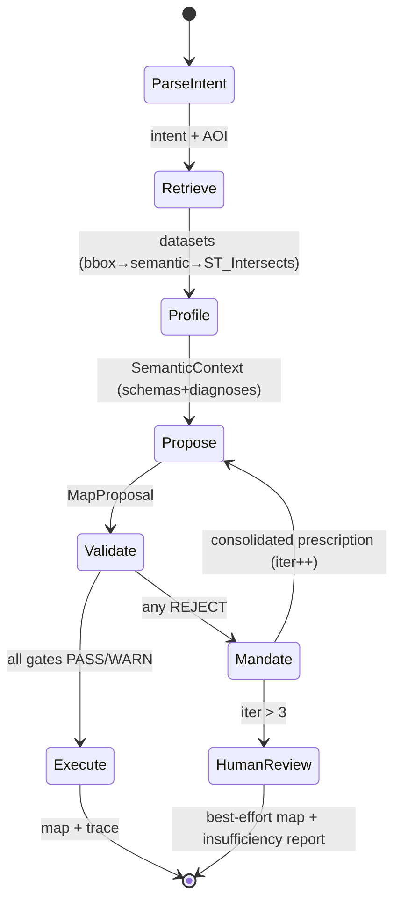

# AutoCarto-Agent — V2 Production Blueprint

**The engineering specification for the full autonomous agent.** This is the future-scope companion to [01_OPERATING_MANUAL.md](01_OPERATING_MANUAL.md). The Manual describes what exists and a phased roadmap; this document is the *target design* — the thing you build after the conference, for the journal paper and for a deployable system. Written to be executable by a lower-capacity coding model paired with a human architect (§ every component has interfaces, invariants, and acceptance tests).

**Version:** 2.0 · **Date:** 2026-07-06 · **Status:** design spec, not yet implemented.

---

## 0. First: do you need any of this for the conference? (The honest answer)

**No. Building the full agent before STDS is overkill, and switching to real data does not strengthen your core claim.** Here is the reasoning, then the small list of things that *are* worth doing.

### 0.1 Why full implementation is not required for a poster

| Consideration | Verdict |
|---|---|
| **Submission type** | Poster. Posters are judged on *idea novelty, clarity, and a credible proof-of-concept* — not production completeness. You already have the proof-of-concept, and it reproduces byte-identically. |
| **Where the novelty lives** | The contribution is the **prescriptive-rejection gate pattern** and **authority-separation architecture** — both already implemented (Gate 2, Gate 3b) and demonstrable. Adding Gates 1/4/5/6 makes the *suite* complete but adds no new idea. |
| **Synthetic vs. real data** | Counter-intuitively, **synthetic SAR variables on real geometry are the *better* choice for the poster's claim.** Your claim is "the validator decides correctly." To prove that, you need *known ground truth* about the spatial structure — which is exactly what SAR construction gives you. Real ACS/CDC data has *unknown* true structure, so it can only demonstrate "the pipeline runs," not "the gate's verdict is right." Real data is a **utility** demonstration, not a **validity** one. |
| **Risk direction** | The things that can hurt you at the conference are not missing features — they are the three *indefensible printed claims* (23% rejection, GVF 0.894, gVisor "blocked"). Those are wording + half-day-benchmark fixes, already specified in the Presentation Guide §4.2 and §8.2. Writing thousands of lines of gate code does nothing for those. |

### 0.2 The minimum-viable pre-conference work (hours, not weeks)

Do these; skip everything else in this document until after STDS:

1. **Fix the poster GVF line** → use the verified 0.751→0.835 / 0.774→0.861 (Presentation Guide §4.2-1). *~10 min.*
2. **Run the half-day mini-benchmark** to make "23%" honest, or drop the badge (Presentation Guide §8.2). *~4 h.*
3. **Reword the gVisor / sanitizer claim** (Presentation Guide §4.2-3). *~10 min.*
4. **(Optional, high payoff) Build the "ungated vs gated" figure** — the single best visual you can add (Presentation Guide §5.2 F-NEW-1). *~1 day.*
5. **(Optional) Phase-0 repo hygiene** so a QR code can point somewhere clean (Manual §11 P0). *~1 day.*

**Everything below is for *after* the conference** — the journal paper, a demo people can actually run against real cities, and eventual deployment. Treat it as the "Future Work" section of your paper made concrete.

### 0.3 What "done" means for each horizon

```mermaid
flowchart LR
    NOW["TODAY<br/>2 gates, synthetic data,<br/>reproducible core"] --> CONF["CONFERENCE<br/>+ corrected poster<br/>+ honest benchmark number<br/>+ killer figure"]
    CONF --> JOURNAL["JOURNAL PAPER<br/>+ all 6 gates<br/>+ real-data case study<br/>+ threshold calibration<br/>+ human eval"]
    JOURNAL --> PROD["PRODUCTION<br/>+ orchestrator + LLM tier<br/>+ gVisor verified<br/>+ API/service + ops"]
    classDef done fill:#d5e8d4,stroke:#2f7c45; classDef near fill:#fff2cc,stroke:#b8860b; classDef far fill:#f8cecc,stroke:#b85450
    class NOW done
    class CONF near
    class JOURNAL,PROD far
```

The rest of this blueprint specifies the JOURNAL and PRODUCTION horizons.

---

## 1. Target system definition

### 1.1 What V2 is

A deployable service that turns a natural-language cartographic request into a statistically validated, publication-quality thematic map — or a **reasoned refusal** — with a complete, replayable audit trace. It fetches real geospatial data, runs a frozen LLM constrained to concept-level decisions, enforces all seven gates deterministically, executes generated code in a hardened sandbox, and emits the map plus a machine-readable justification for every decision.

### 1.2 Service-level objectives (the contract V2 must meet)

| SLO | Target | Rationale |
|---|---|---|
| **Determinism** | Same prompt + same model checkpoint + same data snapshot → identical *gate decisions* and byte-identical *statistical trace* | This is the whole thesis; it must survive real data |
| **Authority containment** | 0 raw data values in any LLM prompt; 0 numeric render constants of free-LLM origin — both *provable from the trace* | The "zero leakage" claim, made falsifiable |
| **Latency** | p50 < 30 s, p95 < 90 s end-to-end for ≤10k-feature choropleth (measured, split LLM vs compute) | Replaces the unbenchmarked "34 s" claim with a real SLO |
| **Refusal quality** | Every REJECT carries a prescription or a named alternative; 0 silent failures | The system's most defensible behavior |
| **Sandbox** | 0 successful escapes in the red-team suite *with the sanitizer deliberately disabled* (container is the boundary) | Honest security posture |
| **Reproducibility** | `autocarto replay <trace.json>` regenerates the identical map | Journal-grade artifact |

### 1.3 Non-goals (scope discipline — say these out loud in the paper)

- Not a general GIS agent (cf. GIS Copilot / LLM-Geo) — it does thematic cartography, deeply, not spatial analysis broadly.
- Not a basemap/reference-map tool — thematic (choropleth / proportional-symbol / bivariate) only in V2.
- Not real-time/streaming — batch request/response.
- Not a map *aesthetic* optimizer (cf. CartoAgent) — validity first; style is constrained templates, not open design.

---

## 2. Target architecture

```mermaid
flowchart TB
    subgraph API["Service layer"]
        REST["REST/gRPC endpoint<br/>POST /generate, GET /replay"]
        Q["Job queue (async)"]
    end
    subgraph ORCH["Orchestrator — Propose-Verify-Execute state machine"]
        SM["State machine<br/>(§4)"]
        TR["Trace writer<br/>(append-only, hashed)"]
    end
    subgraph T1["Tier 1 — Semantic Engine (stochastic, sandboxed authority)"]
        LC["LLM client<br/>(frozen, temp 0, structured output)"]
        SC["SemanticContext builder<br/>(the ONLY prompt serializer)"]
        CG["Constrained code generator<br/>(slot-filling into audited templates)"]
    end
    subgraph T2["Tier 2 — Deterministic Execution Engine (authoritative)"]
        GATES["Gate suite G1..G6<br/>(§3)"]
        CR["Compute router<br/>PySAL / PostGIS / Sedona"]
        SBX["Sandbox<br/>sanitizer + gVisor container"]
        REND["Renderer<br/>template + injected .mplstyle"]
    end
    subgraph T3["Tier 3 — Data Fabric"]
        HR["Hybrid retrieval<br/>bbox → semantic → ST_Intersects"]
        CONN["Data connectors<br/>ACS / CDC PLACES / NLCD / MTBS / TIGER"]
        IDX["STAC indexer + metadata scorer + profiler"]
        VDB[("Qdrant")]
    end
    REST --> Q --> SM
    SM --> LC & GATES & SBX & HR
    LC --> SC --> CG --> GATES
    GATES -- "MANDATE" --> CG
    HR --> VDB
    CONN --> IDX --> VDB
    HR --> CR --> GATES
    GATES --> REND --> SBX
    SM --> TR
    classDef done fill:#d5e8d4,stroke:#2f7c45; classDef part fill:#fff2cc,stroke:#b8860b; classDef new fill:#f8cecc,stroke:#b85450
    class GATES,HR part
    class REST,Q,SM,TR,LC,SC,CG,CR,SBX,REND,CONN,IDX,VDB new
```

### 2.1 The two invariants, enforced structurally (not by convention)

These are the difference between "we intend zero leakage" and "leakage is a type error."

```python
# contracts.py
class SemanticContext(BaseModel):
    """The ONLY object permitted to be serialized into an LLM prompt.
    Its validators REJECT any ndarray/Series/DataFrame anywhere in the payload."""
    dataset_schemas: list[FieldSchema]      # name, dtype, unit, description — never values
    aoi: AreaOfInterest                     # geometry id + bbox, not the vertices the LLM reasons over
    diagnoses: list[Diagnosis]              # gate outputs
    prescriptions: list[Prescription]       # mandated methods/breaks/snippets
    model_config = ConfigDict(frozen=True)

    @field_validator("*", mode="before")
    @classmethod
    def _no_raw_data(cls, v):               # invariant #1: data never flows up
        if isinstance(v, (np.ndarray, pd.Series, pd.DataFrame)):
            raise AuthorityViolation("raw data may not enter an LLM context")
        return v

class RenderPlan(BaseModel):
    """Everything needed to render. Every numeric constant carries provenance."""
    breaks: ProvenancedValue[list[float]]   # provenance ∈ {GATE_PRESCRIBED, TEMPLATE_DEFAULT}
    projection: ProvenancedValue[str]       # invariant #2: never FREE_LLM
    palette: ProvenancedValue[list[str]]
    # a RenderPlan with any provenance == FREE_LLM fails validation → cannot execute
```

Build these first (V2-P1 below). Every downstream component depends on them.

---

## 3. Gate suite — complete specifications

Gates 2 and 3b exist (Manual §4). Below are build-ready specs for the five missing gates. **All gates return the unified `GateResult`** (Manual §8.2) and follow the Gate-2 house style: dataclass result with `to_dict()`, class-level thresholds sourced from `config.py`, prescriptive rejection, seeded randomness, no I/O inside the gate.

### 3.1 Gate 1 — CRS integrity & map-type appropriateness
- **Input:** `GeoDataFrame`, `intended_map_type`, `variable_role` (density | count | rate | ordinal).
- **Checks:** (a) CRS present and single (no mixed-CRS joins); (b) geographic CRS (EPSG:4326) flagged when areal computation follows; (c) equal-area CRS required for density choropleths; (d) unit sanity (area in projected units).
- **Prescription on REJECT:** the AOI-appropriate equal-area CRS from a lookup (CONUS→Albers EPSG:5070; state→state-plane; global→Equal Earth EPSG:8857) + the exact `to_crs()` call.
- **Libraries:** `pyproj`, `geopandas`. **Effort:** ½ day. **Tests:** mixed-CRS REJECT; 4326-for-area REJECT+prescribe 5070; already-equal-area PASS.

### 3.2 Gate 3a — Univariate spatial structure (Moran's I)
- **Input:** values, row-standardized `W`.
- **Check:** global Moran's I with 999-permutation inference; `|I| < 0.10` OR non-significant → REJECT choropleth.
- **Prescription:** proportional-symbol or dot-density alternative (a choropleth's message *is* its spatial pattern; absent pattern → different encoding). Handle negative autocorrelation explicitly (checkerboard is *structure*, not noise — two-sided test).
- **Libraries:** `esda.Moran` (pinned in env, currently unused), reuse Gate-3b W-validation. **Effort:** ½ day. **Tests:** SAR ρ=0.8 PASS; white-noise REJECT; negative-autocorrelation lattice → PASS with note.

### 3.3 Gate 4 — Projection distortion (Tissot)
- **Input:** target CRS, AOI geometry, `map_purpose` (area-comparison | shape | distance).
- **Check:** sample a k×k graticule over the AOI; at each node compute Tissot areal scale (h·k from `pyproj` forward-derivative or `Proj` factors); REJECT if `max areal exaggeration > 20%` for area-comparison maps (threshold in config, calibratable — R-1).
- **Prescription:** ranked equal-area CRS candidates for the AOI + the measured residual distortion of each.
- **Libraries:** `pyproj` (`Proj.get_factors`). **Effort:** 1 day (trickiest math). **Tests:** Web-Mercator over CONUS REJECT (~massive areal exaggeration at high latitude); Albers over CONUS PASS.

### 3.4 Gate 5 — Color-vision accessibility
- **Input:** proposed palette (ordered hex list), n classes, text/background colors.
- **Checks:** (a) simulate deuteranopia/protanopia/tritanopia (`colorspacious` CVD transform, pinned+unused); (b) min perceptual distance ΔE between *adjacent* classes under each simulation ≥ threshold; (c) WCAG 2.1 contrast ≥ 4.5:1 for legend/label text.
- **Prescription:** nearest colorblind-safe sequential/diverging palette from an embedded ColorBrewer + Stevens-bivariate table matching class count and data type.
- **Libraries:** `colorspacious`, `colour-science` (both pinned). **Effort:** 1 day. **Tests:** red-green ramp REJECT under deuteranopia; ColorBrewer YlOrRd PASS; low-contrast label REJECT.

### 3.5 Gate 6 — Map completeness
- **Input:** `RenderManifest` emitted by the renderer (title, legend spec, scale/graticule, data citation, CRS note, class-method note).
- **Check:** declarative checklist; REJECT on any missing required element (required set varies by map type).
- **Prescription:** the specific missing elements + how the template supplies each. Depends on the renderer emitting a manifest — co-design with V2-P4.
- **Effort:** ½ day. **Tests:** missing-citation REJECT; complete-manifest PASS.

### 3.6 Gate-suite orchestration order
`G1 (CRS) → G4 (projection) → [G3a | G3b by map type] → G2 (classification) → G5 (color) → G6 (completeness)`. Rationale: geometry/projection validity gate the statistics; classification depends on the (possibly reprojected) data; color/completeness gate the render. Short-circuit on REJECT but **collect all prescriptions** for a single consolidated mandate to the LLM (fewer round-trips → lower latency + cost).

---

## 4. Orchestrator — the Propose-Verify-Execute state machine

The system's namesake. Today it exists only as `demo.py`'s hard-coding.



- **Pure core, effertful edges:** the state machine is a pure function of `(state, event) → (state, effect)`; effects (LLM call, gate run, sandbox exec) are injected, so the whole loop tests with a `MockLLM` and mock data, exactly as `demo.py` proves is possible today. **Owns the iteration counter** — removes Gate-2's stateful `iteration_count` foot-gun (Manual TD-10).
- **HITL escape hatch** at iteration >3 is already the designed behavior in Gate 2; the orchestrator generalizes it across the suite.
- **Trace:** every transition appends to an append-only, hash-chained trace (prompt, model id+version, each proposal, each `GateResult`, each mandate, final code hash, artifact hashes). `replay(trace)` re-executes deterministically. This *is* the reproducibility artifact for the paper.

**Interface:**
```python
class Orchestrator:
    def __init__(self, llm: LLMClient, fabric: DataFabric, gates: GateSuite,
                 sandbox: SandboxExecutor, renderer: Renderer, *, max_iter: int = 3): ...
    def run(self, prompt: str, *, seed: int = 0) -> MapResult: ...       # MapResult.trace is replayable
    def replay(self, trace: Trace) -> MapResult: ...                     # no LLM/network calls
```
**Effort:** ~1 week with MockLLM; **acceptance:** `autocarto run "…" --llm mock` produces validated map + trace offline; real-key run yields *identical gate decisions* (trace-diff tool proves it).

---

## 5. Tier 1 — Semantic Engine (the LLM, finally in the loop)

- **`llm_client.py`** — provider-agnostic (Anthropic Claude / OpenAI / local), structured output (JSON schema → pydantic `MapProposal`), `temperature=0`, records `{provider, model, version, prompt_hash}` in the trace. For AutoCarto's own build, default to the latest Claude model (structured-output + strong code assembly); keep the interface swappable.
- **`SemanticContext` builder** — the authority firewall (§2.1). The only serializer into a prompt. Contains schemas, diagnoses, prescriptions; structurally cannot contain arrays.
- **Constrained code generator (`codegen.py`)** — the key security+correctness decision: **the LLM fills declarative slots in audited, per-map-type render templates**, it does not write free-form Python. The sandbox then executes *template code + prescribed constants*. This collapses most sandbox attack surface (Manual §10), makes Gate 6's manifest trivial, and makes invariant #2 (no free-LLM numeric constants) enforceable. Cf. CartoAgent's "design stylesheets, never touch the data" principle — same instinct, applied to code.
- **Prompts are versioned files**, hashed into the trace. **Effort:** ~1 week. **Acceptance:** intent-parse accuracy on a labeled prompt set; 100% of generated render plans pass provenance validation (no FREE_LLM constants).

---

## 6. Tier 3 — Data Fabric & real data

This is the "fetch raw data instead of synthetic" part of your question. Build it for the **journal utility case study**, not the poster.

### 6.1 Connectors (`data_fabric/connectors/`)
| Source | Access | Notes |
|---|---|---|
| **TIGER/Line** (geometry) | ArcGIS REST / FTP | Snapshot to `data/` with checksum (Manual TD-7) — never live at render time |
| **ACS** (demographics) | Census API (key) | tract/county tables; cache responses |
| **CDC PLACES** (health) | Socrata CSV/API | the "asthma" variable, for real |
| **NLCD** (land cover) | MRLC / rasterio | tree-canopy loss, for real |
| **MTBS** (fire) | direct download | wildfire perimeters |

Each connector implements `fetch(aoi, variables, vintage) → GeoDataFrame` and writes a provenance record (source, URL, access date, license) into the trace — feeding Gate 6's citation requirement automatically.

### 6.2 Retrieval completion (extends `hybrid_retrieval.py`, which is verified)
- **Real Qdrant** + `stac_indexer.py` (ingest a real/static STAC catalog with bbox payload indexes; antimeridian shard convention enforced at index time).
- **Exact refinement:** `shapely.STRtree` / PostGIS `ST_Intersects` on Stage-1 candidates — the abstract's C7′, currently missing (envelope overlap is necessary, not sufficient).
- **`metadata_scorer.py`:** the 7-point rubric (title, description, variable names, units, temporal extent, license, lineage — 1 pt each); TRUSTED ≥6 / AUGMENT 3–5 / REJECT <3; profiler samples 1000 rows for AUGMENT.
- **Real embedder** behind the existing `embedder=` injection point (Manual §4.3); hash fallback stays for tests/air-gap.

### 6.3 Keep synthetic data as a permanent test asset
Do **not** delete the SAR generators. They are your ground-truth validation fixtures (known spatial structure → provable gate correctness) and they keep CI offline. V2 runs *both*: synthetic for validity tests, real for the utility case study. Say this in the paper — it is a methodological strength, not a limitation.

---

## 7. Compute router & scale

- **`compute_router.py`:** dispatch by feature count — PySAL (dense, <10k), PostGIS+GiST (to ~1M), Sedona (national). Same gate verdicts regardless of backend; only the executor changes.
- **First real upgrade:** sparse weights (`scipy.sparse` + `libpysal` sparse `W`) — today's dense `W.full()` is the actual ceiling, not PySAL itself.
- **Simplification:** Visvalingam-Whyatt (`visvalingamwyatt`, pinned+unused) for admin polygons; H3 restricted to point/raster (MAUP discipline).
- **Effort:** PySAL+PostGIS tiers ~1 week; Sedona is a later, separately-justified milestone (don't build it until a dataset needs it).

---

## 8. Sandbox hardening (make the security claim true)

Sanitizer is verified (Manual §4.4); the **container boundary is unbuilt**. To honor the air-gapped claim:
1. **`Dockerfile.sandbox`** → the `autocarto-sandbox:latest` image that the code already references but which does not exist. Slim Python + pinned geo stack, non-root, no shell.
2. **gVisor CI job** (Linux runner installs `runsc`): the red-team suite runs *inside* the container.
3. **Red-team suite (`tests/security/`):** ≥25 escape vectors — including the ones the current blacklist misses (`__traceback__.tb_frame.f_globals`, `vars()`, `type()` construction) — all must fail **with the sanitizer deliberately disabled**. That proves the container, not the blacklist, is the boundary.
4. **Remove `contextily` from the dev whitelist** (it fetches network tiles — contradicts air-gap; Manual §10).
5. Constrained codegen (§5) means the sandbox mostly runs *your* template code — the strongest mitigation of all.

**Acceptance:** 0 successful escapes with sanitizer off; `docker run` flags asserted by parsing (`--network=none --cap-drop=ALL --read-only runsc`).

---

## 9. Benchmarking & evaluation (generates your real numbers)

This replaces every unbenchmarked claim with a regenerable one.

- **Corpus (`benchmarks/corpus/`):** 80–120 NL prompts × {choropleth, prop-symbol, bivariate} × {well-behaved, zero-inflated, skewed, negative, no-structure, uncorrelated-pair}, each with expected-gate-outcome labels (YAML).
- **Runner → `benchmark_report.json`:** per-gate rejection rate (the real "23%"), iteration-to-convergence distribution, latency split (LLM vs compute — the real "34 s / 90%"), refusal precision/recall.
- **Negative controls:** prompts that *should* be refused — the refusals are the paper's best evidence.
- **Threshold sensitivity (R-1):** sweep GVF / |I| / ρ / distortion thresholds → operating-characteristic curves per gate. Converts "arbitrary constants" (the reviewer's favorite attack) into a contribution.
- **Human eval (R-3):** ≥10 cartographers rate gated vs. ungated LLM maps blind. The strongest possible answer to "does validation help?"
- **Acceptance:** `autocarto benchmark` regenerates every quantitative claim from scratch.

---

## 10. Service, deployment & operations

| Concern | V2 approach |
|---|---|
| **Interface** | FastAPI `POST /generate` (async job) + `GET /replay/{trace_id}`; CLI `autocarto run/replay/benchmark` |
| **Packaging** | `pyproject.toml`, `pip install autocarto`; Docker Compose (app + Qdrant + optional PostGIS) |
| **Config** | `config.py` single source for all thresholds, versioned; env for secrets (LLM keys **never** in trace) |
| **Air-gapped mode** | `AUTOCARTO_OFFLINE=1` → mock LLM + local embedder + snapshot data; test asserts zero sockets |
| **Observability** | structured logs, per-stage timing, gate-decision counters; every run's trace is the audit log |
| **Cost control** | consolidated single-mandate re-prompt (§3.6); cache retrieval + intent parse; prompt-token budget alarms |
| **CI/CD** | Linux+Windows matrix; determinism test on both; security job on Linux; release to (Test)PyPI |
| **Failure modes** | LLM timeout → retry w/ backoff then HITL; data-source down → cached snapshot or explicit insufficiency report; gate exception → fail closed (never render an unvalidated map) |

---

## 11. Delivery plan (post-conference)

Maps onto Manual §11 phases, sized for a lower-capacity model + architect. Each milestone leaves the system demo-able.

| Milestone | Scope | Effort | Unblocks |
|---|---|---|---|
| **V2-P0** | Repo hygiene, package, CI, data snapshots (Manual §11 P0) | ~1 day | everything |
| **V2-P1** | `contracts.py` (SemanticContext, RenderPlan, GateResult, provenance) + G2/G3b adapters | ~2 days | all gates + orchestrator |
| **V2-P2** | Gates 1, 3a, 4, 5, 6 + `.mplstyle` library + `config.py` | ~1 week | complete validation, **journal §gates** |
| **V2-P3** | Orchestrator state machine + MockLLM + trace/replay | ~1 week | "agent" is real |
| **V2-P4** | Tier 1 LLM client + constrained codegen + prompt versioning | ~1 week | end-to-end autonomy |
| **V2-P5** | Data Fabric: connectors + real Qdrant + ST_Intersects + scorer + real embedder | ~1.5 weeks | **real-data case study** |
| **V2-P6** | Benchmark harness + threshold study + human-eval protocol | ~1.5 weeks | **all paper numbers** |
| **V2-P7** | Sandbox container + gVisor CI + red-team; service layer + ops | ~1.5 weeks | **security claim true**, deployable |

**Critical path to the journal paper:** P0→P1→P2→P6 (all gates + real numbers) and P5 (one real-data case study). P3/P4/P7 make it a *system*; P2+P5+P6 make it a *paper*. If time-boxed, do the paper path first.

---

## 12. What to cut if under-resourced (priority ladder)

1. **Never cut:** determinism, authority containment, prescriptive rejection, the reproducible trace. These are the identity of the project.
2. **Cut last:** all 6 gates, real-data case study, benchmark, human eval — the journal essentials.
3. **Cut if needed:** full orchestrator/LLM autonomy (a scripted-proposal harness is a legitimate paper scaffold — you already have one), Sedona tier, service layer.
4. **Cut first:** PostGIS/Sedona backends (dense PySAL is fine for the paper's scales), multi-provider LLM support, the REST service (CLI suffices for research).

The honest paper framing survives every cut in tiers 3–4: *"reference architecture with a validated, reproducible core and a real-data demonstration; full autonomous orchestration is engineered but evaluated under a controlled-proposal protocol."*

---

*Continue to the future-scope publication strategy in [04_V2_PUBLICATION_GUIDE.md](04_V2_PUBLICATION_GUIDE.md) and the reading program in [05_LITERATURE_STUDY_GUIDE.md](05_LITERATURE_STUDY_GUIDE.md).*
