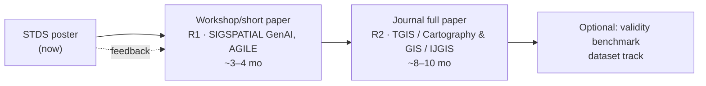

# AutoCarto-Agent — V2 Publication & Future-Scope Guide

**The future-scope companion to [02_CONFERENCE_PRESENTATION_GUIDE.md](02_CONFERENCE_PRESENTATION_GUIDE.md).** The presentation guide gets you through STDS with what exists today. This document plans the arc *after* the poster: turning the reference architecture into a peer-reviewed journal paper and a citable system, positioned against the fast-moving 2025–2026 autonomous-GIS literature.

**Version:** 2.0 · **Date:** 2026-07-06 · Pairs with [03_V2_PRODUCTION_BLUEPRINT.md](03_V2_PRODUCTION_BLUEPRINT.md) (what to build) and [05_LITERATURE_STUDY_GUIDE.md](05_LITERATURE_STUDY_GUIDE.md) (what to read).

---

## 1. The strategic picture

You are entering a **crowded, fast-moving field at exactly the right moment with a differentiated angle.** In 2025–2026 the autonomous-GIS literature exploded: the *Autonomous GIS research agenda* (Li, Ning et al., *Annals of GIS*, 2025), GIS Copilot, LLM-Find, CartoAgent, and a wave of benchmarks (GeoAnalystBench, GeoAgentBench, GeoBenchX). Almost all of it optimizes **capability** — can the agent complete the task, generate runnable code, produce a plausible map.

**Your differentiated angle: nobody in that wave is enforcing *deterministic correctness of the output artifact*.** They validate that code *runs*; you validate that the map is *statistically valid*, and you do it with algorithms that hold veto power over the model. That is a genuinely open niche, and it aligns with the field's own stated anxieties (the GISclaw authors note LLMs "produce syntactically valid but semantically incorrect GIS code… wrong CRS transforms, inverted raster band indices"). You are the paper that answers that anxiety with an architecture.

The risk is **not** that your idea isn't novel — it's that (a) you under-claim and get read as "just guardrails," or (b) you over-claim beyond what's built and get burned in review. This guide threads that needle.

---

## 2. The claim ladder — assert exactly as high as your evidence

Match the venue and the wording to what is actually built at submission time. Do not step above your current rung.

| Rung | Claim you can defend | Requires | Best venue |
|---|---|---|---|
| **R0 (today)** | "A reference architecture + a validated, reproducible core (2 novel gates) for constrained cartographic agents" | what exists now + corrected poster | STDS poster ✓ done |
| **R1** | "A neuro-symbolic architecture with a *complete* deterministic validation suite (6 gates), demonstrated on synthetic-truth and real data" | V2-P2 + one real case study | short paper / workshop (SIGSPATIAL GenAI, AGILE) |
| **R2** | "…that measurably improves cartographic validity vs. unconstrained LLM mapping, with calibrated thresholds" | + V2-P6 benchmark + threshold study | full journal (TGIS, *Cartography and GIS*, IJGIS) |
| **R3** | "…and human cartographers prefer/trust the validated output (blind study), deployed as an open system" | + human eval (R-3) + released system | flagship (IJGIS, *Annals of GIS*, ISPRS) |

**Recommendation:** aim the journal paper at **R2**, with the human-eval R3 component as the "future work → in progress" that reviewers reward. R2 is reachable with the paper-critical path in Blueprint §11 (P0→P1→P2→P5→P6) and is squarely publishable.

---

## 3. Positioning against the 2025–2026 landscape (the related-work map)

Draw this as a 2×2 in the paper: **x = capability breadth** (narrow↔general), **y = correctness enforcement** (model-judged↔deterministic). You occupy the empty high-y quadrant.

| System | What it does | Correctness mechanism | Your contrast |
|---|---|---|---|
| **LLM-Geo / Autonomous GIS** (Li & Ning 2023; agenda 2025) | general spatial-analysis workflows | model reasoning + execution success | you: narrow domain, *deterministic* artifact validation |
| **GIS Copilot** (Akinboyewa et al. 2025) | NL→QGIS spatial analysis | tool documentation + execution feedback | you: gates compute statistics & *veto*, not just retry-on-error |
| **LLM-Find** (Ning et al. 2025) | autonomous geospatial data *retrieval* | source selection + debugging loop | you: retrieval is one tier; spatial-first contract + validation downstream |
| **CartoAgent** (Wang et al. 2025, IJGIS) | multimodal map *style transfer* & aesthetic eval | MLLM visual judgment + human eval | you: *statistical* validity (not aesthetics); deterministic (not MLLM-judged); shared instinct: "don't touch the data" |
| **MapMate / CARTO Agentic** | NL→map design / dev tooling | LLM design | you: refusal + prescription, not open design |
| **Benchmarks** (GeoAnalystBench, GeoAgentBench, GeoBenchX) | measure task success | reference answers | you could *contribute a validity benchmark* — an opening (see §5) |

**The sentence that positions you (memorize it):** *"Prior autonomous-GIS agents ask whether the model can complete the task; we ask whether the artifact it produces is correct, and we answer with deterministic validation that holds veto authority over the model."*

Be generous and precise about CartoAgent specifically — it is the closest neighbor (LLM + cartography + "don't modify the data"). Your distinction is clean and must be stated explicitly: **CartoAgent judges *aesthetics* with an MLLM; you enforce *statistical validity* with deterministic algorithms.** Different axis, complementary, non-competing. Reviewers who know CartoAgent will look for exactly this sentence.

---

## 4. Journal paper skeleton (target: R2, ~8–10k words)

1. **Introduction** — the beautiful-wrong-map problem; the field's capability-over-correctness gap; your thesis (constrain, don't extend); contributions list (Presentation Guide §2, ranked).
2. **Related work** — the 2×2 map (§3); autonomous GIS, LLM code-gen fragility, neuro-symbolic systems, cartographic validity literature (Bertin, Jenks/GVF, Brewer color, MacEachren).
3. **Architecture** — three tiers; the authority invariant as a *type-level* guarantee (Blueprint §2.1); Propose-Verify-Execute state machine (Blueprint §4). This is your theory contribution — give it room.
4. **The gate suite** — one subsection per gate: statistic, threshold + provenance, prescription mechanism. Lead with Gate 2 (the diagnostic→prescriptive novelty) and Gate 3b; present G1/G3a/G4/G5/G6 as the completed suite.
5. **Reproducibility & determinism** — seeded inference, (M+1)/(R+1), hash-chained replayable trace, byte-identical statistical traces. Few competitors can claim this; make it a section, not a footnote.
6. **Evaluation** — (a) validity: synthetic-truth cases prove gates decide *correctly* (your SAR fixtures = ground truth); (b) real-data case study (Atlanta with real ACS/CDC/NLCD); (c) benchmark: rejection rates, convergence, latency split (Blueprint §9); (d) threshold sensitivity / operating characteristics (R-1); (e) ablation: pipeline with gates off vs on.
7. **Discussion** — when to constrain vs. extend an agent; limitations (permutation null model, threshold calibration scope, single domain); generalization to other spatial-analysis agents.
8. **Conclusion + future work** — human eval in progress (R3); production deployment; validity-benchmark contribution.

**Figures** (reuse + Blueprint): architecture diagram; the ungated-vs-gated pair (Presentation Guide F-NEW-1) as Figure 1; Gate-2 diagnostic panel; Gate-3b decision triptych; Atlanta real+synthetic panel; trace excerpt; operating-characteristic curves.

---

## 5. An extra contribution hiding in plain sight: a *validity* benchmark

The benchmark wave (GeoAnalystBench et al.) all measures **task success**. None measures **cartographic validity of outputs**. Your benchmark corpus (Blueprint §9) — prompts labeled with expected gate outcomes, including maps that *should be refused* — is the seed of a **"CartoValidBench": the first benchmark for statistical validity of LLM-generated maps.** That is a second, independently publishable artifact (dataset/benchmark track at SIGSPATIAL or a data journal) and it cements your niche. Flag it in future work even if you don't build it immediately.

---

## 6. Venue strategy & timeline

- **STDS (now):** poster; harvest reviewer questions (Presentation Guide §7) — they are free peer review for the journal draft. Get names of anyone who asks the null-model or threshold questions.
- **R1 short paper (3–4 months):** once the 6-gate suite exists (V2-P2), submit to a workshop — *SIGSPATIAL GenAI/Agentic workshop* (exactly your topic), *AGILE*, or *Annals of GIS* short-form. Low-risk, builds citation footprint, stress-tests the framing.
- **R2 journal (8–10 months):** primary target **Transactions in GIS** (agentic-GIS friendly, right length) or **Cartography and Geographic Information Science** (validity/design fit is perfect). Reach: **IJGIS** (where CartoAgent landed — strong fit, higher bar) or **Annals of GIS** (published the autonomous-GIS agenda — natural home).
- Watch the **International Journal of Digital Earth** and **Annals of GIS** — the autonomous-GIS group publishes there; your paper converses directly with theirs.

---

## 7. Defending against the sharpest reviewer criticisms (journal-grade)

Extends the conference Q&A (Presentation Guide §7) to the harder, written-review level.

- **"Incremental over CartoAgent / GIS Copilot."** → The axis is different (validity-enforcement vs. capability/aesthetics) and the mechanism is different (deterministic veto + prescription vs. model judgment/retry). Put the 2×2 in the intro so this is answered before it's asked.
- **"The gates encode subjective cartographic rules as if objective."** → Concede the threshold values are policy (config-versioned, calibratable) but the *enforcement architecture* is the contribution; the sensitivity study (R-1) shows how verdicts move with thresholds; the human eval (R3) grounds the defaults in expert preference.
- **"Synthetic data undermines the evaluation."** → Reframe as strength: synthetic-truth is *required* to prove the validator is correct (real data has unknown truth); you *also* show a real case study. Present both; name the design rationale.
- **"Free-permutation null inflates significance."** → Acknowledge, report the conditional-permutation/Lee's-L upgrade (R-2), and note the decision requires effect size + aspatial correlation, not p alone.
- **"Does the validation actually help end users?"** → This is the R3 human-eval question; if not yet done, position as in-progress with the protocol specified — reviewers accept a rigorous plan for the strongest claim.
- **"Generality — why only thematic maps?"** → Non-goal by design (Blueprint §1.3); argue the pattern (fluent generator + codified validity conditions + deterministic enforcement) transfers, and cite thematic cartography as the cleanest demonstrator because its rules are already formalized.

---

## 8. The through-line (put this in every abstract, talk, and rebuttal)

> As LLMs move from *assisting* cartographers to *autonomously producing* maps, the field's evaluation has stayed fixed on capability — does the code run, does the map appear. AutoCarto-Agent argues the missing question is *correctness*, and that correctness in cartography is not a matter of model judgment but of computable mathematics. Our contribution is an architecture that gives those computations veto authority over the model, and a prescription mechanism that turns each veto into a convergent fix. The map that ships has provably passed every check — and the proof is in the trace.

Keep the claims exactly at your evidence rung (§2), position cleanly against the 2026 landscape (§3), and this is a strong, defensible paper.

---

## Sources (verified 2026-07-06)

- Li & Ning, *Autonomous GIS: the next-generation AI-powered GIS*, Int. J. Digital Earth 16(2), 2023 — [GitHub: gladcolor/LLM-Geo](https://github.com/gladcolor/LLM-Geo)
- Li, Ning et al., *GIScience in the Era of AI: A Research Agenda Towards Autonomous GIS*, Annals of GIS, 2025 — [arXiv:2503.23633](https://arxiv.org/abs/2503.23633), [Tandfonline](https://www.tandfonline.com/doi/full/10.1080/19475683.2025.2552161)
- Ning, Li, Akinboyewa, Lessani, *An Autonomous GIS Agent Framework for Geospatial Data Retrieval (LLM-Find)*, Int. J. Digital Earth 18(1), 2025 — [Tandfonline](https://www.tandfonline.com/doi/full/10.1080/17538947.2025.2458688)
- Akinboyewa et al., *GIS Copilot: Towards an Autonomous GIS Agent for Spatial Analysis*, 2025 — [arXiv:2411.03205](https://arxiv.org/abs/2411.03205), [GitHub](https://github.com/Teakinboyewa/SpatialAnalysisAgent)
- Wang et al., *CartoAgent: a multimodal LLM-powered multi-agent cartographic framework*, IJGIS 39(9), 2025 — [arXiv:2505.09936](https://arxiv.org/abs/2505.09936), [GitHub](https://github.com/GISense/CartoAgent)
- *MapMate: bridging natural language interaction and map design through LLMs*, 2025 — [ScienceDirect](https://www.sciencedirect.com/science/article/pii/S1569843225007204)
- *GeoAnalystBench* — [arXiv:2509.05881](https://arxiv.org/html/2509.05881v1); *GeoBenchX* (ACM SIGSPATIAL GenAI workshop 2025) — [ACM](https://dl.acm.org/doi/10.1145/3764915.3770721)
