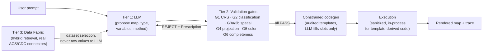

# Architecture

## The core idea

AutoCarto-Agent separates *what to map* (a natural-language request, genuinely open-ended, genuinely the LLM's job) from *whether the resulting map is statistically and cartographically valid* (closed-form, deterministic, never the LLM's job). The LLM proposes; six validation gates dispose. A rejection is never just a veto — it comes with an exact, mandatory prescription, and the LLM's role on a retry is reduced to transcribing that prescription verbatim, not re-reasoning about it. This is what makes the convergence loop's iteration bound provable rather than hopeful.

## Tier 1 — Semantic (the LLM)

[`semantic/llm_client.py`](../src/autocarto/semantic/llm_client.py) defines `LLMClient`, an ABC every provider implements identically: `propose(context, prompt) -> (MapProposal, LLMCallRecord)`. Two implementations exist:

- **`MockLLM`** — deterministic, rule-based, zero network. A fresh context (no prior gate rejections) gets a naive proposal with no discretion beyond picking a map type from simple heuristics (≥2 variables named → bivariate). A context carrying a `Prescription` gets exact, mechanical transcription — no further "reasoning" happens once a mandate exists.
- **`NvidiaLLM`** ([`semantic/nvidia_llm.py`](../src/autocarto/semantic/nvidia_llm.py)) — real intent parsing against NVIDIA's OpenAI-compatible API (default `meta/llama-3.1-70b-instruct`). Genuinely exercises model discretion for a *fresh* proposal (verified live: "income *relates to* asthma" → bivariate; "map *just* income" → choropleth — a distinction the ≥2-vars heuristic alone can't make). Critically, mandate iterations do **not** call the API at all: once a `Prescription` exists, transcription is deterministic and local, matching `MockLLM`'s behavior exactly. This is not an optimization — it's the same "LLM as code-assembler, not decision-maker" design applied to the real model, not just the mock.

**What the LLM never sees:** `SemanticContext` ([`contracts.py`](../src/autocarto/contracts.py)) is the only thing ever passed to an `LLMClient`, and its `__post_init__` recursively rejects any `numpy.ndarray`, `pandas.Series`/`DataFrame`, or `GeoDataFrame`/`GeoSeries` at *any* nesting depth — including three levels deep inside a `Prescription.params` dict, which is exactly the kind of place a raw array could accidentally leak through a careless field addition. The LLM sees variable *names*, *roles*, and *units* — never values. This is enforced structurally (a `TypeError` at construction), not by convention or code review.

## Tier 2 — Validation gates

Six deterministic gates, detailed individually in [`validation_gates.md`](validation_gates.md). The contract every gate implements ([`contracts.py`](../src/autocarto/contracts.py)'s `GateResult`/`Prescription`):

- A `GateResult` is `PASS`, `WARN`, or `REJECT`, carries the statistic(s) that produced the decision, and — this is enforced in `__post_init__`, not just by test coverage — a `REJECT` **cannot** exist without a non-`None` `Prescription`. Constructing one raises `ValueError` immediately.
- Two of the six gates (Gate 3a's `white_noise` regime, Gate 3b's `independent` regime) have scenarios where `REJECT` is *permanently* correct — the variables genuinely lack the spatial structure a map would need, and no amount of iteration can manufacture it. These are deliberate negative controls in the benchmark corpus, not gaps.

`Orchestrator._run_pre_render_gates` ([`orchestrator.py`](../src/autocarto/orchestrator.py)) runs G1/G4 always, G3a or G3b depending on map type, G2 for choropleths, and G5 last (needing to know the class count G2 settled on). It returns both the `GateSuiteResult` and a `resolved` dict of the *exact* concrete values each gate evaluated — breaks, EPSG, palette — so the render plan built from a passing suite is provably derived from what was validated, not a separately re-derived "default" that happens to usually match (a real provenance-tagging bug this project found and fixed the first way, not the second).

### The authority boundary: `RenderPlan`/`ProvenancedValue`

Every numeric constant that ends up in generated code — classification breaks, projection EPSG, color palette — is wrapped in a `ProvenancedValue` tagged one of `GATE_PRESCRIBED`, `TEMPLATE_DEFAULT`, or `FREE_LLM`. `RenderPlan.validate()` runs immediately before code generation and raises `AuthorityViolation` if *any* field carries `FREE_LLM` provenance. This is the last structural checkpoint before code text exists at all — an LLM-invented number cannot reach the render stage even if every gate upstream were somehow bypassed.

## Constrained code generation

[`semantic/codegen.py`](../src/autocarto/semantic/codegen.py) holds three audited `string.Template` bodies — `choropleth_v1`, `bivariate_v1`, `proportional_symbol_v1` — using `$slot` substitution (deliberately not `.format()`, whose `{`/`}` collide with the templates' own dict literals and f-strings). The LLM never writes render logic; it (or rather, the gate-validated `RenderPlan`) fills declarative slots in code a human already wrote and this project's own test suite executes against real `GeoDataFrame`s. Each template declares, up front, exactly which `RenderManifest` elements it guarantees (title, legend, scale bar, citation, ...) — Gate 6 trusts that declaration rather than needing to infer completeness from the rendered pixels.

## Execution: two genuinely different security postures, deliberately

This is the one place a casual reading of the code could overclaim, so it's worth being precise. There are **two separate execution paths** with different security guarantees, and conflating them would misrepresent what's actually protected:

1. **`Orchestrator._execute_render`** — what actually renders a map today. Runs the codegen output **in-process**, after a `CodeSanitizer.sanitize()` pass, with live data (a real `GeoDataFrame`, real numpy arrays) bound directly into `exec_globals`. The method's own docstring is explicit about why this is a *defensible* boundary for *this* code specifically, not a general claim: the code is template-derived with only gate-validated constants substituted in — never free-form LLM logic. It is *not* a claim that arbitrary untrusted code is safely contained this way.
2. **`SandboxExecutor(backend="docker")`** — a genuine process-isolation boundary (`Dockerfile.sandbox` → `autocarto-sandbox:latest`, run with `--runtime=runsc`/gVisor, `--network=none`, `--read-only`, `--cap-drop=ALL`, `--pids-limit=64`), built and red-team-tested (27 escape vectors, [`tests/security/test_escapes.py`](../tests/security/test_escapes.py)) for the case where genuinely arbitrary, untrusted code needs to run — a JSON-serializable data snapshot in, stdout/stderr/exit-code out, no live-object binding. **The orchestrator's render path does not currently use this backend** — wiring live `GeoDataFrame` data into an isolated container is a real, separate undertaking (the container backend has no mechanism to bind a live object into its exec globals, only a JSON snapshot) that Phase 5 deliberately did not expand into, to avoid scope creep beyond what was asked. If that wiring is ever done, this document and `_execute_render`'s docstring both need updating *together* — a stale docstring here would be exactly the kind of gap this project's engineering discipline exists to catch.

`CodeSanitizer` (AST import/attribute/open-mode whitelisting, string/comment scrubbing before regex scanning) sits in front of both paths, but is explicitly documented ([§10 of the Operating Manual](../Fable%20Review/01_OPERATING_MANUAL.md)) as a *cost-raiser*, not the boundary — blacklists are enumerable, not complete, and the red-team suite exists specifically to prove the *container*, not the sanitizer, is what stops a bypass.

## Tier 3 — Data Fabric

[`data_fabric/hybrid_retrieval.py`](../src/autocarto/data_fabric/hybrid_retrieval.py) implements bbox-first, semantic-second retrieval: a Stage 1 spatial pre-filter (bounding-box overlap against a real or mock Qdrant collection), a Stage 1.5 exact-geometry refinement (`shapely.STRtree`, catching the case where an item's bbox overlaps the query AOI but its real polygon doesn't — verified against an adversarial L-shaped fixture), then Stage 2 semantic ranking over the spatially-qualified candidates only. [`data_fabric/metadata_scorer.py`](../src/autocarto/data_fabric/metadata_scorer.py) implements a 7-point completeness rubric (TRUSTED ≥6 / AUGMENT 3–5 / REJECT <3) for deciding how much a dataset's own metadata can be trusted versus needs profiling.

Real data connectors ([`data_fabric/connectors/acs.py`](../src/autocarto/data_fabric/connectors/acs.py), [`cdc_places.py`](../src/autocarto/data_fabric/connectors/cdc_places.py)) both fetch-and-snapshot and load-from-snapshot; `real_data.py`'s normal load path only ever reads the committed snapshot — a `--data real` run never touches the network, regardless of whether `AUTOCARTO_OFFLINE` is set (see [`quickstart.md`](quickstart.md#air-gapped-mode)).

## Determinism as a first-class property

Two independent guarantees, both tested directly rather than assumed:

- **Run-to-run determinism**: two `autocarto demo` invocations produce byte-identical statistical trace JSON (Gate 2, Gate 3b) — [`tests/test_determinism.py`](../tests/test_determinism.py) checks the actual bytes, not a semantic diff.
- **Golden parity**: today's run matches the traces committed in `output/traces/`, exact on the pinned environment and tolerance-guarded (relative 1e-6) elsewhere, so a different scipy/numpy build's harmless last-bit float drift doesn't produce a false failure — a real gap this project found and fixed once already, when that drift leaked into human-readable instruction *text* at full precision instead of staying confined to the tolerance-checked numeric fields.

## Further reading

- [`validation_gates.md`](validation_gates.md) — each gate's exact statistic, threshold, and prescription.
- [`quickstart.md`](quickstart.md) — how to actually run any of this.
- [`Fable Review/01_OPERATING_MANUAL.md`](../Fable%20Review/01_OPERATING_MANUAL.md) — the complete engineering history: every phase, every real bug found and how it was diagnosed and fixed, every claim's current disclosed status. This document is the map; that one is the territory.
